# Water Damage CA - Lead Generation Platform

## Project Overview

This repository contains the code for a lead generation platform focused on water damage restoration services in California. The platform uses Next.js, Supabase for database management, and integrates with various AI services for content enrichment.

## Documentation Structure

This project follows a pyramid documentation structure with this README as the single entry point. All documentation is organized hierarchically as shown in the diagram below:

```mermaid
graph TD
    README[README.md] --> ProjectTasks[Project Tasks]
    README --> PriorityList[Priority Task List]
    README --> DailyLog[Daily Log]
    README --> DocMap[Documentation Map]
    README --> DocsDir[Documentation Directory]

    DocsDir --> Architecture[Architecture]
    DocsDir --> Features[Features]
    DocsDir --> Guides[Guides]
    DocsDir --> Integrations[Integrations]
    DocsDir --> Planning[Planning]
    DocsDir --> Processes[Processes]
    DocsDir --> Testing[Testing]
    DocsDir --> Templates[Templates]
    DocsDir --> Archived[Archived]
    DocsDir --> SearchIndex[Search Index]
    DocsDir --> Overview[Overview]
    DocsDir --> Requirements[Requirements]

    Architecture --> WebArch[Website Architecture]
    Architecture --> SEOStruct[SEO Structure]
    Architecture --> DataFlow[Data Flow]
    Architecture --> BusinessDataFlow[Business Data Flow]

    Features --> BusinessProfiles[Business Profile Implementation]
    Features --> CityManagement[City Management]
    Features --> DataEnrichment[Data Enrichment]
    Features --> AdminDashboard[Admin Dashboard]

    Guides --> DevGuide[New Developer Guide]
    Guides --> TSInterface[TypeScript Interface Guide]
    Guides --> DocStandards[Documentation Standards]
    Guides --> DocReviewChecklist[Documentation Review Checklist]

    Integrations --> GooglePlaces[Google Places Integration]
    Integrations --> Supabase[Supabase Integration]
    Integrations --> OpenRouter[OpenRouter Integration]
    Integrations --> Perplexity[Perplexity Integration]

    Planning --> GBPBatch[GBP Batch Plan]
    Planning --> GBPEnrichment[GBP Enrichment Plan]

    Processes --> DevWorkflow[Development Workflow]
    Processes --> BatchProcessing[Batch Processing]
    Processes --> AdminBatchProcess[Admin Batch Process]

    Testing --> TestGuide[Testing Guide]
    Testing --> NetlifyTest[Netlify Dev Testing]
    Testing --> AdminTest[Admin Subroutes Testing]

    Scripts --> DocCheck[Documentation Check Script]
    README --> Scripts[Scripts]

    classDef current fill:#f9f9f9,stroke:#333,stroke-width:2px;
    classDef category fill:#e1f3d8,stroke:#333,stroke-width:2px;
    classDef document fill:#e8f0fe,stroke:#333,stroke-width:2px;

    class README current;
    class DocsDir,Architecture,Features,Guides,Integrations,Planning,Processes,Testing,Templates,Archived,Scripts category;
    class WebArch,SEOStruct,DataFlow,BusinessDataFlow,BusinessProfiles,CityManagement,DataEnrichment,AdminDashboard,DevGuide,TSInterface,DocStandards,DocReviewChecklist,GooglePlaces,Supabase,OpenRouter,Perplexity,GBPBatch,GBPEnrichment,DevWorkflow,BatchProcessing,AdminBatchProcess,TestGuide,NetlifyTest,AdminTest,DocCheck,ProjectTasks,PriorityList,DailyLog,DocMap,SearchIndex,Overview,Requirements document;
```

> **Note**: This diagram represents the logical structure of our documentation. The actual file paths may differ but are being standardized to follow this hierarchy.

For a comprehensive map of all documentation, see the [Documentation Map](./documentation-map.md) and the [Daily Log](./daily-log.md). For all project tasks and their priorities, see the [Project Tasks](./project-tasks.md) and [Priority Task List](./docs/priority-list.md).

## Documentation Directory

All detailed documentation is organized in the [Documentation Directory](./docs/index.md), which serves as the central hub for all project documentation. The documentation is organized into the following categories:

### Main Categories

- [Architecture](./docs/architecture/index.md) - System design and architecture documentation
- [Features](./docs/features/index.md) - Feature implementation documentation
- [Guides](./docs/guides/index.md) - Developer guides and tutorials
- [Integrations](./docs/integrations/index.md) - Integration documentation for external services
- [Planning](./docs/planning/index.md) - Planning documentation and implementation plans
- [Processes](./docs/processes/index.md) - Process documentation (batch processing, etc.)
- [Testing](./docs/testing/index.md) - Testing documentation and guidelines

### Key Documents

#### Getting Started
- [Overview](./docs/overview.md) - Core technical details of the Next.js application
- [Requirements](./docs/requirements.md) - Current project requirements
- [New Developer Guide](./docs/guides/new-developer-guide.md) - Step-by-step guide for new developers

#### Architecture & Implementation
- [Website Architecture](./docs/architecture/website-architecture.md) - System architecture and component diagrams
- [SEO Structure](./docs/architecture/seo-structure.md) - SEO optimization strategy
- [Data Flow](./docs/architecture/data-flow.md) - How data flows through the system
- [Business Data Flow](./docs/architecture/business-data-flow.md) - Business data flow architecture

#### Feature Documentation
- [Business Profile Implementation](./docs/features/business-profile-implementation.md) - Business profile features
- [City Management](./docs/features/city-management.md) - City page management
- [Data Enrichment](./docs/features/data-enrichment.md) - AI-powered content enrichment
- [Admin Dashboard](./docs/features/admin-dashboard.md) - Admin dashboard features

#### Integration Documentation
- [Google Places Integration](./docs/integrations/google-places.md) - Google Places API integration
- [Supabase Integration](./docs/integrations/supabase.md) - Supabase database integration
- [OpenRouter Web Search Integration](./docs/integrations/openrouter.md) - Comprehensive documentation on OpenRouter web search integration with model fallback chain and error handling
- [Perplexity Integration](./docs/integrations/perplexity.md) - Perplexity deep research integration

#### Process Documentation
- [Development Workflow](./docs/processes/development-workflow.md) - How to contribute to the project
- [Batch Processing](./docs/processes/batch-processing.md) - Batch processing system
- [Admin Batch Process](./docs/processes/admin-batch-process.md) - Admin batch processing interface

#### Testing Documentation
- [Testing Guide](./docs/testing/testing-guide.md) - Detailed testing instructions
- [Netlify Dev Testing](./docs/testing/netlify-dev-testing.md) - Testing in production-like environment
- [Admin Subroutes Testing](./docs/testing/admin-subroutes-testing.md) - Testing admin routes

### Utility Scripts

- [Documentation Check Script](./scripts/check-documentation.js) - Script to check for documentation issues
- [GitHub Action Workflow](./.github/workflows/documentation-check.yml) - Automated documentation checks

### Project Status & Progress

- [Project Tasks](./project-tasks.md) - Consolidated list of all tasks with priorities
- [Priority Task List](./docs/priority-list.md) - Prioritized list of tasks for the project
- [Daily Development Logs](./daily-log.md) - Daily development updates

## Key Features

- Dynamic routing with city and service parameters (`domain.com/[service-slug]-[city]-ca` and `domain.com/[business-name]-[city]-ca`)
- Supabase database integration for content management
- Google Places API integration for business listings
- AI-powered content enrichment with OpenRouter, Gemini, and Perplexity
- Incremental Static Regeneration (ISR) with 6-month caching
- Admin dashboard for content management and batch processing
- SEO-optimized website structure with proper sitemap

## Admin Interface

The admin interface provides tools for managing the application, including batch processing for retrieving and enriching business data, content enrichment tools, and diagnostic utilities.

### Admin Routes

- `/admin` - Main dashboard
- `/admin/batch-process` - Batch processing interface for cities and businesses
- `/admin/enrich-content` - Content enrichment tools for business profiles
- `/admin/diagnostics` - Diagnostic tools for troubleshooting

### Known Issues

- **Layout Issues**: We're currently experiencing layout issues with the admin interface, particularly with the `/admin/batch-process` page. See the [Daily Log](./daily-log.md) for detailed troubleshooting attempts.
- **Responsive Design**: The admin interface may not display correctly on all screen sizes. We're working on improving the responsive design.

### Troubleshooting

If you encounter layout issues with the admin interface:

1. Make sure you're using Netlify Dev on port 8888 (`netlify dev`)
2. Try clearing your browser cache
3. Check the console for any JavaScript errors
4. See the [Project Tasks](./project-tasks.md) for planned improvements

## Tech Stack

- Next.js 14+ with App Router
- TypeScript
- Supabase
- Tailwind CSS
- Various AI services (OpenRouter, Gemini, Perplexity)
- Netlify for deployment

## Development Workflow

1. Clone the repository
2. Follow the setup instructions in the [New Developer Guide](./docs/guides/new-developer-guide.md)
3. Run the development server with `netlify dev` (port 8888) for production-like environment
4. Make changes and test locally
5. Run tests with appropriate commands
6. Update documentation as needed
7. Submit a PR for review

**IMPORTANT**: Always use Netlify Dev (`netlify dev`) on port 8888 for testing, not the Next.js development server (`yarn dev`) on port 3000. This ensures that your testing environment closely matches the production environment.

## Type System

The project uses TypeScript with strict type checking. Key interfaces include:

### BusinessDetails Interface

The `BusinessDetails` interface is a core type used throughout the application for representing business data. Recent updates have streamlined the interface and added support for enriched data.

#### Key Changes (as of 04/17/2025)
- Removed unnecessary properties (`id`, `slug`, `place_id`, `review_count`, `reviews`)
- Simplified city object to only include `name` and `state`
- Changed hours format to use Record type for better type safety
- Made photo dimensions (width/height) required
- Added comprehensive null safety handling
- Added optional enriched data structure for AI-enhanced content

#### Required Properties
- `name`, `description`, `address`: Basic business information
- `rating`, `phone`, `website`: Contact and rating details
- `location`: Object with `lat` and `lng` coordinates
- `city`: Object with only `name` and `state`
- `hours`: Record mapping days to hours (e.g., `{ "Monday": "08:00-18:00" }`)
- `photos`: Array of objects with required `reference`, `width`, and `height`
- `emergency`: Object with `available` and `responseTime`
- `services`: Array of service names

#### Optional Enriched Data
- `enriched_data`: Optional object containing AI-enhanced content
  - Review insights and summaries
  - Service details and certifications
  - Remediation process documentation
  - Restoration techniques information

For examples of proper interface usage, see the [TypeScript Interface Guide](./docs/guides/typescript-interface-guide.md).

## License

This project is proprietary and confidential. Unauthorized copying, distribution, or use is strictly prohibited.
