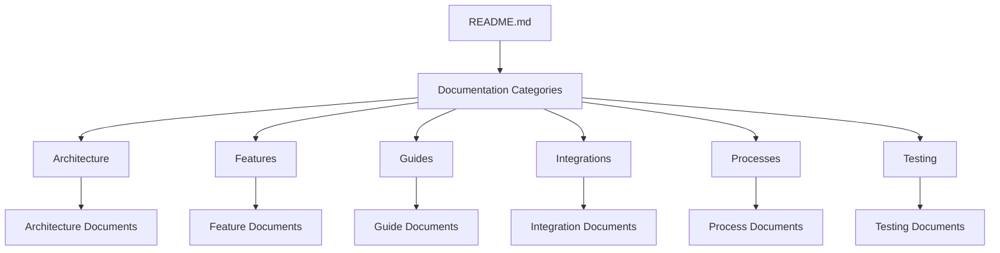

# Documentation Standards Guide

> **Breadcrumb Navigation**: [README.md](../../README.md) > [Documentation](../index.md) > [Guides](./index.md) > Documentation Standards

## Overview

This guide outlines the documentation standards for the Water Damage CA project. Following these standards ensures that our documentation is consistent, comprehensive, and easy to navigate.

## Documentation Structure

### Pyramid Structure

The Water Damage CA project follows a pyramid documentation structure with a single entry point:

1. **README.md** - The single entry point for all documentation
2. **Documentation Categories** - Organized by topic (architecture, features, guides, etc.)
3. **Specific Documents** - Detailed documentation on specific topics



### Directory Structure

```
docs/
├── index.md                  # Documentation home page
├── architecture/             # Architecture documentation
│   ├── index.md              # Architecture overview
│   ├── website-architecture.md
│   ├── seo-structure.md
│   └── ...
├── features/                 # Feature documentation
│   ├── index.md              # Features overview
│   ├── business-profile-implementation.md
│   ├── city-management.md
│   └── ...
├── guides/                   # Developer guides
│   ├── index.md              # Guides overview
│   ├── new-developer-guide.md
│   ├── typescript-interface-guide.md
│   └── ...
├── integrations/             # Integration documentation
│   ├── index.md              # Integrations overview
│   ├── supabase.md
│   ├── openrouter.md
│   └── ...
├── processes/                # Process documentation
│   ├── index.md              # Processes overview
│   ├── development-workflow.md
│   ├── batch-processing.md
│   └── ...
├── testing/                  # Testing documentation
│   ├── index.md              # Testing overview
│   ├── workflow.md
│   ├── guide.md
│   └── ...
└── templates/                # Documentation templates
    └── documentation-template.md
```

## Document Structure

### Required Elements

Every documentation file should include:

1. **Title** - Clear, descriptive title
2. **Breadcrumb Navigation** - Path from README.md to current document
3. **Overview** - Brief description of what the document covers
4. **Related Documentation** - Links to related documents
5. **Last Updated Date** - When the document was last updated

### Optional Elements

Depending on the document type, include as appropriate:

1. **Prerequisites** - What the reader needs to know or have installed
2. **Key Concepts** - Important concepts related to the topic
3. **Implementation Details** - Technical details of implementation
4. **Code Examples** - Illustrative code snippets
5. **Troubleshooting** - Common issues and solutions
6. **Best Practices** - Recommended approaches
7. **Additional Resources** - Links to external resources

## Formatting Guidelines

### Markdown Syntax

- Use ATX-style headers (`#` for h1, `##` for h2, etc.)
- Use fenced code blocks with language specifiers (```tsx, ```json, etc.)
- Use bullet points for lists without a specific order
- Use numbered lists for sequential steps or prioritized items
- Use tables for structured data
- Use blockquotes for important notes or warnings

### Code Examples

- Include language specifier in code blocks
- Keep examples concise and focused
- Include comments to explain complex parts
- Use proper indentation and formatting
- Ensure examples are accurate and up-to-date

### Diagrams

- Use mermaid.js for diagrams
- Include a text description of the diagram for accessibility
- Keep diagrams simple and focused
- Use consistent styling across diagrams

## Writing Style

### General Guidelines

- Use clear, concise language
- Write in present tense
- Use active voice
- Be consistent with terminology
- Define acronyms and technical terms
- Use second person ("you") when addressing the reader
- Avoid jargon and overly technical language when possible

### Tone

- Professional but approachable
- Helpful and instructive
- Objective and factual
- Consistent across all documentation

## Breadcrumb Navigation

Include breadcrumb navigation at the top of each document to help readers understand the document's place in the hierarchy:

```markdown
> **Breadcrumb Navigation**: [README.md](../../README.md) > [Documentation](../index.md) > [Category](./index.md) > Current Document
```

## Documentation Templates

Use the provided templates for creating new documentation:

- [Documentation Template](../templates/documentation-template.md)

## Documentation Review Process

1. **Self-Review** - Review your own documentation for clarity, accuracy, and completeness
2. **Peer Review** - Have another team member review the documentation
3. **Technical Review** - Ensure technical accuracy
4. **Final Review** - Check for formatting, spelling, and grammar

## Maintenance Guidelines

### When to Update Documentation

- When adding new features
- When changing existing features
- When fixing bugs that affect user experience
- When improving processes or workflows
- When clarifying confusing or incomplete information

### How to Update Documentation

1. Identify the documents that need to be updated
2. Make the necessary changes
3. Update the "Last Updated" date
4. Follow the documentation review process
5. Commit the changes

## Related Documentation

- [Development Workflow](../processes/development-workflow.md)
- [New Developer Guide](./new-developer-guide.md)

Last Updated: April 22, 2025
