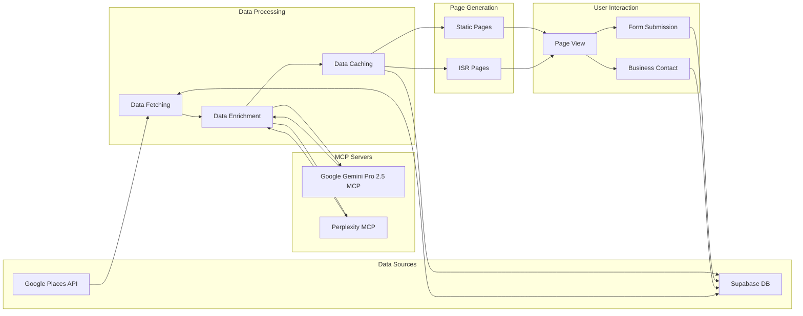
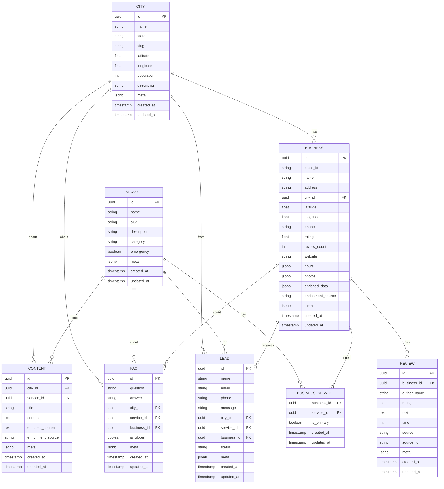
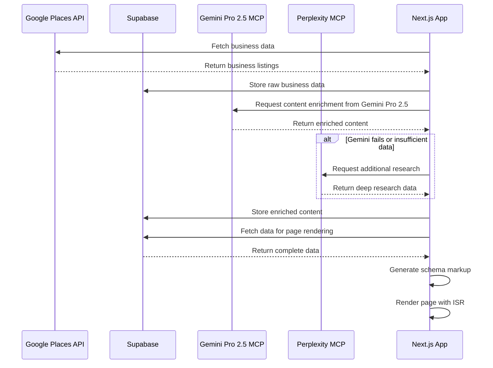

# Water Damage CA - Reconciled Website Structure

This document outlines the reconciled website structure for the Water Damage CA project, incorporating the best elements from both the current implementation and the new programmatic SEO strategy.

## URL Structure

The website follows a city-specific, service-oriented pattern for hyperlocal targeting:

```
domain.com/[service-slug]-[city]-ca
domain.com/[business-name]-[city]-ca
```

Examples:
- `/water-damage-restoration-los-angeles-ca`
- `/abc-restoration-los-angeles-ca`

## System Architecture

```mermaid
graph TD
    subgraph "Frontend (Next.js 14.2.23)"
        A[Next.js App Router] --> B[Dynamic Routes]
        B --> C1[City-Service Pages]
        B --> C2[Business Profile Pages]
        B --> C3[Service Pages]
        B --> C4[Static Pages]

        D[Components] --> D1[BusinessList]
        D --> D2[ServiceCards]
        D --> D3[CitySelector]
        D --> D4[LeadForm]
        D --> D5[SchemaMarkup]
    end

    subgraph "Data Sources"
        E[Google Places API] --> E1[Business Listings]
        E --> E2[Reviews]
        E --> E3[Photos]

        F[Supabase Database] --> F1[Cities]
        F --> F2[Services]
        F --> F3[Businesses]
        F --> F4[Content]
        F --> F5[FAQs]
        F --> F6[Leads]
    end

    subgraph "AI Content Enrichment"
        G[Google Gemini Pro 2.5 MCP] --> G1[Content Generation]
        G --> G2[FAQ Creation]
        G --> G3[Business Descriptions]

        H[Perplexity MCP] --> H1[Deep Research]
        H --> H2[Additional Business Info]
    end

    subgraph "Backend Services"
        I[API Routes] --> I1[/api/places]
        I --> I2[/api/supabase]
        I --> I3[/api/ai-enrichment]

        J[Serverless Functions] --> J1[Lead Processing]
        J --> J2[Data Enrichment]
        J --> J3[Scheduled Updates]
    end

    subgraph "Deployment (Netlify)"
        K[Netlify Build] --> K1[ISR]
        K --> K2[Edge Functions]
        K --> K3[CDN]
    end

    A --> I
    I --> E
    I --> F
    I --> G
    I --> H
    J --> E
    J --> F
    J --> G
    J --> H
    J --> K
```

## Data Flow



## Database Schema



## Page Types and Routes

### 1. City-Service Pages

**URL Pattern:** `/[service-slug]-[city]-ca`

**Implementation:**
- Dynamic route in `app/[service]-[city]-ca/page.tsx`
- Fetches data from Supabase and Google Places API
- Enriches content using Gemini 2.4 Pro MCP
- Implements comprehensive schema markup

**Example URLs:**
- `/water-damage-restoration-los-angeles-ca`
- `/mold-removal-san-francisco-ca`
- `/emergency-water-extraction-san-diego-ca`

### 2. Business Profile Pages

**URL Pattern:** `/[business-slug]-[city]-ca`

**Implementation:**
- Dynamic route in `app/[business]-[city]-ca/page.tsx`
- Fetches business data from Supabase
- Enriches business information using Gemini 2.4 Pro MCP
- Implements LocalBusiness schema markup

**Example URLs:**
- `/abc-restoration-los-angeles-ca`
- `/xyz-mold-removal-san-francisco-ca`


### 3. Service Landing Pages

**URL Pattern:** `/services/[service-slug]`

**Implementation:**
- Dynamic route in `app/services/[service-slug]/page.tsx`
- Explains the service in detail
- Lists cities where the service is available
- Implements Service schema markup

**Example URLs:**
- `/services/water-damage-restoration`
- `/services/mold-removal`

### 4. Static Pages

**URL Pattern:** `/[page-slug]`

**Implementation:**
- Static routes in `app/[page-slug]/page.tsx`
- Content stored in Supabase or as static files

**Example URLs:**
- `/about`
- `/contact`
- `/privacy-policy`
- `/terms-of-service`

## Schema Markup Implementation

### 1. City-Service Pages

```json
{
  "@context": "https://schema.org",
  "@type": "Service",
  "name": "Water Damage Restoration in Los Angeles, CA",
  "serviceType": "Water Damage Restoration",
  "provider": {
    "@type": "LocalBusiness",
    "name": "Water Damage CA",
    "telephone": "(800) 555-1234",
    "priceRange": "$$-$$$"
  },
  "areaServed": {
    "@type": "City",
    "name": "Los Angeles",
    "sameAs": "https://en.wikipedia.org/wiki/Los_Angeles"
  },
  "description": "Professional water damage restoration services in Los Angeles, CA. 24/7 emergency response, licensed technicians, and free estimates."
}
```

### 2. Business Profile Pages

```json
{
  "@context": "https://schema.org",
  "@type": "LocalBusiness",
  "name": "ABC Restoration",
  "image": "https://example.com/abc-restoration.jpg",
  "address": {
    "@type": "PostalAddress",
    "streetAddress": "123 Main St",
    "addressLocality": "Los Angeles",
    "addressRegion": "CA",
    "postalCode": "90001",
    "addressCountry": "US"
  },
  "geo": {
    "@type": "GeoCoordinates",
    "latitude": 34.0522,
    "longitude": -118.2437
  },
  "url": "https://waterdamage-ca.com/abc-restoration-los-angeles-ca",
  "telephone": "(800) 555-1234",
  "priceRange": "$$-$$$",
  "aggregateRating": {
    "@type": "AggregateRating",
    "ratingValue": "4.8",
    "reviewCount": "35"
  }
}
```

### 3. FAQ Schema

```json
{
  "@context": "https://schema.org",
  "@type": "FAQPage",
  "mainEntity": [
    {
      "@type": "Question",
      "name": "How much does water damage restoration cost in Los Angeles?",
      "acceptedAnswer": {
        "@type": "Answer",
        "text": "The cost of water damage restoration in Los Angeles typically ranges from $500 to $3,000 depending on the extent of damage, square footage affected, and specific requirements. Contact us for a free estimate."
      }
    },
    {
      "@type": "Question",
      "name": "How quickly can I get emergency water extraction in Los Angeles?",
      "acceptedAnswer": {
        "@type": "Answer",
        "text": "For emergency situations, our Los Angeles technicians can typically arrive within 1-2 hours of your call. We provide 24/7 service for water damage emergencies."
      }
    }
  ]
}
```

## Deployment Strategy (Netlify)

### 1. Build Configuration

```toml
# netlify.toml
[build]
  command = "next build"
  publish = ".next"

[[plugins]]
  package = "@netlify/plugin-nextjs"

[build.environment]
  NODE_VERSION = "18.17.0"
  NEXT_USE_NETLIFY_EDGE = "true"

[[headers]]
  for = "/*"
  [headers.values]
    Cache-Control = "public, max-age=15552000, stale-while-revalidate=15552000"
```

### 2. ISR Configuration

```javascript
// next.config.js
module.exports = {
  images: {
    domains: ['lh3.googleusercontent.com'],
  },
  experimental: {
    serverActions: true,
  }
};

// In page.tsx files
export const revalidate = 15552000; // 6 months
```

## Content Enrichment Process



## SEO Optimization Strategy

### 1. URL Structure
- Keyword-rich URLs with service and city names
- Consistent pattern across the site
- No trailing slashes
- All lowercase

### 2. Metadata
- Dynamic title and description based on service and city
- OpenGraph and Twitter card metadata
- Canonical URLs to prevent duplicate content

### 3. Schema Markup
- Comprehensive schema for all page types
- LocalBusiness schema for business profiles
- Service schema for service pages
- FAQ schema for FAQ sections
- BreadcrumbList schema for navigation

### 4. Content Strategy
- AI-enriched content using Gemini Pro 2.5 MCP
- Backup research from Perplexity MCP
- City-specific content for local relevance
- Service-specific content for expertise signals

### 5. Technical SEO
- 6-month ISR caching (15,552,000 seconds)
- XML sitemap generation
- robots.txt configuration
- Proper heading hierarchy
- Internal linking structure

## Implementation Plan

### Phase 1: Core Infrastructure
1. Set up Supabase database with updated schema
2. Implement Google Places API integration
3. Configure Gemini Pro 2.5 MCP server
4. Configure Perplexity MCP server
5. Create base page templates with schema markup

### Phase 2: Content Generation
1. Fetch and store business data from Google Places API
2. Enrich content using Gemini Pro 2.5 MCP
3. Generate FAQs and additional content
4. Implement schema markup for all page types

### Phase 3: SEO Optimization
1. Implement metadata generation
2. Create XML sitemap
3. Configure robots.txt
4. Set up canonical URLs
5. Implement proper heading hierarchy

### Phase 4: Deployment
1. Configure Netlify build settings
2. Set up ISR with 6-month cache
3. Configure CDN and caching headers
4. Deploy to production
5. Submit sitemap to search engines
