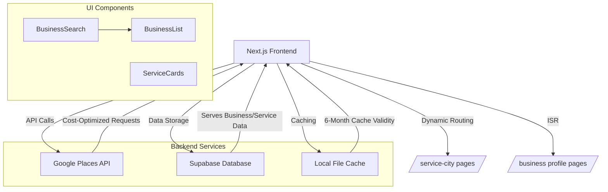

# Water Damage CA - Technical Implementation Plan

This document outlines the technical implementation details for the Water Damage CA website development.

## Technology Stack

- **Frontend Framework**: Next.js 14.2.23 with App Router
- **Styling**: TailwindCSS
- **Deployment**: Netlify
- **Data Sources**:
  - Supabase Database
  - Google Places API
  - WordPress API (optional)
- **Content Enhancement**: OpenAI API
- **Image Storage**: Netlify (initial MVP)

## Core Architecture

### Directory Structure

```
water-damage-ca/
├── app/
│   ├── [service]-[city]-ca/
│   │   └── page.tsx
│   ├── [business]-[city]-ca/
│   │   └── page.tsx
│   ├── services/
│   │   └── [category]/
│   │       └── page.tsx
│   ├── api/
│   │   ├── revalidate/
│   │   │   └── route.ts
│   │   ├── places/
│   │   │   └── route.ts
│   │   └── content/
│   │       └── route.ts
│   ├── layout.tsx
│   └── page.tsx
├── components/
│   ├── layout/
│   │   ├── Header.tsx
│   │   ├── Footer.tsx
│   │   └── Navigation.tsx
│   ├── business/
│   │   ├── BusinessCard.tsx
│   │   └── BusinessList.tsx
│   ├── service/
│   │   ├── ServiceDescription.tsx
│   │   └── ServiceFeatures.tsx
│   ├── ui/
│   │   ├── Button.tsx
│   │   ├── Card.tsx
│   │   └── Form.tsx
│   └── seo/
│       ├── SchemaMarkup.tsx
│       └── MetaTags.tsx
├── lib/
│   ├── api/
│   │   ├── supabase.ts
│   │   ├── googlePlaces.ts
│   │   └── openai.ts
│   ├── utils/
│   │   ├── formatting.ts
│   │   ├── seo.ts
│   │   └── validation.ts
│   └── types/
│       ├── business.ts
│       ├── service.ts
│       └── city.ts
├── public/
│   ├── images/
│   │   └── services/
│   │       └── [1-10].jpg
│   └── data/
│       └── cached-data.json
└── Roadmap/
    ├── project-requirements.md
    ├── tracking-progress.md
    └── technical-implementation-plan.md
```

### Data Flow Architecture

1. **Build Time**:
   - Fetch city/service combinations from Supabase
   - Generate static paths for all combinations
   - Pre-render pages with ISR (6-month cache)

2. **Runtime (Client)**:
   - Serve cached pages to users
   - Handle client-side interactions
   - Submit forms and capture leads

3. **Data Refresh**:
   - Automatic revalidation after 6 months
   - Manual revalidation via API endpoint if needed

## API Integration Details

### Supabase Integration

```typescript
// lib/api/supabase.ts
import { createClient } from '@supabase/supabase-js';
import { CityService, City, Service } from '../types';

const supabaseUrl = process.env.NEXT_PUBLIC_SUPABASE_URL!;
const supabaseKey = process.env.NEXT_PUBLIC_SUPABASE_ANON_KEY!;
const supabase = createClient(supabaseUrl, supabaseKey);

export async function fetchCityServiceCombinations(): Promise<CityService[]> {
  try {
    const { data, error } = await supabase
      .from('city_service_matrix')
      .select(`
        cities!inner(id, name, slug, state, population),
        services!inner(id, name, slug, category, description)
      `);

    if (error) throw error;

    return data.map(row => ({
      city: {
        name: row.cities.name,
        slug: row.cities.slug,
        state: row.cities.state,
        population: row.cities.population,
      },
      service: {
        name: row.services.name,
        slug: row.services.slug,
        category: row.services.category || '',
        description: row.services.description || '',
      }
    }));
  } catch (error) {
    console.error('Error fetching Supabase data:', error);
    return [];
  }
}

export async function fetchCities(): Promise<City[]> {
  // Implementation to fetch unique cities from Supabase
}

export async function fetchServices(): Promise<Service[]> {
  // Implementation to fetch unique services from Supabase
}
```

### Google Places API Integration

```typescript
// lib/api/googlePlaces.ts
import { Business } from '../types';

export async function fetchBusinesses(service: string, city: string): Promise<Business[]> {
  try {
    const query = `${service.replace('-', ' ')} ${city} CA`;
    const url = `https://maps.googleapis.com/maps/api/place/textsearch/json?query=${encodeURIComponent(query)}&key=${process.env.GOOGLE_PLACES_API_KEY}`;

    const response = await fetch(url);
    const data = await response.json();

    if (!data.results) {
      return [];
    }

    return data.results.slice(0, 5).map(result => ({
      name: result.name,
      address: result.formatted_address,
      rating: result.rating,
      totalRatings: result.user_ratings_total,
      placeId: result.place_id,
      location: {
        lat: result.geometry.location.lat,
        lng: result.geometry.location.lng,
      },
      photos: result.photos ? result.photos.map(photo => ({
        reference: photo.photo_reference,
        width: photo.width,
        height: photo.height,
      })) : [],
    }));
  } catch (error) {
    console.error('Error fetching Google Places data:', error);
    return [];
  }
}

export async function fetchBusinessDetails(placeId: string): Promise<Business | null> {
  // Implementation to fetch detailed business information
}
```

### OpenAI Integration for Content Enhancement

```typescript
// lib/api/openai.ts
import OpenAI from 'openai';

const openai = new OpenAI({
  apiKey: process.env.OPENAI_API_KEY,
});

export async function generateServiceDescription(service: string, city: string): Promise<string> {
  try {
    const response = await openai.chat.completions.create({
      model: "gpt-4",
      messages: [
        {
          role: "system",
          content: "You are a professional content writer specializing in water damage and mold remediation services."
        },
        {
          role: "user",
          content: `Write a detailed, SEO-optimized description for ${service.replace('-', ' ')} services in ${city}, CA. Include information about the importance of quick response, professional techniques, and local considerations. The content should be around 300 words.`
        }
      ],
    });

    return response.choices[0].message.content || '';
  } catch (error) {
    console.error('Error generating content with OpenAI:', error);
    return '';
  }
}

export async function generateFAQs(service: string, city: string): Promise<{question: string, answer: string}[]> {
  // Implementation to generate FAQs for a service in a specific city
}
```

## Caching Implementation

### File-Based Caching System

```typescript
interface CacheEntry<T> {
  data: T;
  timestamp: number;
  expiresAt: number;
}

class FileCache {
  private readonly cacheDir: string;
  private readonly ttl: number;

  constructor(cacheDir: string, ttlInDays = 180) {
    this.cacheDir = cacheDir;
    this.ttl = ttlInDays * 24 * 60 * 60 * 1000;
  }

  async get<T>(key: string): Promise<T | null> {
    const path = this.getCachePath(key);
    if (!fs.existsSync(path)) return null;

    const entry: CacheEntry<T> = JSON.parse(
      await fs.promises.readFile(path, 'utf-8')
    );

    if (Date.now() > entry.expiresAt) {
      await fs.promises.unlink(path);
      return null;
    }

    return entry.data;
  }

  async set<T>(key: string, data: T): Promise<void> {
    const entry: CacheEntry<T> = {
      data,
      timestamp: Date.now(),
      expiresAt: Date.now() + this.ttl
    };

    await fs.promises.writeFile(
      this.getCachePath(key),
      JSON.stringify(entry)
    );
  }
}
```

### Cache Implementation Strategy

1. **API Response Caching**
   - Cache Google Places API responses
   - Store in `/cache/places-api/[city]/[service]`
   - 6-month TTL with automatic cleanup

2. **Static Asset Caching**
   - Cache optimized images
   - Store in `/public/cache/images`
   - Implement cache versioning

3. **Data Layer Caching**
   - Cache database queries
   - In-memory cache for frequent requests
   - File-based persistence for reliability

## Performance Optimization

### 1. Image Optimization

```typescript
interface ImageOptimizationConfig {
  quality: number;
  width: number;
  height: number;
  format: 'webp' | 'avif';
}

const optimizeImage = async (
  input: string,
  config: ImageOptimizationConfig
): Promise<Buffer> => {
  return sharp(input)
    .resize(config.width, config.height)
    .toFormat(config.format, { quality: config.quality })
    .toBuffer();
};
```

### 2. Code Splitting Strategy

```typescript
// Dynamic imports for route-based code splitting
const BusinessProfile = dynamic(() => import('@/components/BusinessProfile'), {
  loading: () => <LoadingSpinner />,
  ssr: true
});

// Prefetch critical components
const prefetchCriticalComponents = () => {
  const router = useRouter();
  useEffect(() => {
    router.prefetch('/[service]-[city]-ca');
    router.prefetch('/[business]-[city]-ca');
  }, [router]);
};
```

### 3. API Request Optimization

```typescript
const batchRequests = async <T>(
  requests: Promise<T>[],
  batchSize = 3,
  delayMs = 1000
): Promise<T[]> => {
  const results: T[] = [];

  for (let i = 0; i < requests.length; i += batchSize) {
    const batch = requests.slice(i, i + batchSize);
    const batchResults = await Promise.all(batch);
    results.push(...batchResults);

    if (i + batchSize < requests.length) {
      await new Promise(resolve => setTimeout(resolve, delayMs));
    }
  }

  return results;
};
```

### 4. Memory Management

1. **Component Cleanup**
   - Implement useEffect cleanup
   - Clear intervals and timeouts
   - Unsubscribe from events

2. **Data Lifecycle**
   - Clear unused cache entries
   - Implement memory limits
   - Monitor memory usage

3. **Resource Loading**
   - Lazy load below-fold content
   - Defer non-critical resources
   - Implement progressive loading

## Technical Architecture

## System Overview



## Key Features

- **Cost-Optimized API Integration**: Field masks and ID-only requests
- **Caching Strategy**: Local file cache with 6-month validity
- **SOLID Principles**:
  - Single Responsibility components
  - Open/Closed extension points
  - Liskov Substitution in API handlers
  - Interface Segregation for data services
  - Dependency Injection for API clients

[See Places API Implementation Details](../Data%20Enrichment/places-api-integration.md)
[View Supabase Integration](../../docs/integrations/supabase.md)

## SOLID Implementation Details

Following the SOLID principles, our code organization will be structured as follows:

### Directory Structure (Updated for SOLID)

```
water-damage-ca/
├── app/
│   ├── [service]-[city]-ca/
│   │   └── page.tsx
│   ├── [business]-[city]-ca/
│   │   └── page.tsx
│   ├── services/
│   │   └── [category]/
│   │       └── page.tsx
│   ├── api/
│   │   ├── revalidate/
│   │   │   └── route.ts
│   │   ├── places/
│   │   │   ├── search.ts
│   │   │   ├── details.ts
│   │   │   └── photos.ts
│   │   └── content/
│   │       ├── generate.ts
│   │       └── enhance.ts
│   ├── layout.tsx
│   └── page.tsx
├── components/
│   ├── layout/
│   │   ├── Header.tsx
│   │   ├── Footer.tsx
│   │   └── Navigation.tsx
│   ├── business/
│   │   ├── BusinessCard.tsx
│   │   ├── BusinessList.tsx
│   │   └── BusinessDetails.tsx
│   ├── service/
│   │   ├── ServiceDescription.tsx
│   │   ├── ServiceFeatures.tsx
│   │   └── ServiceCTA.tsx
│   ├── ui/
│   │   ├── Button.tsx
│   │   ├── Card.tsx
│   │   └── Form.tsx
│   └── seo/
│       ├── SchemaMarkup.tsx
│       └── MetaTags.tsx
├── lib/
│   ├── api/
│   │   ├── supabase/
│   │   │   ├── fetchCities.ts
│   │   │   ├── fetchServices.ts
│   │   │   └── fetchCombinations.ts
│   │   ├── googlePlaces/
│   │   │   ├── searchBusinesses.ts
│   │   │   ├── getBusinessDetails.ts
│   │   │   └── getBusinessPhotos.ts
│   │   └── openai/
│   │       ├── generateDescription.ts
│   │       ├── generateFAQs.ts
│   │       └── enhanceContent.ts
│   ├── utils/
│   │   ├── string/
│   │   │   ├── slugify.ts
│   │   │   └── capitalize.ts
│   │   ├── seo/
│   │   │   ├── generateMetaTags.ts
│   │   │   └── generateSchema.ts
│   │   └── validation/
│   │       ├── validateCity.ts
│   │       └── validateService.ts
│   └── types/
│       ├── business.ts
│       ├── service.ts
│       ├── city.ts
│       └── api.ts
├── public/
│   ├── images/
│   │   └── services/
│   │       └── [1-10].jpg
│   └── data/
│       └── cached-data.json
└── Roadmap/
    ├── project-requirements.md
    ├── tracking-progress.md
    └── technical-implementation-plan.md
```

### Single Responsibility Examples

#### API Modules

Instead of having a single monolithic Google Places API file, we'll split it into focused files:

```typescript
// lib/api/googlePlaces/searchBusinesses.ts
import { BusinessSearchParams, BusinessSearchResult } from '@/lib/types/api';

/**
 * Search for businesses using the Google Places API
 *
 * @param params - Search parameters including service and city
 * @returns Array of business search results
 */
export async function searchBusinesses(params: BusinessSearchParams): Promise<BusinessSearchResult[]> {
  try {
    const { service, city } = params;
    const query = `${service.replace('-', ' ')} ${city} CA`;
    const url = `https://maps.googleapis.com/maps/api/place/textsearch/json?query=${encodeURIComponent(query)}&key=${process.env.GOOGLE_PLACES_API_KEY}`;

    const response = await fetch(url);
    const data = await response.json();

    if (!data.results) {
      return [];
    }

    return data.results.slice(0, 5).map(result => ({
      name: result.name,
      address: result.formatted_address,
      rating: result.rating,
      totalRatings: result.user_ratings_total,
      placeId: result.place_id,
      location: {
        lat: result.geometry.location.lat,
        lng: result.geometry.location.lng,
      },
      photos: result.photos ? result.photos.map(photo => ({
        reference: photo.photo_reference,
        width: photo.width,
        height: photo.height,
      })) : [],
    }));
  } catch (error) {
    console.error('Error searching businesses:', error);
    return [];
  }
}
```

```typescript
// lib/api/googlePlaces/getBusinessDetails.ts
import { BusinessDetails } from '@/lib/types/business';

/**
 * Get detailed information about a business using its place ID
 *
 * @param placeId - Google Places ID for the business
 * @returns Detailed business information or null if not found
 */
export async function getBusinessDetails(placeId: string): Promise<BusinessDetails | null> {
  try {
    const url = `https://maps.googleapis.com/maps/api/place/details/json?place_id=${placeId}&fields=name,formatted_address,formatted_phone_number,website,opening_hours,rating,user_ratings_total,reviews&key=${process.env.GOOGLE_PLACES_API_KEY}`;

    const response = await fetch(url);
    const data = await response.json();

    if (!data.result) {
      return null;
    }

    return {
      name: data.result.name,
      address: data.result.formatted_address,
      phone: data.result.formatted_phone_number,
      website: data.result.website,
      hours: data.result.opening_hours?.weekday_text || [],
      rating: data.result.rating,
      totalRatings: data.result.user_ratings_total,
      reviews: data.result.reviews?.map(review => ({
        author: review.author_name,
        rating: review.rating,
        text: review.text,
        time: review.time,
      })) || [],
    };
  } catch (error) {
    console.error('Error fetching business details:', error);
    return null;
  }
}
```

#### Component Structure

Each component will have a single responsibility:

```typescript
// components/business/BusinessCard.tsx
import Image from 'next/image';
import { Business } from '@/lib/types/business';

interface BusinessCardProps {
  business: Business;
}

/**
 * Card component to display basic business information
 */
export default function BusinessCard({ business }: BusinessCardProps) {
  return (
    <div className="border rounded-lg p-4 shadow-sm">
      <h3 className="text-lg font-semibold">{business.name}</h3>
      <p className="text-gray-600">{business.address}</p>
      <div className="flex items-center mt-2">
        <span className="text-yellow-500">★</span>
        <span className="ml-1">{business.rating} ({business.totalRatings} reviews)</span>
      </div>
    </div>
  );
}
```

```typescript
// components/business/BusinessList.tsx
import { Business } from '@/lib/types/business';
import BusinessCard from './BusinessCard';

interface BusinessListProps {
  businesses: Business[];
  title?: string;
}

/**
 * Component to display a list of businesses
 */
export default function BusinessList({ businesses, title }: BusinessListProps) {
  return (
    <div className="my-8">
      {title && <h2 className="text-2xl font-bold mb-4">{title}</h2>}
      <div className="grid grid-cols-1 md:grid-cols-2 lg:grid-cols-3 gap-4">
        {businesses.map((business) => (
          <BusinessCard key={business.placeId} business={business} />
        ))}
      </div>
    </div>
  );
}
```

### Open/Closed Principle Example

We'll create interfaces that allow for extension:

```typescript
// lib/types/content.ts
export interface ContentGenerator {
  generate(params: ContentParams): Promise<string>;
}

export interface ContentParams {
  service: string;
  city: string;
  [key: string]: any; // Allow for additional parameters
}

// This allows us to create different content generators that all follow the same interface
// without modifying existing code
```

### Dependency Inversion Example

```typescript
// lib/api/content/contentService.ts
import { ContentGenerator, ContentParams } from '@/lib/types/content';
import { OpenAIContentGenerator } from './openAIContentGenerator';
import { TemplateContentGenerator } from './templateContentGenerator';

/**
 * Content service that uses dependency injection to allow different content generators
 */
export class ContentService {
  private generator: ContentGenerator;

  constructor(generator?: ContentGenerator) {
    // Default to OpenAI generator, but allow injection of any ContentGenerator
    this.generator = generator || new OpenAIContentGenerator();
  }

  async generateContent(params: ContentParams): Promise<string> {
    return this.generator.generate(params);
  }

  // Allow switching generators at runtime
  setGenerator(generator: ContentGenerator): void {
    this.generator = generator;
  }
}

// Usage example:
// const contentService = new ContentService();
// const content = await contentService.generateContent({ service: 'water-damage', city: 'sacramento' });
//
// // Switch to template-based generation
// contentService.setGenerator(new TemplateContentGenerator());
```

This SOLID approach will make our codebase more maintainable, testable, and extensible as we progress through the different phases of development.

## Dynamic Routing Implementation

### Service-City Pages

```typescript
// app/[service]-[city]-ca/page.tsx
import { fetchCityServiceCombinations } from '@/lib/api/supabase';
import { fetchBusinesses } from '@/lib/api/googlePlaces';
import { generateServiceDescription } from '@/lib/api/openai';
import { Metadata } from 'next';
import SchemaMarkup from '@/components/seo/SchemaMarkup';
import BusinessList from '@/components/business/BusinessList';
import ServiceDescription from '@/components/service/ServiceDescription';

export async function generateStaticParams() {
  const combinations = await fetchCityServiceCombinations();

  return combinations.map(combo => ({
    service: combo.service.slug,
    city: combo.city.slug,
  }));
}

export async function generateMetadata({ params }): Promise<Metadata> {
  const { service, city } = params;

  return {
    title: `${service.replace('-', ' ')} in ${city}, CA | Professional Services`,
    description: `Top-rated ${service.replace('-', ' ')} services in ${city}, California. 24/7 emergency response, professional technicians, and guaranteed results.`,
  };
}

export const revalidate = 15552000; // 6 months in seconds

export default async function ServiceCityPage({ params }) {
  const { service, city } = params;

  // Fetch data in parallel
  const [businesses, description] = await Promise.all([
    fetchBusinesses(service, city),
    generateServiceDescription(service, city),
  ]);

  return (
    <>
      <SchemaMarkup
        type="Service"
        service={service}
        city={city}
      />

      <main>
        <h1>{service.replace('-', ' ')} in {city}, CA</h1>

        <ServiceDescription content={description} />

        <BusinessList businesses={businesses} />

        {/* Additional components */}
      </main>
    </>
  );
}
```

## Implementation Timeline

### Week 1-2: Foundation
- Set up Next.js project with TypeScript and TailwindCSS
- Configure Netlify deployment
- Implement Supabase database integration
- Create basic page templates and components

### Week 3-4: Core Functionality
- Implement dynamic routing
- Set up Google Places API integration
- Create business listing components
- Implement schema markup

### Week 5-6: Content and Polish
- Implement OpenAI content generation
- Add SEO optimization
- Create sitemap generation
- Test and deploy MVP

## Next Steps After MVP

- Implement lead capture forms
- Add more sophisticated business profiles
- Enhance content with city-specific information
- Implement advanced SEO features

This technical implementation plan provides a detailed roadmap for developing the Water Damage CA website, focusing on the core architecture, data flow, and key components needed for the MVP.

## Data Types

```typescript
// lib/types/index.ts

export interface City {
  name: string;
  slug: string;
  state: string;
  population: number;
}

export interface Service {
  name: string;
  slug: string;
  category: string;
  description: string;
}

export interface CityService {
  city: City;
  service: Service;
}

export interface Business {
  name: string;
  address: string;
  rating: number;
  totalRatings: number;
  placeId: string;
  location: {
    lat: number;
    lng: number;
  };
  photos: {
    reference: string;
    width: number;
    height: number;
  }[];
}
