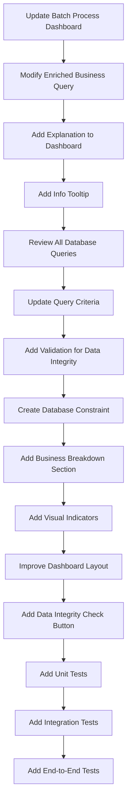

# Immediate Next Steps - 04/23/2025

## Goal

To update the batch process dashboard to correctly count enriched businesses based on the newly implemented data enrichment distinction.

## Entry Point

`README.md`

## Hierarchical Structure

Follow the pyramid hierarchical structure, starting from the main entry point `README.md`.

## Implementation Focus

*   Batch Process Dashboard: Update the batch process dashboard to correctly count enriched businesses.
*   Database Queries: Ensure all database queries use the correct criteria for counting enriched businesses.
*   UI Updates: Enhance the batch process dashboard with clear statistics about enriched businesses.
*   Testing: Add unit tests for the enriched business counting functionality.

## Considerations

*   The data enrichment distinction has been implemented and documented in [Data Enrichment Distinction](./data-enrichment-distinction.md).
*   The database has been updated to ensure that all businesses with `enrichment_source = "google_places"` have `enriched_data = null`.
*   The batch process dashboard should only count businesses with `enrichment_source = "openrouter web search"` as truly enriched.
*   The admin dashboard can be accessed locally using Netlify dev at http://localhost:8888/admin.
*   The batch process dashboard can be accessed at http://localhost:8888/admin/batch-process.
*   Scripts have been created to check and maintain data integrity, including `check-enrichment-status.js` and `fix-google-places-businesses.js`.
*   The current database state is: 688 total businesses, 55 with `enrichment_source = "openrouter web search"` and 633 with `enrichment_source = "google_places"`.
*   The batchProcessor.ts file has been updated to use the correct `enrichment_source` value when adding businesses from Google Places API.

## Specific Instructions

1. **Batch Process Dashboard Updates**
   - [ ] Update the batch process dashboard to correctly count enriched businesses
   - [ ] Modify the query in batchProcessor.ts to only count businesses with `enrichment_source = "openrouter web search"`
   - [ ] Add a clear explanation of what counts as an "enriched business" to the dashboard
   - [ ] Add a tooltip or info icon that explains the distinction between GBP data and enriched data

2. **Database Query Updates**
   - [ ] Review all database queries that count or filter enriched businesses
   - [ ] Update queries to use the correct criteria: `enrichment_source = "openrouter web search"` and non-null `enriched_data`
   - [ ] Add validation to ensure that businesses with `enrichment_source = "google_places"` always have `enriched_data = null`
   - [ ] Create a database trigger or constraint to enforce this rule at the database level

3. **UI Enhancements**
   - [ ] Add a section to the batch process dashboard that shows the breakdown of businesses by enrichment source
   - [ ] Add a visual indicator (icon or badge) to distinguish between enriched and non-enriched businesses
   - [ ] Improve the batch process dashboard layout for better readability
   - [ ] Add a button to run the data integrity check script from the admin interface

4. **Testing**
   - [ ] Add unit tests for the enriched business counting functionality
   - [ ] Add tests to verify that the data integrity rules are enforced
   - [ ] Add integration tests for the batch process dashboard
   - [ ] Add end-to-end tests for the batch processing workflow

## Plan

## Updated Next Steps

1. **Batch Process Dashboard Updates**
   - Update the batch process dashboard to correctly count enriched businesses
   - Modify the query in batchProcessor.ts to only count businesses with `enrichment_source = "openrouter web search"`
   - Add a clear explanation of what counts as an "enriched business" to the dashboard
   - Add a tooltip or info icon that explains the distinction between GBP data and enriched data

2. **Database Query Updates**
   - Review all database queries that count or filter enriched businesses
   - Update queries to use the correct criteria: `enrichment_source = "openrouter web search"` and non-null `enriched_data`
   - Add validation to ensure that businesses with `enrichment_source = "google_places"` always have `enriched_data = null`
   - Create a database trigger or constraint to enforce this rule at the database level

3. **UI Enhancements**
   - Add a section to the batch process dashboard that shows the breakdown of businesses by enrichment source
   - Add a visual indicator (icon or badge) to distinguish between enriched and non-enriched businesses
   - Improve the batch process dashboard layout for better readability
   - Add a button to run the data integrity check script from the admin interface

4. **Testing**
   - Add unit tests for the enriched business counting functionality
   - Add tests to verify that the data integrity rules are enforced
   - Add integration tests for the batch process dashboard
   - Add end-to-end tests for the batch processing workflow

5. **Data Integrity Maintenance**
   - Schedule regular runs of the data integrity check script
   - Create an automated alert system for data integrity violations
   - Implement a logging system for data integrity checks
   - Add a dashboard for monitoring data integrity

6. **Documentation**
   - Update batch process dashboard documentation
   - Add database query documentation for enriched business counting
   - Update admin interface documentation
   - Add data integrity maintenance documentation
