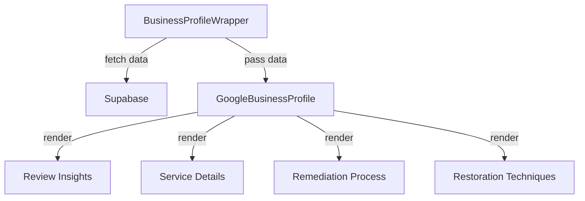

# Enriched Data Implementation Guide

## Overview

This document details the implementation of enriched business data in the Water Damage CA project. This feature enhances business profiles with detailed information about services, reviews, and processes.

## Table of Contents

1. [Architecture](#architecture)
2. [Data Structure](#data-structure)
3. [Component Implementation](#component-implementation)
4. [Integration with Supabase](#integration-with-supabase)
5. [Testing Guidelines](#testing-guidelines)
6. [Deployment Notes](#deployment-notes)

## Architecture

### Component Flow


## Data Structure

### Business Details Interface
```typescript
interface BusinessDetails {
  enriched_data?: {
    reviewInsights?: {
      summary?: string;
      strengths?: string[];
      areasForImprovement?: string[];
      testimonialHighlights?: string[];
    };
    serviceDetails?: {
      certifications?: string[];
      primaryServices?: Array<{
        name: string;
        description: string;
        estimatedCost?: string;
      }>;
      specializations?: string[];
    };
    remediationProcess?: {
      removalPhase?: {
        steps: string[];
        description: string;
      };
      // ... other phases
    };
    restorationTechniques?: {
      dryingTechniques?: string[];
      specializedEquipment?: string[];
      moistureDetectionTools?: string[];
      waterExtractionMethods?: string[];
    };
  };
}
```

## Component Implementation

### 1. BusinessProfileWrapper
```typescript
// Fetch and transform data
const transformedData: BusinessDetails = {
  // ... other fields ...
  enriched_data: data.enriched_data || undefined
};
```

### 2. GoogleBusinessProfile
Implements four main sections:
1. Review Insights
2. Service Details
3. Remediation Process
4. Restoration Techniques

## Integration with Supabase

### Data Storage
- All enriched data is stored in the Supabase database
- No caching layer needed due to Next.js built-in caching
- Direct integration with business profiles table

### Data Updates
- Updates handled through Supabase client
- Real-time updates not implemented (static data)

## Testing Guidelines

### Unit Tests
1. Test data transformation
2. Test component rendering
3. Test null states

### Integration Tests
1. Test data flow from Supabase
2. Test component integration

### E2E Tests
1. Test full business profile rendering
2. Test all interactive elements

## Deployment Notes

### Performance Considerations
- Lazy loading of sections
- Optimized data fetching
- Proper TypeScript typing

### Monitoring
- Track component render performance
- Monitor data fetch times
- Watch for type errors

## Status: ✅ Implemented

Last Updated: April 15, 2025
Implemented By: [Developer Name]
