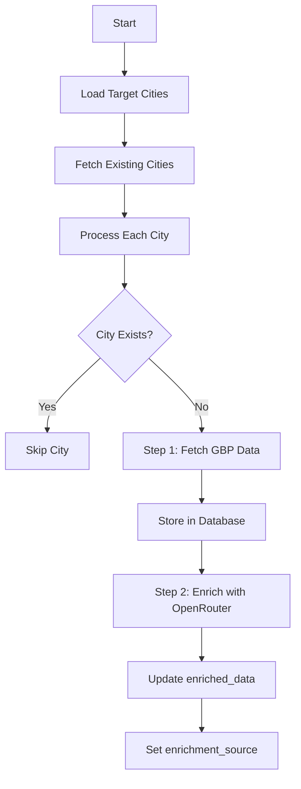
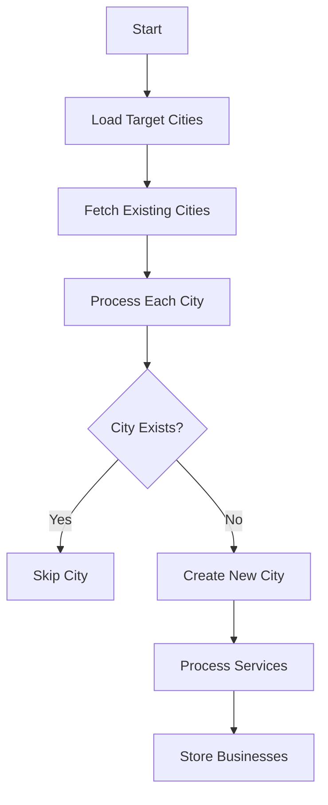
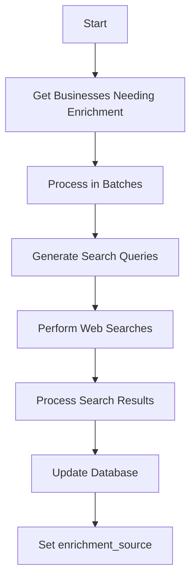

# Batch Processing System Documentation

> **Breadcrumb Navigation**: [README.md](../../README.md) > [Documentation](../index.md) > [Processes](./index.md) > Batch Processing

## Overview
The batch processing system is designed to efficiently fetch, enrich, and store city and business data from Google Places API while optimizing for cost, performance, and reliability.

## System Components

### 1. Core Utilities

#### Logger (`lib/utils/logger.ts`)
- Structured logging with Supabase integration and console fallback
- Log levels: debug, info, warn, error
- Metadata tracking for each log entry
- Graceful fallback when Supabase is unavailable
- Example usage:
```typescript
// Initialize with fallback
let logger: Logger;
try {
  logger = new Logger('ComponentName');
} catch (error) {
  logger = {
    info: (msg: string, meta?: any) => console.log(msg, meta),
    warn: (msg: string, meta?: any) => console.warn(msg, meta),
    error: (msg: string, meta?: any) => console.error(msg, meta),
    debug: (msg: string, meta?: any) => console.debug(msg, meta),
  } as Logger;
}

// Usage
await logger.info('Operation completed', { metadata });
```

#### FileCache (`lib/utils/cache.ts`)
- File-based persistent caching system
- 6-month default TTL
- Cache statistics tracking
- JSON storage format
```typescript
const cache = new FileCache('cache/places-api');
await cache.set(key, data, ttlMs);
const data = await cache.get(key);
```

#### RateLimiter (`lib/utils/rateLimiter.ts`)
- Configurable request windows
- Token bucket algorithm
- Automatic delay handling
- Usage statistics
```typescript
const rateLimiter = new RateLimiter({
  maxRequests: 10,
  windowMs: 60 * 1000
});
await rateLimiter.acquire();
```

### 2. Data Processing Scripts

#### City Enrichment (`scripts/batch-enrich-cities.ts`)
- Fetches and enriches city data
- Handles GBP data retrieval
- Updates database with enriched information
```typescript
interface CityData {
  id?: number;
  name: string;
  state: string;
  enriched_data?: any;
  created_at?: string;
  updated_at?: string;
}
```

#### Table Inspector (`scripts/inspect-tables.ts`)
- Database schema inspection
- Sample data analysis
- Row count tracking

### 3. Database Schema

#### Cities Table
- Primary city information
- Enriched data storage
- Timestamps for tracking

#### Businesses Table
- Business profile data
- City relationships
- Service categorization

## Processing Flows

### 1. Two-Step Batch Processing Flow


### 2. City Data Processing Flow


### 3. Business Enrichment Flow


## Cost Optimization

1. **API Usage**
   - Field masks for minimal data transfer
   - Maximum results per query (20)
   - 6-month caching strategy

2. **Rate Limiting**
   - 10 requests per minute
   - Automatic retry handling
   - Delay between batches

## Error Handling

1. **Retry Strategy**
   - 3 attempts per API call
   - 2-second delay between retries
   - Error logging with context

2. **Data Validation**
   - Schema validation
   - Required field checks
   - Data type verification

## Monitoring

1. **Statistics Tracking**
   - Cache hit/miss rates
   - API call counts
   - Processing times
   - Success/failure rates

2. **Logging**
   - Structured log format
   - Operation context
   - Error details
   - Performance metrics

## Test Configuration

### Test Batch Cities
```typescript
const TARGET_CITIES = [
  { name: 'Los Angeles', state: 'CA' },    // existing - control
  { name: 'Sacramento', state: 'CA' },     // existing - control
  { name: 'Fresno', state: 'CA' },         // new
  { name: 'Oakland', state: 'CA' },        // new
  { name: 'Santa Clara', state: 'CA' }     // new
];
```

## Usage

1. **Running the Enrichment Process**
```bash
npx ts-node -P scripts/tsconfig.json scripts/batch-enrich-cities.ts
```

2. **Inspecting Tables**
```bash
npx ts-node -P scripts/tsconfig.json scripts/inspect-tables.ts
```

## Admin Interface

The admin interface for batch processing is located at `/admin/batch-process`. It provides a user-friendly way to manage and monitor the batch processing flow.

The admin interface allows you to:

-   Start and stop the batch processing job.
-   Monitor the progress of the batch processing job.
-   View logs and statistics related to the batch processing job.
-   Configure the batch processing job settings.

### Accessing the Admin Interface

The admin interface can be accessed through the following URLs:

- **Local Development**: http://localhost:3000/admin/batch-process
- **Netlify Dev**: http://localhost:8888/admin/batch-process

### Batch Processing UI Features

The batch processing UI includes the following features:

1. **Process Control**
   - Start Button: Initiates a new batch processing job
   - Cancel Button: Cancels a running batch process
   - Refresh Button: Manually refreshes the status display
   - Status Indicator: Shows the current state of the batch process (idle, running, completed, failed)
   - Real-time Updates: Automatically refreshes to show the latest status

2. **Two-Step Flow Visualization**
   - Step 1 Indicator: Shows progress of Google Places API data retrieval (0-50%)
   - Step 2 Indicator: Shows progress of OpenRouter Web Search enrichment (50-100%)
   - Progress Bar: Visual indicator of the overall batch process progress
   - Current Step Display: Shows the current step being executed
   - Time Tracking: Shows the elapsed time since the process started

3. **Statistics Display**
   - Cities Processed: Shows the number of cities processed out of the total
   - New Cities Added: Shows the number of new cities added to the database
   - Businesses Found: Shows the total number of businesses found
   - New Businesses: Shows the number of new businesses added to the database
   - Enriched Businesses: Shows the number of businesses enriched with OpenRouter Web Search

4. **Status Messages**
   - Info Messages: Provides information about the current process
   - Error Messages: Displays any errors that occur during processing
   - Process Overview: Shows a summary of the batch process configuration including the two-step flow

### Using the Batch Processing UI

1. **Starting a Batch Process**
   - Navigate to `/admin/batch-process`
   - Click the "Start Batch Process" button
   - The process will start and the UI will update to show the progress
   - The process follows a two-step flow: first retrieving Google Places API data, then enriching with OpenRouter Web Search

2. **Monitoring Progress**
   - The progress bar shows the overall completion percentage (0-100%)
   - The two-step flow visualization shows which step is currently running:
     - Step 1 (0-50%): Retrieving Google Business Profile data from Google Places API
     - Step 2 (50-100%): Enriching businesses with OpenRouter Web Search
   - The current step display shows what the process is currently doing
   - The statistics display shows the results of the process so far

3. **Controlling the Process**
   - Click the "Cancel Process" button to stop a running batch process
   - Click the "Refresh Status" button to manually refresh the status display
   - The process can be safely interrupted and restarted later

4. **Viewing Results**
   - When the process completes, the status will change to "COMPLETED"
   - The statistics display will show the final results
   - Any errors will be displayed in the error message section
   - The enriched businesses count shows how many businesses were successfully enriched with OpenRouter Web Search

## Recent Updates (04/18/2025)

### Recent Improvements (04/18/2025)

1. **Logger Enhancements**
   - Added console fallback for when Supabase is unavailable
   - Improved error handling in logger initialization
   - Added graceful degradation for logging operations
   - Enhanced logging context and metadata

2. **Error Handling Improvements**
   - Enhanced error handling in API routes with proper try/catch blocks
   - Added detailed error messages and status codes
   - Improved state management during errors
   - Added development mode detection for database validation

3. **Development Environment**
   - Standardized on port 3000 for Next.js development server
   - Updated package.json and start-dev.bat scripts
   - Added environment variable handling improvements
   - Enhanced development mode detection

4. **Database Integration**
   - Added proper TypeScript types for Supabase integration
   - Created database.types.ts with complete table definitions
   - Implemented graceful fallbacks for database operations
   - Added development mode skip for database validation

### Google Places API Integration Fixes

The Google Places API integration has been improved with the following changes:

1. **API Request Format**
   - Added proper Accept header
   - Added detailed logging of API requests
   - Ensured correct field masks are used

2. **Cache Implementation**
   - Added checks for server-side environments
   - Skipped caching in server-side environments
   - Improved error handling for cache operations

3. **Real Data Usage**
   - Updated to use real Google Business Profiles instead of mock data
   - Improved error handling for API failures
   - Added retry logic for failed API calls

### Two-Step Flow Implementation

The batch processor has been updated to implement a two-step flow:

1. **Step 1: Google Places API Data Retrieval**
   - Retrieves Google Business Profile data from Google Places API
   - Stores basic business data in standard columns (name, address, phone, etc.)
   - Stores rating and review_count in dedicated columns
   - Sets enriched_data to null initially
   - Sets enrichment_source to null initially
   - Skips existing cities to avoid duplicates

2. **Step 2: OpenRouter Web Search Enrichment**
   - Enriches businesses with data from OpenRouter Web Search
   - Stores enriched data in the enriched_data column
   - Sets enrichment_source to "openrouter web search"
   - Processes businesses in batches to avoid rate limiting

3. **UI Improvements**
   - Added two-step flow visualization to the batch processing UI
   - Added cancel button to stop the batch process
   - Added refresh button to manually refresh the status
   - Updated progress tracking to show progress for each step

## Business Enrichment Implementation

The business enrichment functionality has been implemented using the OpenRouter Web Search MCP server. This allows for enriching business profiles with additional information from web searches.

### Implementation Details

1. **OpenRouter Web Search MCP Integration**
   - ✅ Implemented in `lib/api/openRouterSearch.ts`
   - ✅ Provides functions for enriching business profiles with web search data
   - ✅ Includes caching to reduce API calls
   - ✅ Handles rate limiting and retries

2. **Batch Enrichment Script**
   - ✅ Implemented in `scripts/batch-enrich-businesses.ts`
   - ✅ Processes businesses in batches to avoid rate limiting
   - ✅ Updates the Supabase database with enriched data

3. **Admin API Route**
   - ✅ Implemented in `app/api/admin/enrich-businesses/route.ts`
   - ✅ Provides endpoints for starting, monitoring, and cancelling the enrichment process
   - ✅ Supports enriching specific businesses or all businesses that need enrichment

4. **Admin UI**
   - ✅ Implemented in `app/admin/enrich-businesses/page.tsx`
   - ✅ Provides a user interface for triggering and monitoring the enrichment process
   - ✅ Displays a list of businesses with their enrichment status
   - ✅ Allows selecting specific businesses for enrichment

### Enriched Data Structure

The enriched data is stored in the `enriched_data` field of the business record in the Supabase database. The structure is as follows:

```typescript
interface EnrichedData {
  reviewInsights: {
    summary: string;
    strengths: string[];
    testimonialHighlights: string[];
  };
  serviceDetails: {
    certifications: string[];
    primaryServices: Array<{
      name: string;
      description: string;
    }>;
  };
  remediationProcess: {
    steps: string[];
    description: string;
  };
  restorationTechniques: {
    dryingTechniques: string[];
    specializedEquipment: string[];
  };
}
```

### Usage

To enrich business profiles:

1. Navigate to `/admin/enrich-businesses`
2. Select the businesses you want to enrich, or leave all unselected to enrich all businesses that need enrichment
3. Click the "Enrich Selected" or "Enrich All" button
4. Monitor the progress of the enrichment process

Alternatively, you can run the batch enrichment script directly:

```bash
cd water-damage-ca
npx ts-node scripts/batch-enrich-businesses.ts
```

## Testing

### Unit Tests

Unit tests have been implemented for both the batch processing functionality and the OpenRouter Web Search MCP integration:

1. **OpenRouter Web Search MCP Integration Tests**
   - ✅ Tests for enriching individual business profiles
   - ✅ Tests for batch enrichment of multiple businesses
   - ✅ Tests for caching functionality
   - ✅ Tests for error handling

2. **Batch Processing Tests**
   - ✅ Tests for the batch processing state management
   - ✅ Tests for error handling
   - ✅ Tests for the complete batch processing flow

To run the unit tests:

```bash
# Run all unit tests
npx jest

# Run specific tests
npx jest --testPathPattern=__tests__/openRouterSearch.test.ts
npx jest --testPathPattern=__tests__/batchProcessor.test.ts
```

Or use the provided batch file:

```bash
.\run-unit-tests.bat
```

### Integration Tests

Integration tests have been implemented to test the actual functionality with real API calls:

1. **Batch Processing Integration Test**
   - ✅ Tests the complete batch processing flow
   - ✅ Monitors the progress in real-time
   - ✅ Verifies the results in the database

2. **OpenRouter Web Search MCP Integration Test**
   - ✅ Tests the web search functionality
   - ✅ Tests the business profile enrichment
   - ✅ Verifies the enriched data structure

To run the integration tests:

```bash
# Run batch processing test
npx ts-node scripts/test-batch-processing.ts

# Run OpenRouter Web Search MCP integration test
npx ts-node scripts/test-openrouter-search.ts
```

Or use the provided batch file:

```bash
.\run-batch-processing-tests.bat
```

## Next Steps

1. **UI Updates**
   - [ ] Add UI components to display the enriched data on business profile pages
   - [ ] Improve the styling of the enriched data display
   - [ ] Add filters for searching businesses by enrichment status
   - [x] Fix UI access issues for batch processing admin interface

2. **Testing Improvements**
   - [x] Add direct test script for the batch processor
   - [ ] Add end-to-end tests for the enrichment process
   - [x] Improve test coverage for database schema changes
   - [ ] Add performance tests

3. **Optimization**
   - [x] Use real Google Business Profiles instead of mock data
   - [ ] Improve the search query generation for better results
   - [ ] Enhance the processing of search results
   - [ ] Implement more sophisticated caching strategies

## Related Documentation

- [Development Workflow](./development-workflow.md)
- [Data Enrichment](../features/data-enrichment.md)
- [Supabase Integration](../integrations/supabase.md)
- [OpenRouter Integration](../integrations/openrouter.md)

Last Updated: April 22, 2025
