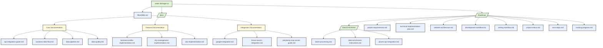

# Documentation Structure

```mermaid
graph TD
    %% Root
    Root[water-damage-ca] --> README.md
    Root --> Docs[/docs/]
    Root --> Roadmap[/Roadmap/]

    %% Docs Directory
    Docs --> CoreDocs[Core Documentation]
    Docs --> FeatureDocs[Feature Documentation]
    Docs --> IntegrationDocs[Integration Documentation]

    %% Core Documentation
    CoreDocs --> ApiGuide[api-integration-guide.md]
    CoreDocs --> DataFlow[business-data-flow.md]
    CoreDocs --> Pipeline[data-pipeline.md]
    CoreDocs --> Quality[data-quality.md]

    %% Feature Documentation
    FeatureDocs --> BusProfile[business-profile-implementation.md]
    FeatureDocs --> CityMgmt[city-management-implementation.md]
    FeatureDocs --> SeoImpl[seo-implementation.md]

    %% Integration Documentation
    IntegrationDocs --> GoogleInt[google-integration.md]
    IntegrationDocs --> BraveInt[brave-search-integration.md]
    IntegrationDocs --> PerplexityInt[perplexity-mcp-server-guide.md]

    %% Roadmap Directory
    Roadmap --> DataEnrich[/Data Enrichment/]
    Roadmap --> ProjReqs[project-requirements.md]
    Roadmap --> TechPlan[technical-implementation-plan.md]
    Roadmap --> WebArch[website-architecture.md]
    Roadmap --> DevFlow[development-workflow.md]
    Roadmap --> TestFlow[testing-workflow.md]
    Roadmap --> Status[project-status.md]
    Roadmap --> NextSteps[next-steps.md]
    Roadmap --> Progress[tracking-progress.md]

    %% Data Enrichment Directory
    DataEnrich --> BatchProc[batch-processing.md]
    DataEnrich --> EnrichInst[data-enrichment-instructions.md]
    DataEnrich --> PlacesApi[places-api-integration.md]

    %% Styling
    classDef default fill:#f9f9f9,stroke:#333,stroke-width:2px;
    classDef directory fill:#e1f3d8,stroke:#333,stroke-width:2px;
    classDef category fill:#fff7de,stroke:#333,stroke-width:2px;
    classDef file fill:#e8f0fe,stroke:#333,stroke-width:2px;
    
    class Root,Docs,Roadmap,DataEnrich directory;
    class CoreDocs,FeatureDocs,IntegrationDocs category;
    class README.md,ApiGuide,DataFlow,Pipeline,Quality,BusProfile,CityMgmt,SeoImpl,GoogleInt,BraveInt,PerplexityInt,ProjReqs,TechPlan,WebArch,DevFlow,TestFlow,Status,NextSteps,Progress,BatchProc,EnrichInst,PlacesApi file;
```
