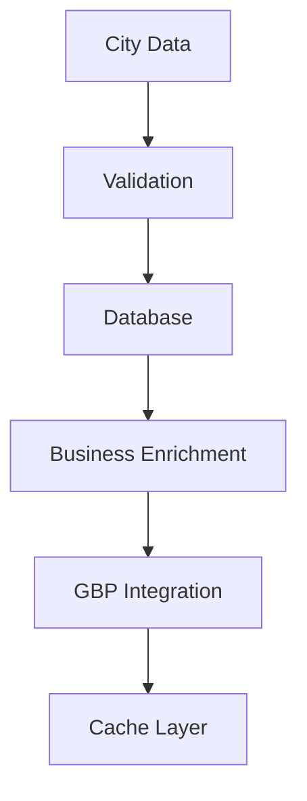

# Water Damage CA - Project Documentation

## 1. System Architecture

### Database Schema
- cities table (existing)
- businesses table (existing)

### Data Flow

## 2. Core Components

### Data Management
- Supabase Integration
- Google Places API
- Caching System

### Processing Systems
- [Batch Processing](./batch-processing.md)
- City Validation
- Business Enrichment

## 3. API Integration

### Google Places API
- Field Masks
- Cost Optimization
- Rate Limiting
- Response Caching

## 4. Testing Framework

### Test Scenarios
- City Processing
- Business Data Enrichment
- API Integration
- Cache Performance

### Monitoring
- API Usage
- Processing Time
- Cache Hit Rate
- Error Rates

## 5. Deployment Strategy

### Build Process
- Next.js Configuration
- ISR Implementation
- Cache Management

### Production Deployment
- Staging Environment
- Production Release
- Monitoring Setup

## 6. Maintenance

### Regular Tasks
- Cache Cleanup
- Data Validation
- Error Log Review

### Performance Optimization
- Query Optimization
- Cache Strategy
- API Usage Review
