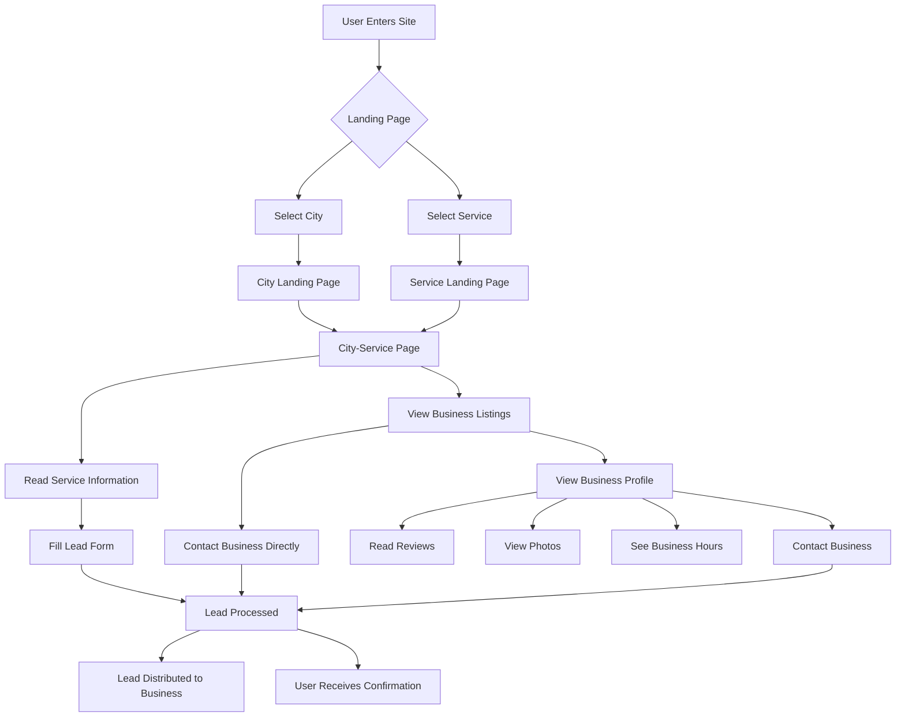
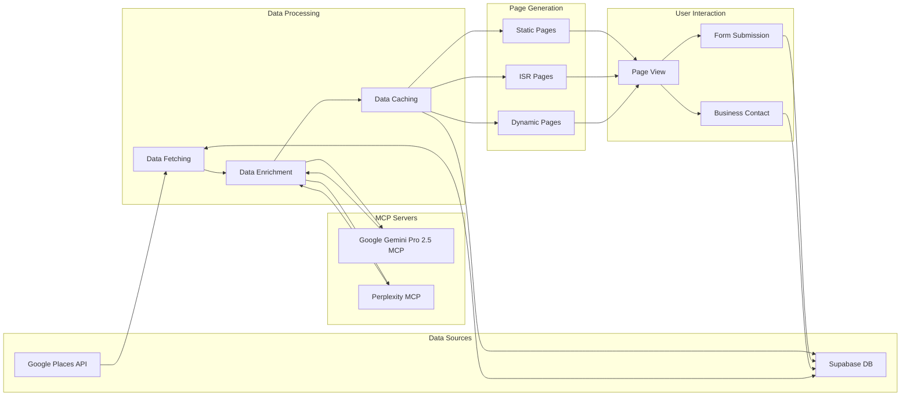
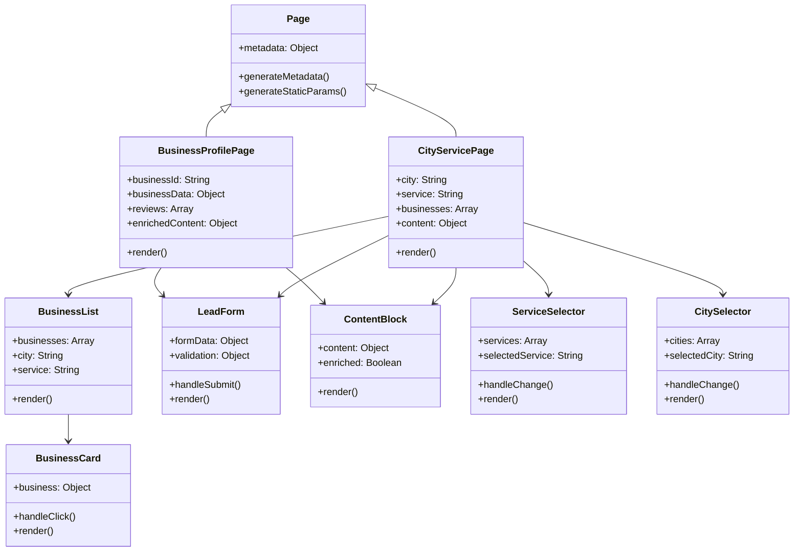
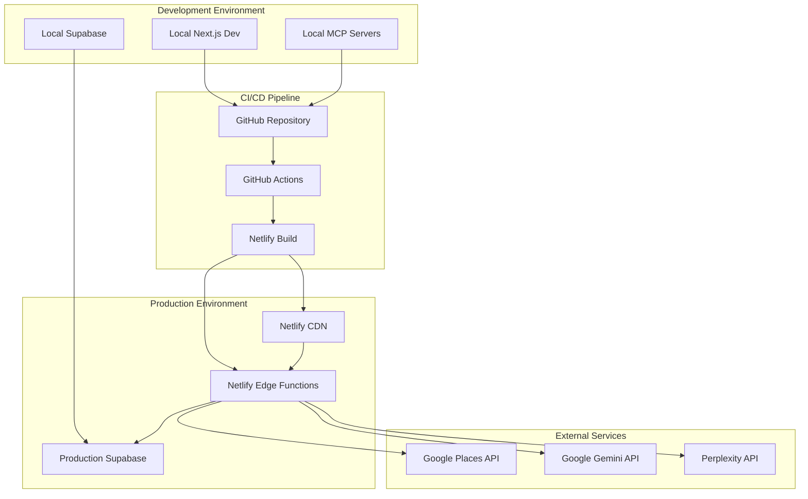

# Water Damage CA - Website Architecture & Flowchart

## System Architecture

```mermaid
graph TD
    subgraph "Frontend (Next.js)"
        A[Next.js App Router] --> B[Dynamic Routes]
        B --> C1[City-Service Pages]
        B --> C2[Business Profile Pages]
        B --> C3[Landing Pages]

        D[Components] --> D1[BusinessList]
        D --> D2[ServiceCards]
        D --> D3[CitySelector]
        D --> D4[LeadForm]
        D --> D5[ContentBlocks]
    end

    subgraph "Data Sources"
        F[Google Places API] --> F1[Business Listings]
        F --> F2[Reviews]
        F --> F3[Photos]

        G[Supabase Database] --> G1[User Data]
        G --> G2[Lead Data]
        G --> G3[Analytics]
        G --> G4[Cached API Data]
        G --> G5[Service Data]
        G --> G6[City Data]
        G --> G7[Content Templates]
    end

    subgraph "AI Content Enrichment"
        H[Google Gemini Pro 2.5 MCP] --> H1[Content Generation]
        H --> H2[FAQ Creation]
        H --> H3[Business Descriptions]

        I[Perplexity MCP Server] --> I1[Deep Research]
        I --> I2[Additional Business Info]
    end

    subgraph "Backend Services"
        J[API Routes] --> J1[/api/places]
        J --> J3[/api/supabase]
        J --> J4[/api/ai-enrichment]

        K[Serverless Functions] --> K1[Lead Processing]
        K --> K2[Data Enrichment]
        K --> K3[Scheduled Updates]
    end

    A --> J
    J --> F
    J --> G
    J --> H
    J --> I
    K --> F
    K --> G
    K --> H
    K --> I
```

## User Flow



## Data Flow



## Component Architecture



## Database Schema

```mermaid
erDiagram
    CITY {
        string id PK
        string name
        string state
        string slug
        float latitude
        float longitude
        int population
        string description
    }

    SERVICE {
        string id PK
        string name
        string slug
        string description
        string category
        boolean emergency
    }

    BUSINESS {
        string id PK
        string place_id
        string name
        string address
        string phone
        float rating
        int review_count
        string website
        json hours
        json photos
        timestamp last_updated
    }

    LEAD {
        string id PK
        string name
        string email
        string phone
        string message
        string city_id FK
        string service_id FK
        string business_id FK
        timestamp created_at
        string status
    }

    CONTENT {
        string id PK
        string city_id FK
        string service_id FK
        string title
        text content
        text enriched_content
        json meta
        timestamp last_updated
    }

    CITY_SERVICE {
        string city_id FK
        string service_id FK
        text custom_content
        json meta
    }

    CITY ||--o{ CITY_SERVICE : has
    SERVICE ||--o{ CITY_SERVICE : has
    CITY ||--o{ BUSINESS : located_in
    CITY ||--o{ LEAD : from
    SERVICE ||--o{ LEAD : for
    BUSINESS ||--o{ LEAD : to
    CITY ||--o{ CONTENT : about
    SERVICE ||--o{ CONTENT : about
```

## Deployment Architecture



This architecture document provides a comprehensive overview of the Water Damage CA website structure, data flow, component relationships, and deployment strategy. The diagrams illustrate how different parts of the system interact and how data flows through the application.
