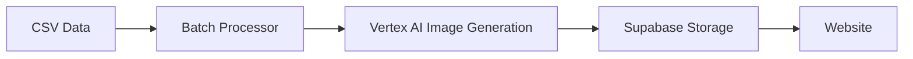

# Google Generative AI Integration

This documentation covers the integration of Google Generative AI services (Vertex AI) for image generation in the Windows Doors CA website project.

## Table of Contents

1. [Overview](#overview)
2. [Architecture](#architecture)
3. [Implementation](#implementation)
4. [Usage](#usage)
5. [Testing](#testing)
6. [Troubleshooting](#troubleshooting)
7. [References](#references)

## Overview

The Google Generative AI integration allows us to generate high-quality product images for the Windows Doors CA website using Google's Vertex AI Imagen service. This integration processes data from the Window World LA website, generates corresponding images, and stores them in Supabase for use in our website.

### Key Features

- Image generation using Vertex AI's `imagen-3.0-fast-generate-001` model
- Batch processing of CSV data
- Supabase Storage integration for image storage
- Error handling and logging
- Test scripts for verification

## Architecture

The integration follows this architecture:



### Components

1. **CSV Data Source**
   - Contains URLs, image types, and prompts from Window World LA website

2. **Batch Processor**
   - Reads CSV data
   - Manages processing in batches
   - Handles errors and retries

3. **Vertex AI Integration**
   - Connects to Google Cloud Vertex AI
   - Generates images using the Imagen model
   - Processes prompts and returns image data

4. **Supabase Storage**
   - Stores generated images
   - Provides public URLs for website use
   - Manages buckets and permissions

## Implementation

### Directory Structure

```bash
Supabase/
├── scripts/
│   ├── check-bucket.ts
│   ├── run-test-batch.ts
│   ├── run-test-batch.js
│   ├── simple-test-batch.js
│   ├── imagen-test-batch.js
│   ├── basic-imagen-test.js
│   └── test-supabase-connection.js
├── test-data/
│   ├── test-images.csv
│   └── generation-results.json
└── utils/
    ├── batch-image-generation.ts
    ├── image-generation.ts
    ├── storage.ts
    └── vertex-ai-client.ts
```

### Key Files

- **batch-image-generation.ts**: Handles batch processing of CSV data
- **image-generation.ts**: Provides utilities for generating images
- **storage.ts**: Manages Supabase Storage operations
- **vertex-ai-client.ts**: Initializes and manages Vertex AI client

## Usage

### Environment Setup

Required environment variables:

```env
# Supabase Credentials
NEXT_PUBLIC_SUPABASE_URL=your-supabase-url
NEXT_PUBLIC_SUPABASE_ANON_KEY=your-supabase-anon-key
SUPABASE_SERVICE_ROLE_KEY=your-supabase-service-role-key

# Google Generative AI SDK Environment Variables
GOOGLE_CLOUD_PROJECT=your-google-cloud-project
GOOGLE_CLOUD_LOCATION=your-google-cloud-location
GOOGLE_GENAI_USE_VERTEXAI=true
```

### Running the Test Batch

```bash
# Check if the Supabase bucket exists
node --experimental-modules Supabase/scripts/test-supabase-connection.js

# Run the test batch
node --experimental-modules Supabase/scripts/imagen-test-batch.js
```

## Testing

We've implemented several test scripts to verify different aspects of the integration:

1. **test-supabase-connection.js**: Tests Supabase Storage CRUD operations
2. **basic-imagen-test.js**: Tests basic image generation with Vertex AI
3. **imagen-test-batch.js**: Tests batch processing with 5 test entries

### Test Results

Initial testing revealed quota limitations with the Vertex AI API. A quota increase request has been submitted to resolve this issue.

## Troubleshooting

### Common Issues

1. **Quota Exceeded Error**
   - Error: `Quota exceeded for aiplatform.googleapis.com/generate`
   - Solution: Request a quota increase in the Google Cloud Console

2. **Supabase Permission Errors**
   - Error: `new row violates row-level security`
   - Solution: Use the service role key for admin operations

3. **Module Loading Errors**
   - Error: `require is not defined in ES module scope`
   - Solution: Use ES modules syntax consistently

## References

- [Vertex AI Documentation](https://cloud.google.com/vertex-ai/docs)
- [Imagen API Reference](https://cloud.google.com/vertex-ai/generative-ai/docs/model-reference/imagen-api)
- [Supabase Storage Documentation](https://supabase.com/docs/guides/storage)
- [Google Cloud Quotas](https://console.cloud.google.com/iam-admin/quotas)
