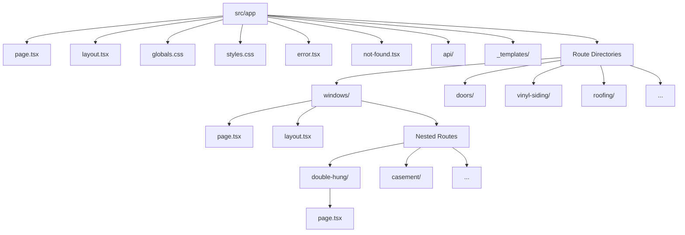
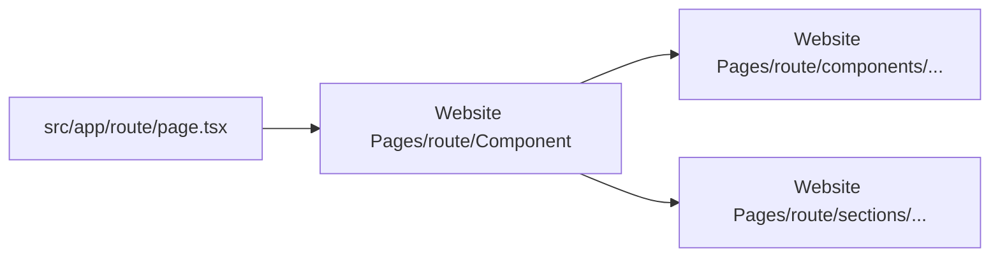

# App Router Structure

> **Breadcrumb Navigation**: [README.md](../../README.md) > [Documentation](../index.md) > [Architecture](./index.md) > App Router Structure

## Table of Contents

1. [Overview](#overview)
2. [App Router Basics](#app-router-basics)
3. [Directory Structure](#directory-structure)
4. [File Conventions](#file-conventions)
5. [Route Types](#route-types)
6. [Layouts and Templates](#layouts-and-templates)
7. [Data Fetching](#data-fetching)
8. [Integration with Website Pages](#integration-with-website-pages)
9. [Migration from Pages Router](#migration-from-pages-router)
10. [Best Practices](#best-practices)
11. [Common Patterns](#common-patterns)
12. [Related Documentation](#related-documentation)

## Overview

This document provides a comprehensive guide to the App Router structure in the Windows Doors CA website project. It explains how the Next.js App Router is implemented, the conventions used, and how it integrates with the rest of the project.

## App Router Basics

The Next.js App Router is a file-system based router built on React Server Components. It supports:

- Layouts that persist across routes
- Server Components for improved performance
- Streaming and Suspense for improved loading states
- Data fetching within components
- Dynamic and static routes

In our project, the App Router is located in the `Relume Work Dir/src/app` directory.

## Directory Structure

The App Router follows this directory structure:



### Current App Router Structure

```
src/app/
├── about/                  # About page
├── admin/                  # Admin pages
├── api/                    # API routes
├── casement/               # Casement windows page
├── contact/                # Contact page
├── debug/                  # Debug pages
├── doors/                  # Doors category page
├── double-hung/            # Double-hung windows page
├── faqs/                   # FAQs page
├── financing/              # Financing page
├── gallery/                # Gallery page
├── garden/                 # Garden windows page
├── hinged-patio-doors/     # Hinged patio doors page
├── migration-test/         # Migration test pages
├── roofing/                # Roofing category page
├── sample-page/            # Sample page
├── service-areas/          # Service areas page
├── service-areas-fresh/    # Alternative service areas page
├── service-areas-minimal/  # Minimal service areas page
├── test/                   # Test pages
├── test-page/              # Test page
├── vinyl-siding/           # Vinyl siding category page
├── warranty/               # Warranty page
├── window-style-finder/    # Window style finder page
├── windows/                # Windows category page
├── _templates/             # Page templates
├── error.tsx               # Error handling component
├── globals.css             # Global CSS
├── layout.tsx              # Root layout
├── not-found.tsx           # 404 page
├── page.tsx                # Home page
└── styles.css              # Custom styles
```

## File Conventions

The App Router uses specific file naming conventions:

| File | Purpose |
|------|---------|
| `page.tsx` | Defines a route and makes it publicly accessible |
| `layout.tsx` | Defines a shared layout for a segment and its children |
| `loading.tsx` | Creates a loading UI for a segment and its children |
| `error.tsx` | Creates an error UI for a segment and its children |
| `not-found.tsx` | Creates a UI for 404 errors |
| `route.ts` | Creates a Server API endpoint |
| `middleware.ts` | Defines middleware for routes |
| `global-error.tsx` | Creates a global error UI |

### Special Files

- **`page.tsx`**: Required to make a route publicly accessible
- **`layout.tsx`**: Wraps page or child segments in a shared UI
- **`template.tsx`**: Similar to layout but creates a new instance on navigation
- **`loading.tsx`**: Creates a loading state using React Suspense
- **`error.tsx`**: Creates an error state using React Error Boundary
- **`not-found.tsx`**: Rendered when a route can't be found

## Route Types

The App Router supports several types of routes:

### Static Routes

Standard routes with fixed paths:

```
src/app/windows/page.tsx → /windows
src/app/doors/page.tsx → /doors
```

### Dynamic Routes

Routes with parameters:

```
src/app/windows/[type]/page.tsx → /windows/double-hung, /windows/casement, etc.
```

### Catch-All Routes

Routes that capture all segments:

```
src/app/blog/[...slug]/page.tsx → /blog/2023/05/post-title
```

### Optional Catch-All Routes

Routes that capture all segments but also match the base path:

```
src/app/blog/[[...slug]]/page.tsx → /blog, /blog/2023/05/post-title
```

## Layouts and Templates

### Layouts

Layouts are shared UI that wraps page or child segments:

```tsx
// src/app/layout.tsx
export default function RootLayout({ children }) {
  return (
    <html lang="en">
      <body>
        <Header />
        <main>{children}</main>
        <Footer />
      </body>
    </html>
  );
}
```

### Nested Layouts

Layouts can be nested to create more complex UI structures:

```
src/app/layout.tsx → Applied to all routes
src/app/windows/layout.tsx → Applied to /windows and its child routes
src/app/windows/[type]/layout.tsx → Applied to specific window type routes
```

### Templates

Templates are similar to layouts but create a new instance on each navigation:

```tsx
// src/app/template.tsx
export default function Template({ children }) {
  return (
    <div className="template">
      {children}
    </div>
  );
}
```

## Data Fetching

The App Router supports several data fetching patterns:

### Server Components

```tsx
// src/app/windows/page.tsx
async function getWindows() {
  const res = await fetch('https://api.example.com/windows');
  return res.json();
}

export default async function WindowsPage() {
  const windows = await getWindows();
  return (
    <div>
      {windows.map((window) => (
        <WindowCard key={window.id} window={window} />
      ))}
    </div>
  );
}
```

### Client Components

```tsx
'use client';

import { useState, useEffect } from 'react';

export default function WindowsPage() {
  const [windows, setWindows] = useState([]);
  
  useEffect(() => {
    async function fetchWindows() {
      const res = await fetch('/api/windows');
      const data = await res.json();
      setWindows(data);
    }
    fetchWindows();
  }, []);
  
  return (
    <div>
      {windows.map((window) => (
        <WindowCard key={window.id} window={window} />
      ))}
    </div>
  );
}
```

## Integration with Website Pages

In our project, App Router pages typically import components from the Website Pages directory:

```tsx
// src/app/windows/page.tsx
import WindowsPage from '../../../Website Pages/windows/WindowsPage';

export default function Page() {
  return <WindowsPage />;
}
```

This pattern allows us to:

1. Use the App Router for routing and server-side features
2. Reuse existing components from the Website Pages directory
3. Gradually migrate from the Pages Router to the App Router

### Component Import Pattern



## Migration from Pages Router

We are in the process of migrating from the Pages Router to the App Router. The migration follows these steps:

1. Create a new App Router page in `src/app/[route]/page.tsx`
2. Import the corresponding component from `Website Pages/[route]/`
3. Test the new route to ensure it works correctly
4. Update internal links to point to the new route
5. Remove the old Pages Router page once all references are updated

### Migration Status

The migration status is tracked in the [App Router Migration Tracking](../migration/app-router-migration-tracking.md) document.

## Best Practices

1. **Route Organization**
   - Group related routes together
   - Use nested routes for hierarchical content
   - Keep route segments short and descriptive

2. **Component Structure**
   - Keep page components simple
   - Import complex UI from Website Pages
   - Use layouts for shared UI elements

3. **Data Fetching**
   - Use Server Components for data fetching when possible
   - Create API routes for client-side data fetching
   - Implement proper error handling and loading states

4. **Performance**
   - Use streaming and Suspense for improved loading states
   - Implement proper caching strategies
   - Optimize images and assets

## Common Patterns

### Page with Layout

```tsx
// src/app/windows/layout.tsx
export default function WindowsLayout({ children }) {
  return (
    <div className="windows-layout">
      <WindowsSidebar />
      <div className="windows-content">{children}</div>
    </div>
  );
}

// src/app/windows/page.tsx
import WindowsPage from '../../../Website Pages/windows/WindowsPage';

export default function Page() {
  return <WindowsPage />;
}
```

### Dynamic Route

```tsx
// src/app/windows/[type]/page.tsx
import WindowTypePage from '../../../../Website Pages/windows/WindowTypePage';

export default function Page({ params }) {
  return <WindowTypePage type={params.type} />;
}

export async function generateStaticParams() {
  return [
    { type: 'double-hung' },
    { type: 'casement' },
    { type: 'awning' },
    // ...
  ];
}
```

## Related Documentation

- [Unified Project Structure](./unified-project-structure.md)
- [File Placement Guide](./file-placement-guide.md)
- [App Router Migration Tracking](../migration/app-router-migration-tracking.md)
- [Next.js App Router Documentation](https://nextjs.org/docs/app)

Last Updated: May 28, 2025
