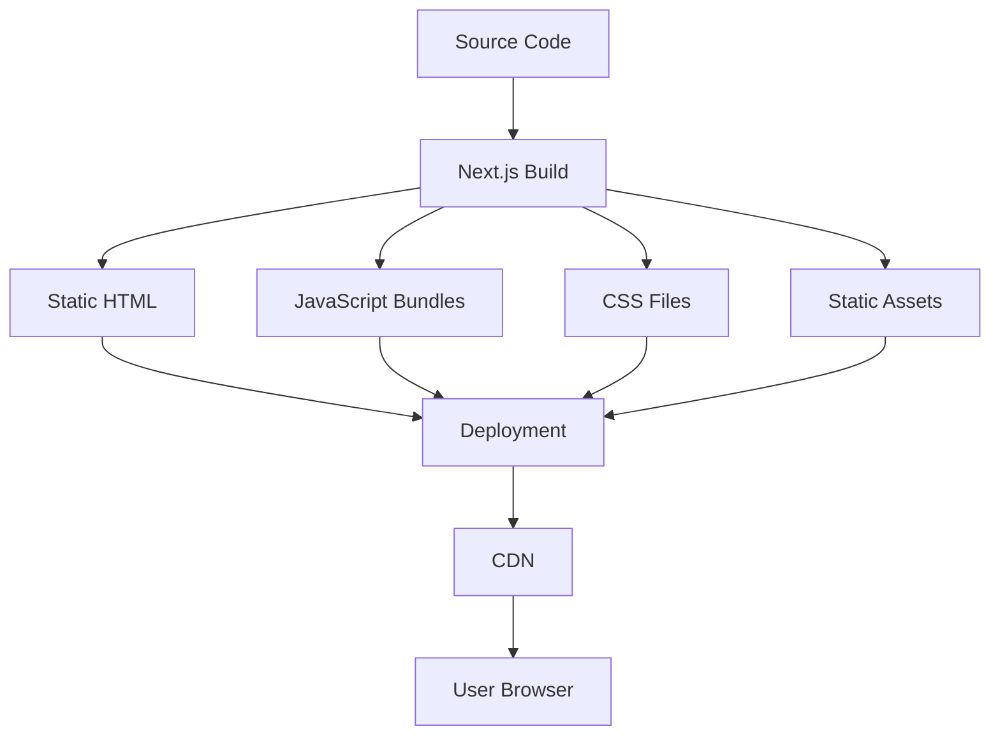
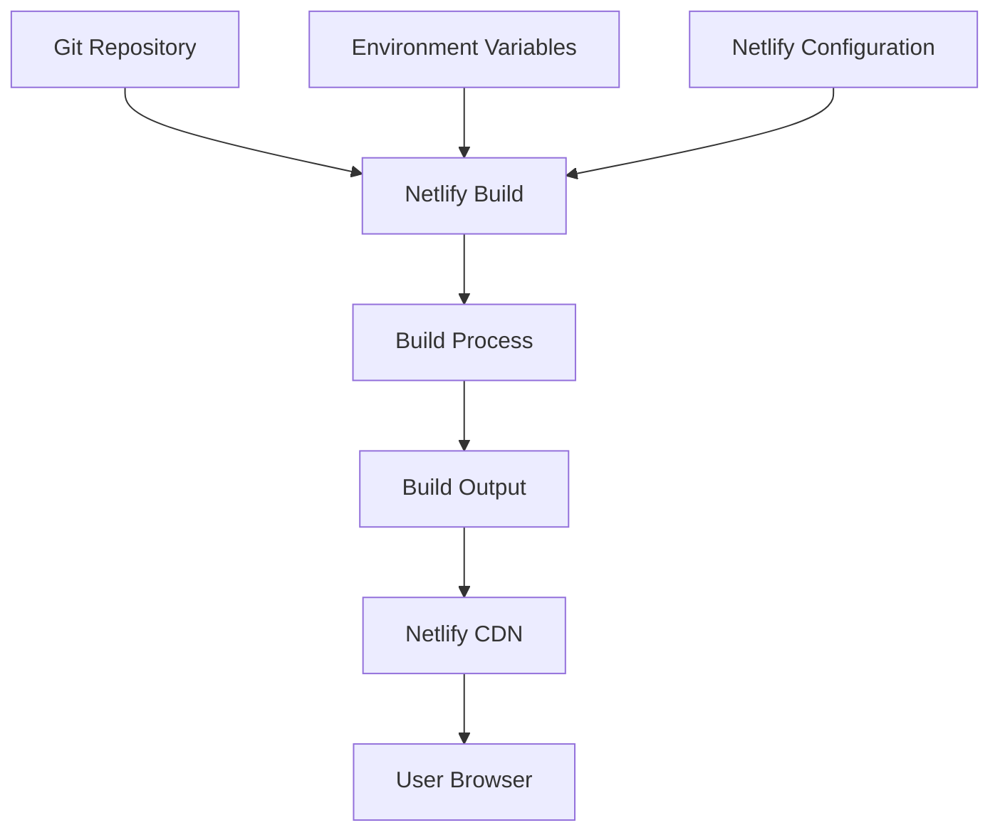
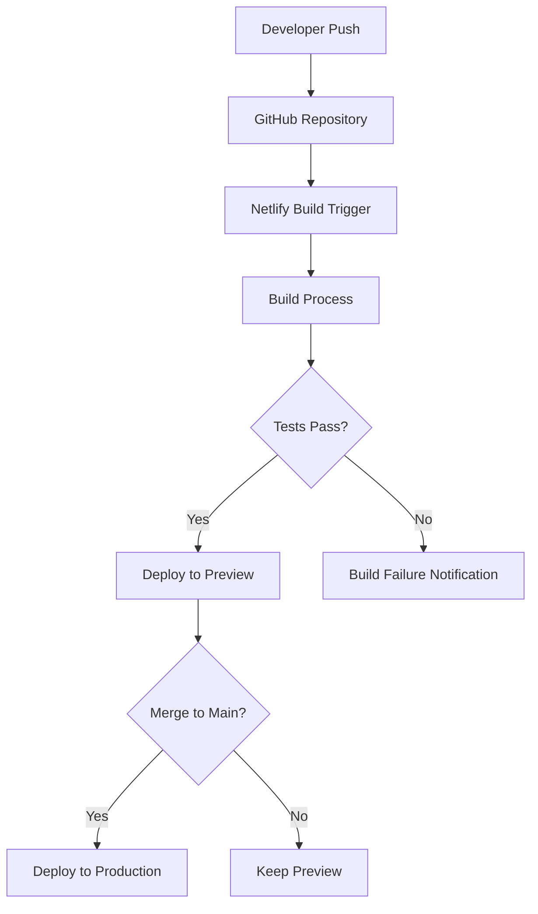

# Build and Deployment Structure

> **Breadcrumb Navigation**: [README.md](../../README.md) > [Documentation](../index.md) > [Architecture](./index.md) > Build and Deployment Structure

## Table of Contents

1. [Overview](#overview)
2. [Build Process](#build-process)
3. [Build Configuration](#build-configuration)
4. [Build Output](#build-output)
5. [Deployment Process](#deployment-process)
6. [Environment Configuration](#environment-configuration)
7. [Continuous Integration](#continuous-integration)
8. [Monitoring and Logging](#monitoring-and-logging)
9. [Troubleshooting](#troubleshooting)
10. [Related Documentation](#related-documentation)

## Overview

This document explains how the Windows Doors CA website project structure relates to the build and deployment process. It covers the build configuration, output structure, deployment process, and environment configuration to help developers understand how the project is built and deployed.

## Build Process

The project uses Next.js for building the application. The build process transforms the source code into optimized assets for production deployment.

### Build Workflow



### Build Steps

1. **Code Preparation**
   - TypeScript compilation
   - ESLint validation
   - Type checking

2. **Asset Optimization**
   - JavaScript bundling and minification
   - CSS processing with PostCSS and Tailwind
   - Image optimization

3. **Static Generation**
   - Pre-rendering of pages
   - Generation of static HTML
   - Creation of JSON data files for dynamic routes

4. **Output Generation**
   - Creation of the `.next` directory with build artifacts
   - Organization of assets for deployment

## Build Configuration

The build process is configured through several files:

### 1. Next.js Configuration (`next.config.js`)

```javascript
/** @type {import('next').NextConfig} */
const nextConfig = {
  reactStrictMode: true,
  images: {
    domains: ['images.unsplash.com', 'windowsdoorsca.com'],
  },
  experimental: {
    appDir: true,
  },
  // ISR with 6-month cache
  revalidate: 86400,
};

module.exports = nextConfig;
```

Key configuration options:
- `reactStrictMode`: Enables React's strict mode for development
- `images`: Configures image optimization and allowed domains
- `experimental.appDir`: Enables the App Router
- `revalidate`: Sets the revalidation period for ISR (Incremental Static Regeneration)

### 2. TypeScript Configuration (`tsconfig.json`)

```json
{
  "compilerOptions": {
    "target": "es5",
    "lib": ["dom", "dom.iterable", "esnext"],
    "allowJs": true,
    "skipLibCheck": true,
    "strict": true,
    "forceConsistentCasingInFileNames": true,
    "noEmit": true,
    "esModuleInterop": true,
    "module": "esnext",
    "moduleResolution": "node",
    "resolveJsonModule": true,
    "isolatedModules": true,
    "jsx": "preserve",
    "incremental": true,
    "plugins": [
      {
        "name": "next"
      }
    ],
    "paths": {
      "@/*": ["./src/*"]
    }
  },
  "include": ["next-env.d.ts", "**/*.ts", "**/*.tsx", ".next/types/**/*.ts"],
  "exclude": ["node_modules"]
}
```

Key configuration options:
- `paths`: Configures path aliases for imports
- `include`: Specifies files to include in compilation
- `exclude`: Specifies files to exclude from compilation

### 3. PostCSS Configuration (`postcss.config.js`)

```javascript
module.exports = {
  plugins: {
    tailwindcss: {},
    autoprefixer: {},
  },
};
```

### 4. Tailwind CSS Configuration (`tailwind.config.js`)

```javascript
/** @type {import('tailwindcss').Config} */
module.exports = {
  content: [
    './src/pages/**/*.{js,ts,jsx,tsx,mdx}',
    './src/components/**/*.{js,ts,jsx,tsx,mdx}',
    './src/app/**/*.{js,ts,jsx,tsx,mdx}',
    './Website Pages/**/*.{js,ts,jsx,tsx,mdx}',
  ],
  theme: {
    extend: {
      colors: {
        primary: '#0066cc',
        secondary: '#f0f0f0',
        // ...
      },
      // ...
    },
  },
  plugins: [
    require('@relume_io/relume-tailwind'),
    // ...
  ],
};
```

Key configuration options:
- `content`: Specifies files to scan for CSS classes
- `theme`: Configures the theme including colors, spacing, etc.
- `plugins`: Includes Tailwind plugins, including Relume Tailwind

### 5. ESLint Configuration (`.eslintrc.json`)

```json
{
  "extends": "next/core-web-vitals",
  "rules": {
    // Custom rules
  }
}
```

## Build Output

The build process generates output in the `.next` directory:

```
.next/
├── cache/                  # Build cache
├── server/                 # Server-side code
│   ├── app/                # App Router pages
│   ├── chunks/             # Code chunks
│   ├── pages/              # Pages Router pages (legacy)
│   └── ...
├── static/                 # Static assets
│   ├── chunks/             # JavaScript chunks
│   ├── css/                # CSS files
│   ├── images/             # Optimized images
│   ├── media/              # Media files
│   └── ...
├── types/                  # TypeScript types
└── ...
```

### Key Output Files

1. **HTML Files**
   - Pre-rendered HTML for static pages
   - HTML shells for dynamic pages

2. **JavaScript Bundles**
   - Client-side JavaScript bundles
   - Server-side JavaScript bundles
   - Shared chunks for code splitting

3. **CSS Files**
   - Processed and minified CSS files
   - CSS modules

4. **Static Assets**
   - Optimized images
   - Fonts
   - Other static files

## Deployment Process

The project is deployed using Netlify:

### Deployment Workflow



### Netlify Configuration (`netlify.toml`)

```toml
[build]
  command = "npm run build"
  publish = ".next"

[build.environment]
  NODE_VERSION = "18.17.0"
  NPM_VERSION = "9.6.7"

[[redirects]]
  from = "/*"
  to = "/index.html"
  status = 200
```

Key configuration options:
- `build.command`: Specifies the build command
- `build.publish`: Specifies the directory to publish
- `build.environment`: Sets environment variables for the build
- `redirects`: Configures URL redirects

## Environment Configuration

The project uses environment variables for configuration:

### Environment Files

- `.env`: Default environment variables
- `.env.local`: Local environment variables (not committed to Git)
- `.env.development`: Development environment variables
- `.env.production`: Production environment variables

### Key Environment Variables

```
# Next.js
NEXT_PUBLIC_SITE_URL=https://windowsdoorsca.com

# Supabase
NEXT_PUBLIC_SUPABASE_URL=https://your-supabase-url.supabase.co
NEXT_PUBLIC_SUPABASE_ANON_KEY=your-supabase-anon-key

# Google Services
NEXT_PUBLIC_GOOGLE_MAPS_API_KEY=your-google-maps-api-key
GOOGLE_CLOUD_PROJECT_ID=your-google-cloud-project-id
GOOGLE_CLOUD_LOCATION=your-google-cloud-location

# Analytics
NEXT_PUBLIC_GA_MEASUREMENT_ID=your-ga-measurement-id
```

### Environment Variable Usage

Environment variables are accessed in the code using:

```javascript
// Server-side
const apiKey = process.env.API_KEY;

// Client-side (must be prefixed with NEXT_PUBLIC_)
const siteUrl = process.env.NEXT_PUBLIC_SITE_URL;
```

## Continuous Integration

The project uses Netlify for continuous integration:

### CI/CD Pipeline



### Build Hooks

Netlify build hooks can be used to trigger builds:

```
https://api.netlify.com/build_hooks/your-build-hook-id
```

## Monitoring and Logging

The project uses several tools for monitoring and logging:

### 1. Netlify Analytics

- Page views
- Top pages
- Referrers
- Error rates

### 2. Google Analytics

- User behavior
- Conversion tracking
- Event tracking

### 3. Error Tracking

- Next.js error logging
- Custom error boundaries

## Troubleshooting

### Common Build Issues

1. **TypeScript Errors**
   - Check for type errors in the code
   - Ensure all required types are defined

2. **Missing Dependencies**
   - Ensure all dependencies are installed
   - Check for version conflicts

3. **Environment Variable Issues**
   - Verify environment variables are set correctly
   - Check for missing environment variables

4. **Build Configuration Issues**
   - Check Next.js configuration
   - Verify Netlify configuration

### Deployment Issues

1. **Failed Builds**
   - Check build logs for errors
   - Verify build command is correct

2. **Missing Assets**
   - Ensure all assets are included in the build
   - Check for path issues

3. **Routing Issues**
   - Verify redirects are configured correctly
   - Check for 404 errors

## Related Documentation

- [Unified Project Structure](./unified-project-structure.md)
- [App Router Structure](./app-router-structure.md)
- [File Placement Guide](./file-placement-guide.md)
- [Component Organization](./component-organization.md)
- [Project Map](./project-map.md)

Last Updated: May 28, 2025
