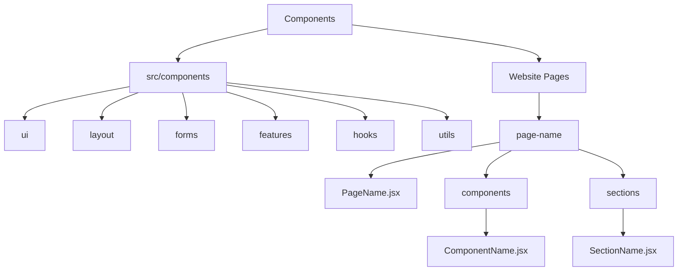
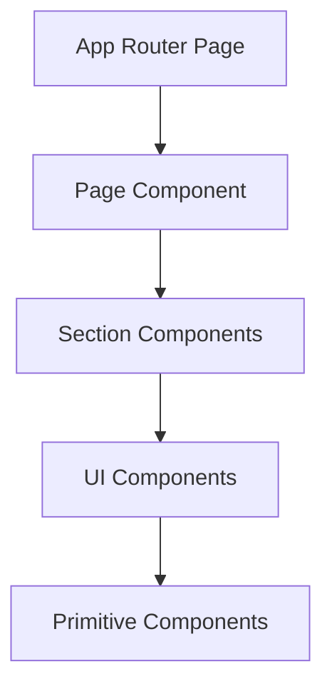

# Component Organization

> **Breadcrumb Navigation**: [README.md](../../README.md) > [Documentation](../index.md) > [Architecture](./index.md) > Component Organization

## Table of Contents

1. [Overview](#overview)
2. [Component Types](#component-types)
3. [Component Directory Structure](#component-directory-structure)
4. [Naming Conventions](#naming-conventions)
5. [Component Hierarchy](#component-hierarchy)
6. [Component Composition](#component-composition)
7. [State Management](#state-management)
8. [Component Documentation](#component-documentation)
9. [Best Practices](#best-practices)
10. [Related Documentation](#related-documentation)

## Overview

This document outlines how components should be organized within the Windows Doors CA website project. It provides guidelines for component types, directory structure, naming conventions, and best practices to ensure consistency and maintainability across the project.

## Component Types

Components in the project are categorized into several types based on their purpose and scope:

### 1. Page Components

- **Purpose**: Represent entire pages in the application
- **Location**: `Website Pages/[page-name]/[PageName].jsx`
- **Characteristics**: 
  - Imported by App Router pages
  - Compose multiple section components
  - Handle page-level state and data fetching

### 2. Section Components

- **Purpose**: Represent major sections of a page
- **Location**: `Website Pages/[page-name]/sections/[SectionName].jsx`
- **Characteristics**:
  - Composed of multiple UI components
  - Represent logical sections of a page (hero, features, testimonials, etc.)
  - May handle section-specific state

### 3. UI Components

- **Purpose**: Reusable UI elements used across the application
- **Location**: `src/components/ui/[ComponentName].tsx`
- **Characteristics**:
  - Highly reusable
  - Focused on presentation
  - Minimal business logic
  - Examples: Button, Card, Input, Modal

### 4. Layout Components

- **Purpose**: Define the structure and layout of pages
- **Location**: `src/components/layout/[ComponentName].tsx`
- **Characteristics**:
  - Define page structure
  - Handle responsive layout
  - Examples: Header, Footer, Sidebar, Container

### 5. Form Components

- **Purpose**: Handle form inputs and validation
- **Location**: `src/components/forms/[ComponentName].tsx`
- **Characteristics**:
  - Handle form state
  - Validate inputs
  - Submit form data
  - Examples: ContactForm, RequestEstimateForm

### 6. Feature Components

- **Purpose**: Implement specific features
- **Location**: `src/components/features/[ComponentName].tsx`
- **Characteristics**:
  - Implement specific business features
  - May contain complex logic
  - Examples: ProductFilter, GalleryViewer

### 7. Page-Specific Components

- **Purpose**: Components used only on specific pages
- **Location**: `Website Pages/[page-name]/components/[ComponentName].jsx`
- **Characteristics**:
  - Used only on a specific page
  - Not intended for reuse
  - May have page-specific logic

## Component Directory Structure

The project follows this component directory structure:



### Shared Components

```
src/components/
├── ui/                        # UI components
│   ├── Button.tsx
│   ├── Card.tsx
│   ├── Input.tsx
│   └── ...
├── layout/                    # Layout components
│   ├── Header.tsx
│   ├── Footer.tsx
│   ├── Container.tsx
│   └── ...
├── forms/                     # Form components
│   ├── ContactForm.tsx
│   ├── RequestEstimateForm.tsx
│   └── ...
├── features/                  # Feature components
│   ├── ProductFilter.tsx
│   ├── GalleryViewer.tsx
│   └── ...
└── [domain]/                  # Domain-specific components
    ├── windows/
    ├── doors/
    └── ...
```

### Page-Specific Components

```
Website Pages/
├── windows/                   # Windows page
│   ├── WindowsPage.jsx        # Main page component
│   ├── components/            # Page-specific components
│   │   ├── WindowTypeCard.jsx
│   │   └── ...
│   └── sections/              # Page sections
│       ├── HeroSection.jsx
│       ├── FeaturesSection.jsx
│       └── ...
├── doors/                     # Doors page
│   ├── DoorsPage.jsx
│   ├── components/
│   └── sections/
└── ...
```

## Naming Conventions

### Component Files

- **PascalCase**: All component files should use PascalCase
  - Examples: `Button.tsx`, `ProductCard.tsx`, `HeroSection.jsx`

- **Descriptive Names**: Names should clearly describe the component's purpose
  - Good: `ProductDetailCard.tsx`
  - Bad: `Card.tsx` (too generic)

- **Suffix Conventions**:
  - `Page` suffix for page components: `WindowsPage.jsx`
  - `Section` suffix for section components: `HeroSection.jsx`
  - `Form` suffix for form components: `ContactForm.tsx`

### Component Directories

- **kebab-case**: Directory names should use kebab-case
  - Examples: `website-pages`, `product-cards`

- **Descriptive Names**: Directory names should clearly describe their contents
  - Good: `form-controls`
  - Bad: `utils` (too generic)

## Component Hierarchy

Components should follow a clear hierarchy:



1. **App Router Pages**: `src/app/[route]/page.tsx`
   - Import page components from Website Pages
   - Handle routing and server-side operations

2. **Page Components**: `Website Pages/[page-name]/[PageName].jsx`
   - Compose section components
   - Handle page-level state and data fetching

3. **Section Components**: `Website Pages/[page-name]/sections/[SectionName].jsx`
   - Compose UI components
   - Handle section-specific logic

4. **UI Components**: `src/components/ui/[ComponentName].tsx`
   - Reusable UI elements
   - Compose primitive components

5. **Primitive Components**: Basic HTML elements or simple components
   - Buttons, inputs, text elements, etc.

## Component Composition

Components should be composed using these patterns:

### 1. Composition over Inheritance

- Prefer component composition over inheritance
- Use children props to create flexible components
- Example:

```tsx
// Card component that accepts children
function Card({ children, className }) {
  return (
    <div className={`card ${className}`}>
      {children}
    </div>
  );
}

// Usage
<Card className="product-card">
  <CardHeader>Product Title</CardHeader>
  <CardBody>Product Description</CardBody>
  <CardFooter>
    <Button>Add to Cart</Button>
  </CardFooter>
</Card>
```

### 2. Component Props

- Use props to make components configurable
- Provide sensible defaults
- Use TypeScript for prop type definitions
- Example:

```tsx
interface ButtonProps {
  variant?: 'primary' | 'secondary' | 'tertiary';
  size?: 'small' | 'medium' | 'large';
  disabled?: boolean;
  onClick?: () => void;
  children: React.ReactNode;
}

function Button({
  variant = 'primary',
  size = 'medium',
  disabled = false,
  onClick,
  children
}: ButtonProps) {
  // Component implementation
}
```

### 3. Render Props

- Use render props for components that need to share logic
- Example:

```tsx
function WindowList({ renderItem }) {
  const windows = useWindows();
  
  return (
    <div className="window-list">
      {windows.map(window => renderItem(window))}
    </div>
  );
}

// Usage
<WindowList
  renderItem={window => (
    <WindowCard
      key={window.id}
      title={window.title}
      image={window.image}
    />
  )}
/>
```

## State Management

### Local Component State

- Use React's `useState` for component-specific state
- Keep state as close as possible to where it's used

### Context API

- Use React's Context API for state that needs to be shared between components
- Create context providers for specific domains (e.g., `ProductContext`, `AuthContext`)

### Form State

- Use form libraries like Formik or React Hook Form for complex forms
- Handle form validation at the form component level

## Component Documentation

Each component should include:

### 1. JSDoc Comments

```tsx
/**
 * Button component with various styles and sizes.
 *
 * @param {Object} props - Component props
 * @param {'primary' | 'secondary' | 'tertiary'} [props.variant='primary'] - Button variant
 * @param {'small' | 'medium' | 'large'} [props.size='medium'] - Button size
 * @param {boolean} [props.disabled=false] - Whether the button is disabled
 * @param {Function} [props.onClick] - Click handler
 * @param {React.ReactNode} props.children - Button content
 * @returns {JSX.Element} Button component
 */
```

### 2. TypeScript Types

```tsx
interface ButtonProps {
  variant?: 'primary' | 'secondary' | 'tertiary';
  size?: 'small' | 'medium' | 'large';
  disabled?: boolean;
  onClick?: () => void;
  children: React.ReactNode;
}
```

### 3. Usage Examples

```tsx
// Example usage in comments
/**
 * @example
 * <Button variant="primary" size="large" onClick={handleClick}>
 *   Click Me
 * </Button>
 */
```

## Best Practices

### 1. Component Size

- Keep components small and focused on a single responsibility
- Split large components into smaller, more manageable pieces
- Aim for less than 200 lines of code per component

### 2. Component Reusability

- Design components to be reusable when appropriate
- Avoid hardcoding values that could be passed as props
- Use composition to create flexible components

### 3. Performance Considerations

- Use React.memo for pure components that render often
- Avoid unnecessary re-renders by using useMemo and useCallback
- Implement virtualization for long lists

### 4. Accessibility

- Ensure all components are accessible
- Use semantic HTML elements
- Include proper ARIA attributes
- Ensure keyboard navigation works

### 5. Testing

- Write tests for all components
- Test component rendering, props, and interactions
- Use React Testing Library for component tests

## Related Documentation

- [Unified Project Structure](./unified-project-structure.md)
- [App Router Structure](./app-router-structure.md)
- [File Placement Guide](./file-placement-guide.md)
- [Directory Structure Policy](./directory-structure-policy.md)

Last Updated: May 28, 2025
