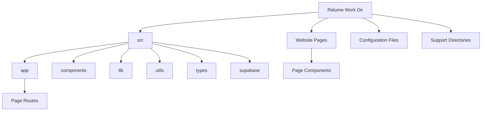

# Directory Structure Policy

**Priority Level: 1 (Critical)**

> **Breadcrumb Navigation**: [README.md](../../README.md) > [Documentation](../index.md) > [Architecture](./index.md) > Directory Structure Policy

## Table of Contents

1. [Overview](#overview)
2. [Core Policy](#core-policy)
3. [Main Working Directory](#main-working-directory)
4. [Root Directory Structure](#root-directory-structure)
5. [Implementation](#implementation)
6. [File Placement Guidelines](#file-placement-guidelines)
7. [Enforcement](#enforcement)
8. [Related Documentation](#related-documentation)

## Overview

This document establishes the official policy for directory structure in the Windows Doors CA website project. It provides clear guidelines on where files should be located and how the project structure should be maintained.

## Core Policy

**ALL files related to the website implementation MUST be located within the Relume Work Dir directory.**

This is a strict requirement with no exceptions unless explicitly authorized by the project lead. No development files should exist outside the Relume Work Dir directory.

## Main Working Directory

The Relume Work Dir directory is the primary working directory for the project. It contains all the code, assets, and configuration files needed for the website.



### Main Directory Structure

```
Relume Work Dir/
├── src/                     # Source code
│   ├── app/                 # Next.js App Router
│   │   ├── [routes]/        # Route directories
│   │   ├── api/             # API routes
│   │   ├── globals.css      # Global CSS
│   │   ├── styles.css       # Custom styles
│   │   ├── layout.tsx       # Root layout
│   │   └── page.tsx         # Home page
│   ├── components/          # Shared components
│   ├── lib/                 # Library code
│   ├── supabase/            # Supabase integration
│   ├── types/               # TypeScript types
│   └── utils/               # Utility functions
├── Website Pages/           # Page-specific components
├── public/                  # Static assets
├── styles/                  # Global styles
├── [Configuration Files]    # Various configuration files
└── [Support Directories]    # Various support directories
```

## Root Directory Structure

### Root Directory (`react-win-dir/`)

The root directory should contain **only** the following:

1. **Git-related files**: Files necessary for Git version control
   - `.gitignore`
   - `.git/` (directory)

2. **Project configuration files**: Essential configuration files that must be at the root level
   - `.windsurfrules`
   - `tsconfig.json`
   - `update-import-paths.ps1`

3. **Primary documentation**: Main README file that provides an overview of the project
   - `README.md`

4. **Special directories**: Directories that must remain at the root level
   - `.netlify/` - Netlify configuration
   - `backup-before-removal/` - Backup files (temporary)
   - `Content Engine/` - Content engine related files
   - `Docs/` - Project documentation
   - `Export Documentation/` - Export-related documentation
   - `IDE Instructions/` - IDE-specific instructions
   - `Relume Work Dir/` - Main working directory containing all project code
   - `Relume-DO-NOT-EDIT/` - Original Relume files that should never be modified
   - `Sample Images/` - Sample images for the project
   - `Scripts/` - Utility scripts
   - `Web Dev Progress/` - Tracking progress for web development

### Relume Work Dir Directory (`react-win-dir/Relume Work Dir/`)

The Relume Work Dir directory is the **main working directory** and should contain:

1. **Source Code Organization**:
   - `src/` - Source code directory
     - `app/` - Next.js App Router pages
     - `components/` - Shared React components
     - `lib/` - Library code
     - `supabase/` - Supabase integration
     - `types/` - TypeScript types
     - `utils/` - Utility functions

2. **Website Pages**: Page-specific components
   - `Website Pages/` - Contains components for specific pages
     - `[page-name]/` - Directory for each page
       - `components/` - Components specific to the page
       - `sections/` - Page sections

3. **Configuration files**: Project configuration files
   - `.eslintrc.json` - ESLint configuration
   - `next.config.js` - Next.js configuration
   - `postcss.config.js` - PostCSS configuration
   - `tailwind.config.js` - Tailwind CSS configuration
   - `tsconfig.json` - TypeScript configuration
   - `package.json` - Project dependencies
   - `yarn.lock` - Yarn lock file

4. **Support Directories**:
   - `.next/` - Next.js build directory
   - `config/` - Configuration files
   - `docs/` - Internal documentation
   - `docs-assets/` - Documentation assets
   - `env-files/` - Environment files
   - `hooks/` - React hooks
   - `misc/` - Miscellaneous files
   - `node_modules/` - Node.js dependencies
   - `Output/` - Output files
   - `public/` - Public assets
   - `scripts/` - Scripts
   - `Service accounts/` - Service account key files
   - `styles/` - Global styles
   - `Supabase/` - Supabase integration
   - `Test Pages/` - Test pages
   - `Vertex AI Tests/` - Vertex AI test files

Any exceptions to this structure must be explicitly approved by the project lead and documented.

## Implementation

To implement this policy:

1. All new files must be created within the Relume Work Dir directory in the appropriate subdirectory.
2. Any existing files outside the Relume Work Dir directory should be moved into it or deleted, except for the authorized files and directories in the root.
3. Follow the [File Placement Guide](./file-placement-guide.md) to determine where to place new files.
4. Use the App Router for all new pages, following the structure in `src/app/`.
5. Place page-specific components in the `Website Pages/` directory.
6. If a file must exist outside the Relume Work Dir directory for technical reasons, this exception must be documented.

## File Placement Guidelines

### App Router Pages

All App Router pages should follow this structure:

```
src/app/
├── [route]/
│   ├── page.tsx       # Page component
│   ├── layout.tsx     # (Optional) Layout component
│   ├── loading.tsx    # (Optional) Loading component
│   └── error.tsx      # (Optional) Error component
```

### Website Pages Components

Page-specific components should follow this structure:

```
Website Pages/
├── [page-name]/
│   ├── [PageName].jsx           # Main page component
│   ├── components/              # Page-specific components
│   │   └── [ComponentName].jsx
│   └── sections/                # Page sections
│       └── [SectionName].jsx
```

### Shared Components

Shared components should be placed in the `src/components/` directory:

```
src/components/
├── ui/                # UI components (buttons, inputs, etc.)
├── layout/            # Layout components (headers, footers, etc.)
├── forms/             # Form components
└── [domain]/          # Domain-specific components
```

### API Routes

API routes should be placed in the `src/app/api/` directory:

```
src/app/api/
├── [endpoint]/
│   └── route.ts       # API route handler
```

### Configuration Files

Configuration files should be placed in the Relume Work Dir directory:

- `.eslintrc.json` - ESLint configuration
- `next.config.js` - Next.js configuration
- `postcss.config.js` - PostCSS configuration
- `tailwind.config.js` - Tailwind CSS configuration
- `tsconfig.json` - TypeScript configuration
- `package.json` - Project dependencies

### Environment Files

Environment files should be placed in the `env-files/` directory:

- `.env` - Environment variables
- `.env.example` - Example environment variables
- `.env.local` - Local environment variables
- `.env.local.example` - Example local environment variables

### Service Account Files

Service account files should be placed in the `Service accounts/` directory:

- `service-account-key.json` - Service account key
- `vertex-ai-imagen-service-account-key.json` - Vertex AI service account key

## Enforcement

This policy is enforced through:

1. **Code Reviews**: All pull requests will be checked for compliance with this policy.
2. **Documentation**: All documentation must reflect this policy.
3. **Onboarding**: All new developers must be made aware of this policy.
4. **Regular Audits**: The project structure will be audited regularly to ensure compliance.
5. **File Placement Guide**: The [File Placement Guide](./file-placement-guide.md) provides a decision tree to help developers determine where to place new files.
6. **Automated Checks**: Import path checks and linting rules help enforce the policy.

## Related Documentation

- [Unified Project Structure](./unified-project-structure.md)
- [App Router Structure](./app-router-structure.md)
- [File Placement Guide](./file-placement-guide.md)
- [Project Structure Audit](./project-structure-audit.md)
- [Component Organization](./component-organization.md)
- [Getting Started for New Developers](../onboarding/getting-started-for-new-developers.md)

Last Updated: May 28, 2025 (Updated to reflect actual project structure and added file placement guidelines)
