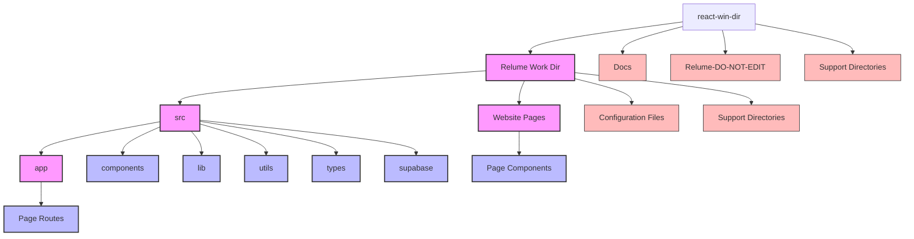
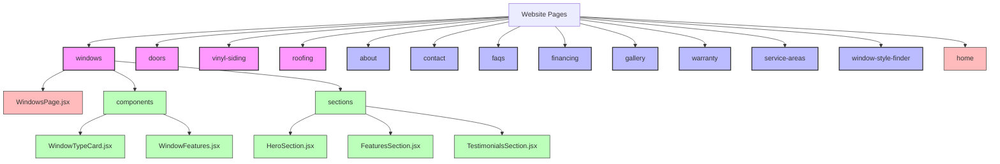
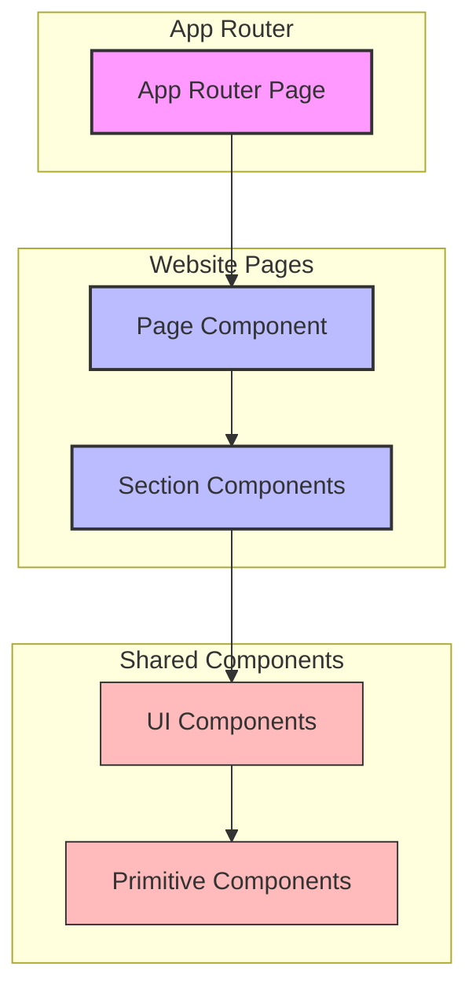
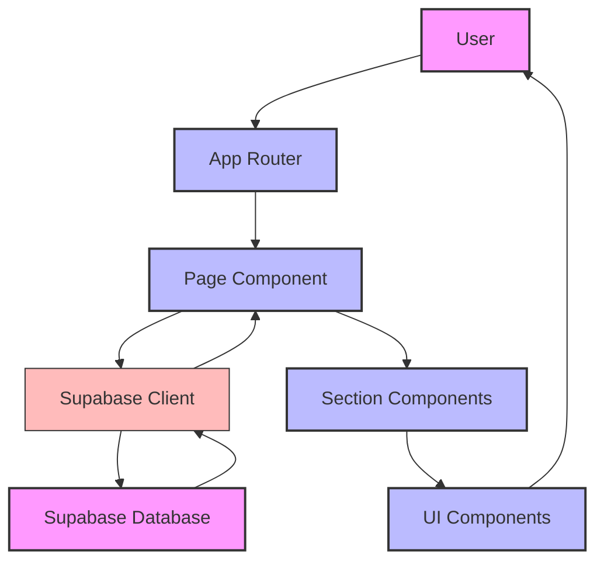
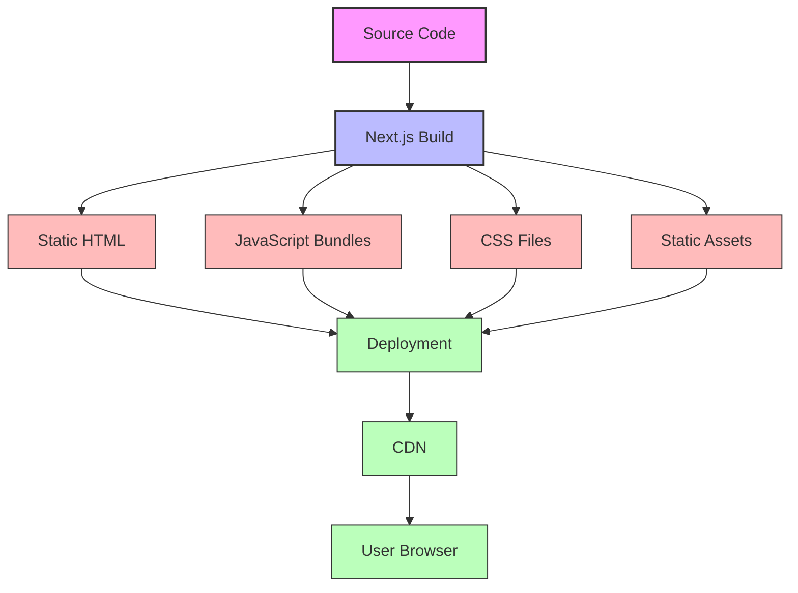

# Project Map

> **Breadcrumb Navigation**: [README.md](../../README.md) > [Documentation](../index.md) > [Architecture](./index.md) > Project Map

## Table of Contents

1. [Overview](#overview)
2. [High-Level Project Structure](#high-level-project-structure)
3. [Root Directory Map](#root-directory-map)
4. [Main Working Directory Map](#main-working-directory-map)
5. [Source Code Map](#source-code-map)
6. [App Router Map](#app-router-map)
7. [Website Pages Map](#website-pages-map)
8. [Component Relationships](#component-relationships)
9. [Data Flow](#data-flow)
10. [Build Process](#build-process)
11. [Related Documentation](#related-documentation)

## Overview

This document provides a comprehensive visual map of the Windows Doors CA website project structure. It uses Mermaid diagrams to visualize the relationships between different parts of the codebase, helping developers understand the overall architecture and navigate the project more effectively.

## High-Level Project Structure

The project is organized into several key areas:

## Root Directory Map

The root directory contains the main working directory and support directories:

```mermaid
flowchart TD
    A[react-win-dir] --> B[Relume Work Dir]
    A --> C[Docs]
    A --> D[Relume-DO-NOT-EDIT]
    A --> E[Content Engine]
    A --> F[Export Documentation]
    A --> G[IDE Instructions]
    A --> H[Sample Images]
    A --> I[Scripts]
    A --> J[Web Dev Progress]
    A --> K[.netlify]
    A --> L[backup-before-removal]
    A --> M[.gitignore]
    A --> N[.windsurfrules]
    A --> O[README.md]
    A --> P[tsconfig.json]
    A --> Q[update-import-paths.ps1]
    
    classDef core fill:#f9f,stroke:#333,stroke-width:2px
    classDef docs fill:#bbf,stroke:#333,stroke-width:2px
    classDef config fill:#fbb,stroke:#333,stroke-width:1px
    classDef support fill:#bfb,stroke:#333,stroke-width:1px
    
    class B core
    class C,F,J docs
    class M,N,P,Q config
    class D,E,G,H,I,K,L support
```

## Main Working Directory Map

The main working directory (`Relume Work Dir`) contains the source code and supporting files:

```mermaid
flowchart TD
    A[Relume Work Dir] --> B[src]
    A --> C[Website Pages]
    A --> D[public]
    A --> E[styles]
    A --> F[config]
    A --> G[docs]
    A --> H[docs-assets]
    A --> I[env-files]
    A --> J[hooks]
    A --> K[misc]
    A --> L[Output]
    A --> M[scripts]
    A --> N[Service accounts]
    A --> O[Supabase]
    A --> P[Test Pages]
    A --> Q[Vertex AI Tests]
    A --> R[.next]
    A --> S[node_modules]
    A --> T[.eslintrc.json]
    A --> U[next.config.js]
    A --> V[package.json]
    A --> W[postcss.config.js]
    A --> X[tailwind.config.js]
    A --> Y[tsconfig.json]
    A --> Z[yarn.lock]
    
    classDef core fill:#f9f,stroke:#333,stroke-width:2px
    classDef pages fill:#bbf,stroke:#333,stroke-width:2px
    classDef assets fill:#fbb,stroke:#333,stroke-width:1px
    classDef config fill:#bfb,stroke:#333,stroke-width:1px
    classDef support fill:#fbf,stroke:#333,stroke-width:1px
    
    class B,C core
    class D,E assets
    class F,T,U,V,W,X,Y,Z config
    class G,H,I,J,K,L,M,N,O,P,Q,R,S support
```

## Source Code Map

The source code directory (`src`) contains the application code:

```mermaid
flowchart TD
    A[src] --> B[app]
    A --> C[components]
    A --> D[lib]
    A --> E[supabase]
    A --> F[types]
    A --> G[utils]
    
    B --> B1[Page Routes]
    B --> B2[api]
    B --> B3[globals.css]
    B --> B4[layout.tsx]
    B --> B5[page.tsx]
    
    C --> C1[ui]
    C --> C2[layout]
    C --> C3[forms]
    C --> C4[features]
    
    D --> D1[api.ts]
    D --> D2[constants.ts]
    D --> D3[helpers.ts]
    
    E --> E1[client.ts]
    E --> E2[schema.ts]
    E --> E3[queries.ts]
    
    F --> F1[product.ts]
    F --> F2[api.ts]
    F --> F3[supabase.ts]
    
    G --> G1[formatting.ts]
    G --> G2[validation.ts]
    G --> G3[hooks.ts]
    
    classDef core fill:#f9f,stroke:#333,stroke-width:2px
    classDef components fill:#bbf,stroke:#333,stroke-width:2px
    classDef utils fill:#fbb,stroke:#333,stroke-width:1px
    classDef data fill:#bfb,stroke:#333,stroke-width:1px
    
    class B core
    class C,C1,C2,C3,C4 components
    class D,G,G1,G2,G3 utils
    class E,F,E1,E2,E3,F1,F2,F3 data
```

## App Router Map

The App Router directory (`src/app`) contains the page routes:

```mermaid
flowchart TD
    A[src/app] --> B[about]
    A --> C[admin]
    A --> D[api]
    A --> E[contact]
    A --> F[doors]
    A --> G[windows]
    A --> H[vinyl-siding]
    A --> I[roofing]
    A --> J[faqs]
    A --> K[financing]
    A --> L[gallery]
    A --> M[warranty]
    A --> N[service-areas]
    A --> O[window-style-finder]
    A --> P[_templates]
    A --> Q[error.tsx]
    A --> R[globals.css]
    A --> S[layout.tsx]
    A --> T[not-found.tsx]
    A --> U[page.tsx]
    A --> V[styles.css]
    
    F --> F1[entry]
    F --> F2[patio]
    F --> F3[garage]
    F --> F4[page.tsx]
    
    G --> G1[double-hung]
    G --> G2[casement]
    G --> G3[awning]
    G --> G4[bay-bow]
    G --> G5[page.tsx]
    
    classDef product fill:#f9f,stroke:#333,stroke-width:2px
    classDef info fill:#bbf,stroke:#333,stroke-width:2px
    classDef core fill:#fbb,stroke:#333,stroke-width:1px
    classDef api fill:#bfb,stroke:#333,stroke-width:1px
    
    class F,G,H,I product
    class B,J,K,L,M,N,O info
    class P,Q,R,S,T,U,V core
    class C,D api
```

## Website Pages Map

The Website Pages directory contains the page components:

## Component Relationships

This diagram shows how components relate to each other:

## Data Flow

This diagram shows how data flows through the application:

## Build Process

This diagram shows the build process:

## Related Documentation

- [Unified Project Structure](./unified-project-structure.md)
- [App Router Structure](./app-router-structure.md)
- [File Placement Guide](./file-placement-guide.md)
- [Component Organization](./component-organization.md)
- [Directory Structure Policy](./directory-structure-policy.md)

Last Updated: May 28, 2025
