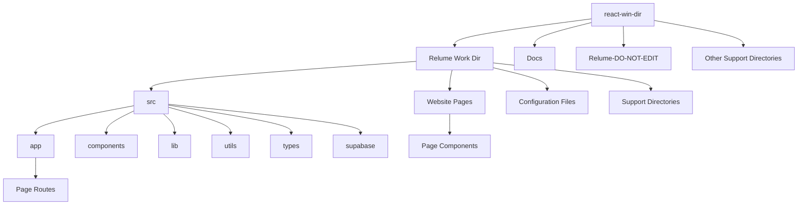

# Unified Project Structure

> **Breadcrumb Navigation**: [README.md](../../README.md) > [Documentation](../index.md) > [Architecture](./index.md) > Unified Project Structure

## Table of Contents

1. [Overview](#overview)
2. [Directory Structure Overview](#directory-structure-overview)
3. [Root Directory](#root-directory)
4. [Main Working Directory](#main-working-directory)
5. [Source Code Organization](#source-code-organization)
6. [App Router Structure](#app-router-structure)
7. [Website Pages Structure](#website-pages-structure)
8. [Component Organization](#component-organization)
9. [Configuration Files](#configuration-files)
10. [Routing System](#routing-system)
11. [File Naming Conventions](#file-naming-conventions)
12. [Best Practices](#best-practices)
13. [Related Documentation](#related-documentation)

## Overview

This document provides a comprehensive and authoritative overview of the Windows Doors CA website project structure. It serves as the single source of truth for understanding the organization of directories, files, and components within the project.

## Directory Structure Overview

The project follows a hierarchical structure with clear separation of concerns:



## Root Directory

The root directory (`react-win-dir/`) contains:

1. **Main Working Directory**: `Relume Work Dir/` - Contains all website implementation files
2. **Documentation**: `Docs/` - Contains project documentation
3. **Reference Files**: `Relume-DO-NOT-EDIT/` - Original Relume files (do not modify)
4. **Support Directories**: Various directories for specific purposes
5. **Configuration Files**: Essential configuration files that must be at the root level

```
react-win-dir/
├── .netlify/                # Netlify configuration
├── backup-before-removal/   # Backup files (temporary)
├── Content Engine/          # Content engine related files
├── Docs/                    # Project documentation
├── Export Documentation/    # Export-related documentation
├── IDE Instructions/        # IDE-specific instructions
├── Relume Work Dir/         # MAIN WORKING DIRECTORY
├── Relume-DO-NOT-EDIT/      # Original Relume files (DO NOT MODIFY)
├── Sample Images/           # Sample images for the project
├── Scripts/                 # Utility scripts
├── .gitignore               # Git ignore file
├── .windsurfrules           # Windsurf rules
├── README.md                # Main README file
├── tsconfig.json            # TypeScript configuration
└── update-import-paths.ps1  # Import path update script
```

## Main Working Directory

The main working directory (`Relume Work Dir/`) contains all files related to the website implementation:

```
Relume Work Dir/
├── .next/                   # Next.js build directory
├── config/                  # Configuration files
├── docs/                    # Internal documentation
├── docs-assets/             # Documentation assets
├── env-files/               # Environment files
├── hooks/                   # React hooks
├── misc/                    # Miscellaneous files
├── node_modules/            # Node.js dependencies
├── Output/                  # Output files
├── public/                  # Public assets
├── scripts/                 # Scripts
├── Service accounts/        # Service account files
├── src/                     # Source code
├── styles/                  # Global styles
├── Supabase/                # Supabase integration
├── Test Pages/              # Test pages
├── Vertex AI Tests/         # Vertex AI test files
├── Website Pages/           # Page-specific components
├── [Configuration Files]    # Various configuration files
```

## Source Code Organization

The source code is organized in the `src/` directory:

```
src/
├── app/                     # App Router pages
├── components/              # Shared components
├── lib/                     # Library code
├── supabase/                # Supabase integration
├── types/                   # TypeScript types
└── utils/                   # Utility functions
```

### Key Directories

1. **app/**: Contains all App Router pages and routes
2. **components/**: Contains shared components used across multiple pages
3. **lib/**: Contains library code and third-party integrations
4. **utils/**: Contains utility functions and helpers
5. **types/**: Contains TypeScript type definitions
6. **supabase/**: Contains Supabase database integration code

## App Router Structure

The App Router structure (`src/app/`) follows Next.js conventions:

```
src/app/
├── [route directories]/     # Route-specific directories
│   └── page.tsx             # Page component for the route
├── api/                     # API routes
├── _templates/              # Page templates
├── error.tsx                # Error handling component
├── globals.css              # Global CSS
├── layout.tsx               # Root layout
├── not-found.tsx            # 404 page
├── page.tsx                 # Home page
└── styles.css               # Custom styles
```

### Route Organization

Routes are organized by feature or page type:

1. **Product Pages**: `windows/`, `doors/`, `vinyl-siding/`, `roofing/`
2. **Product Detail Pages**: `double-hung/`, `casement/`, `entry/`, etc.
3. **Information Pages**: `about/`, `contact/`, `faqs/`, etc.
4. **Utility Pages**: `gallery/`, `financing/`, `warranty/`, etc.

## Website Pages Structure

The Website Pages structure (`Website Pages/`) contains the components used by the App Router pages:

```
Website Pages/
├── [page directories]/      # Page-specific directories
│   ├── components/          # Components for the page
│   ├── sections/            # Page sections
│   └── [page files]         # Page files
```

### Relationship with App Router

The App Router pages import components from the Website Pages directory:

```typescript
// src/app/windows/page.tsx
import WindowsPage from '../../../Website Pages/windows/WindowsPage';

export default function Page() {
  return <WindowsPage />;
}
```

This separation allows for:
1. Clean routing through the App Router
2. Reuse of Relume components from the Website Pages directory
3. Gradual migration from Pages Router to App Router

## Component Organization

Components are organized in several ways:

1. **Shared Components**: Located in `src/components/`
   - Used across multiple pages
   - Organized by function (UI, layout, forms, etc.)

2. **Page-Specific Components**: Located in `Website Pages/[page]/components/`
   - Used only on specific pages
   - Organized by page

3. **Section Components**: Located in `Website Pages/[page]/sections/`
   - Represent major sections of a page
   - Composed of multiple smaller components

## Configuration Files

Configuration files are located in various directories:

1. **Root Configuration Files**:
   - `.gitignore`: Git ignore file
   - `.windsurfrules`: Windsurf rules
   - `tsconfig.json`: TypeScript configuration

2. **Main Working Directory Configuration Files**:
   - `next.config.js`: Next.js configuration
   - `tailwind.config.js`: Tailwind CSS configuration
   - `postcss.config.js`: PostCSS configuration
   - `.eslintrc.json`: ESLint configuration
   - `package.json`: Project dependencies and scripts

## Routing System

The project uses Next.js App Router for routing:

1. **File-Based Routing**: Routes are defined by the directory structure in `src/app/`
2. **Dynamic Routes**: Use `[param]` syntax for dynamic segments
3. **Catch-All Routes**: Use `[...param]` syntax for catch-all segments
4. **Optional Catch-All Routes**: Use `[[...param]]` syntax for optional catch-all segments

### Route Examples

- `/` - Root route (`src/app/page.tsx`)
- `/windows` - Windows route (`src/app/windows/page.tsx`)
- `/windows/double-hung` - Double-hung windows route (`src/app/windows/double-hung/page.tsx`)
- `/api/contact` - Contact API route (`src/app/api/contact/route.ts`)

## File Naming Conventions

1. **React Components**: Use PascalCase for component files (e.g., `Header.tsx`, `ProductCard.tsx`)
2. **Utility Functions**: Use camelCase for utility files (e.g., `formatDate.ts`, `validateForm.ts`)
3. **Page Files**: Use `page.tsx` for App Router pages
4. **Layout Files**: Use `layout.tsx` for App Router layouts
5. **API Routes**: Use `route.ts` for API routes

## Best Practices

1. **File Placement**:
   - Place all website implementation files in the `Relume Work Dir` directory
   - Place all documentation in the `Docs` directory
   - Never modify files in the `Relume-DO-NOT-EDIT` directory

2. **Component Creation**:
   - Create shared components in `src/components/`
   - Create page-specific components in `Website Pages/[page]/components/`
   - Use composition to build complex components from simpler ones

3. **Imports**:
   - Use relative imports for files in the same directory
   - Use absolute imports for files in different directories
   - Configure path aliases in `tsconfig.json` for cleaner imports

4. **Code Organization**:
   - Keep related files together
   - Split large files into smaller, focused files
   - Use index files to simplify imports

## Related Documentation

- [Project Structure Audit](./project-structure-audit.md)
- [Directory Structure Policy](./directory-structure-policy.md)
- [App Router Structure](./app-router-structure.md)
- [File Placement Guide](./file-placement-guide.md)
- [Component Organization](./component-organization.md)

Last Updated: May 28, 2025
