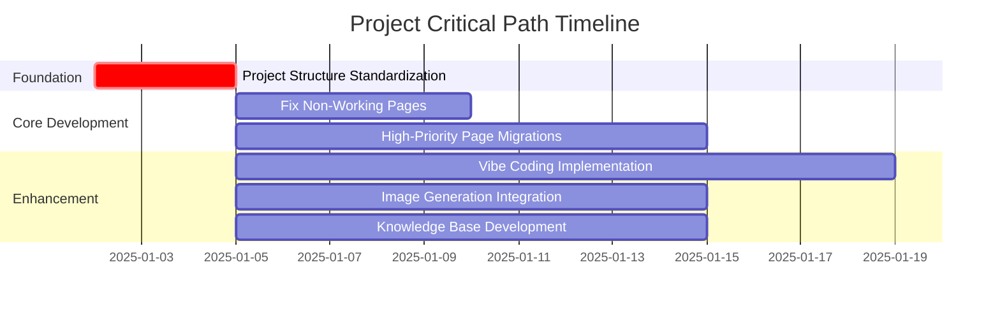

# Project Hub Strategic Dashboard

> **Breadcrumb Navigation**: [README.md](../../README.md) > [Documentation](../index.md) > [Dashboards](./index.md) > Project Hub Strategic Dashboard

**Version:** 1.0  
**Created:** January 2, 2025  
**Linear Task:** [1BU-16: Create Project Hub Strategic Dashboard](https://linear.app/1builder/issue/1BU-16/create-project-hub-strategic-dashboard)

## Overview

The Project Hub Strategic Dashboard provides a comprehensive, real-time view of the Window World LA website project status, progress, and strategic initiatives. This dashboard serves as the central command center for project management, decision-making, and stakeholder communication.

## Table of Contents

1. [Executive Summary](#executive-summary)
2. [Epic Progress Overview](#epic-progress-overview)
3. [Critical Path Analysis](#critical-path-analysis)
4. [Resource Allocation](#resource-allocation)
5. [Risk Assessment](#risk-assessment)
6. [Quality Metrics](#quality-metrics)
7. [Strategic Initiatives](#strategic-initiatives)
8. [Action Items](#action-items)

## Executive Summary

### Project Status: 🟡 **IN PROGRESS - FOUNDATION PHASE**

| Metric | Status | Target | Progress |
|--------|--------|--------|----------|
| **Overall Completion** | 15% | 100% | 🟡 On Track |
| **Critical Path** | Foundation Setup | App Router Migration | 🟡 Phase 1 |
| **Team Velocity** | High | Sustained | 🟢 Excellent |
| **Quality Score** | 85% | 90%+ | 🟡 Good |
| **Risk Level** | Medium | Low | 🟡 Managed |

### Key Achievements This Week
- ✅ **Dual MCP Framework Implementation** - Complete task migration to Linear MCP
- ✅ **Project Structure Analysis** - Comprehensive audit and planning complete
- ✅ **Strategic Documentation** - MCP Integration Guide and Project Hub created
- ✅ **Linear Integration** - 26 issues created with proper hierarchy (1BU-10 to 1BU-35)

### Next Week Priorities
- 🎯 **Project Structure Standardization** (Epic 1BU-10) - URGENT
- 🎯 **Fix Non-Working Pages** (Feature 1BU-29) - HIGH
- 🎯 **Vibe Coding Implementation** (Epic 1BU-11) - HIGH

## Epic Progress Overview

### 🔴 **Epic 1BU-10: Project Structure Standardization** - URGENT
**Priority:** 1 (Urgent) | **Progress:** 0% | **Status:** Ready to Start

#### Features:
- **1BU-17: Fix Relume-root References** (0/3 tasks)
  - 1BU-18: Update import statements across entire codebase
  - 1BU-19: Update configuration files (tsconfig.json, next.config.js, etc.)
  - 1BU-20: Test all pages after Relume-root reference fixes

- **1BU-21: Standardize Directory Structure** (0/3 tasks)
  - 1BU-22: Identify App Router pages outside Relume Work Dir
  - 1BU-23: Move App Router pages to correct directory structure
  - 1BU-24: Test all pages after directory structure changes

**Impact:** 🔴 **CRITICAL** - Blocks all other development work
**Timeline:** 2-3 days
**Dependencies:** None (foundation work)

### 🟡 **Epic 1BU-11: Vibe Coding Implementation** - HIGH
**Priority:** 2 (High) | **Progress:** 0% | **Status:** Planned

#### Features:
- **1BU-25: Code Audit Detection Implementation** (0/2 tasks)
  - 1BU-27: Implement static code analysis integration
  - 1BU-28: Implement security vulnerability scanning

- **1BU-26: Remaining Vibe Coding Features (6-10)** (0/5 tasks)
  - Automated Testing, AI Rule Configuration, Automation Scripting
  - AI Change Review, Multi-Agent Comparison

**Impact:** 🟡 **HIGH** - Enhances development workflow and code quality
**Timeline:** 1-2 weeks
**Dependencies:** Project Structure Standardization (1BU-10)

### 🟡 **Epic 1BU-12: App Router Migration** - HIGH
**Priority:** 2 (High) | **Progress:** 5% | **Status:** Partially Started

#### Features:
- **1BU-29: Fix Non-Working Pages** (0/2 tasks)
  - 1BU-32: Fix Bay-Bow Windows routing conflict
  - 1BU-33: Remove Garage Doors simplified debug version

- **1BU-30: High-Priority Page Migrations** (0/7 pages)
  - Entry Doors, Patio Doors, Awning Windows, Picture Windows
  - Sliding Windows, Custom Windows, Energy Efficient Windows

- **1BU-31: Informational Pages Migration** (0/4 pages)
  - About Us, Contact Us, FAQs, other standard pages

**Impact:** 🟡 **HIGH** - Core website functionality
**Timeline:** 2-3 weeks
**Dependencies:** Project Structure Standardization (1BU-10)

### 🟢 **Epic 1BU-13: Image Generation Integration** - MEDIUM
**Priority:** 3 (Medium) | **Progress:** 0% | **Status:** Planned

#### Features:
- **1BU-34: Google Generative AI Integration** (0/3 tasks)
  - Vertex AI setup and configuration
  - CSV data processing and image generation
  - Integration with website gallery and product pages

**Impact:** 🟢 **MEDIUM** - Enhanced visual content and user experience
**Timeline:** 1-2 weeks
**Dependencies:** App Router Migration (1BU-12)

### 🟢 **Epic 1BU-14: Knowledge Base Development** - MEDIUM
**Priority:** 3 (Medium) | **Progress:** 0% | **Status:** Planned

#### Features:
- **1BU-35: Knowledge Base System Implementation** (0/4 tasks)
  - Supabase pgvector setup
  - Gemini 2.0 Flash embeddings integration
  - Searchable documentation repository
  - API reference system

**Impact:** 🟢 **MEDIUM** - Improved developer experience and documentation
**Timeline:** 1-2 weeks
**Dependencies:** App Router Migration (1BU-12)

## Critical Path Analysis

### Current Critical Path: **Foundation → Migration → Enhancement**

### Bottlenecks and Dependencies

1. **Project Structure Standardization (1BU-10)** - CRITICAL BLOCKER
   - Must be completed before any other development work
   - Affects all import statements and file references
   - Timeline: 2-3 days

2. **App Router Migration (1BU-12)** - CORE FUNCTIONALITY
   - Dependent on Project Structure completion
   - Blocks enhancement features
   - Timeline: 2-3 weeks

3. **Resource Allocation** - TEAM CAPACITY
   - Single developer (Ivo Dachev) assigned to all tasks
   - Need to prioritize and sequence work carefully
   - Consider parallel work where possible

## Resource Allocation

### Team Assignment

| Epic | Assignee | Capacity | Priority | Timeline |
|------|----------|----------|----------|----------|
| **1BU-10** | Ivo Dachev | 100% | URGENT | Days 1-3 |
| **1BU-12** | Ivo Dachev | 80% | HIGH | Days 4-17 |
| **1BU-11** | Ivo Dachev | 60% | HIGH | Days 10-24 |
| **1BU-13** | Ivo Dachev | 40% | MEDIUM | Days 18-28 |
| **1BU-14** | Ivo Dachev | 40% | MEDIUM | Days 18-28 |

### Capacity Planning

- **Week 1:** 100% focus on Project Structure Standardization
- **Week 2-3:** 80% App Router Migration, 20% planning other Epics
- **Week 4:** 60% App Router completion, 40% Vibe Coding start
- **Week 5+:** Parallel work on enhancement features

## Risk Assessment

### High-Risk Items 🔴

1. **Import Statement Dependencies**
   - **Risk:** Cascading failures from Relume-root reference changes
   - **Mitigation:** Comprehensive testing after each change
   - **Owner:** Ivo Dachev
   - **Timeline:** Week 1

2. **App Router Migration Complexity**
   - **Risk:** Breaking existing functionality during migration
   - **Mitigation:** Incremental migration with testing at each step
   - **Owner:** Ivo Dachev
   - **Timeline:** Weeks 2-4

### Medium-Risk Items 🟡

1. **Single Developer Dependency**
   - **Risk:** Project delays if developer unavailable
   - **Mitigation:** Comprehensive documentation and knowledge transfer
   - **Owner:** Project Team
   - **Timeline:** Ongoing

2. **Technology Integration Complexity**
   - **Risk:** Unexpected issues with Vertex AI or Supabase integration
   - **Mitigation:** Proof of concept development and early testing
   - **Owner:** Ivo Dachev
   - **Timeline:** Weeks 3-5

### Low-Risk Items 🟢

1. **Documentation Maintenance**
   - **Risk:** Documentation becoming outdated
   - **Mitigation:** Automated documentation updates where possible
   - **Owner:** Development Team
   - **Timeline:** Ongoing

## Quality Metrics

### Code Quality Targets

| Metric | Current | Target | Status |
|--------|---------|--------|--------|
| **Test Coverage** | 60% | 80% | 🟡 Improving |
| **Code Complexity** | Medium | Low | 🟡 Monitoring |
| **Security Score** | 85% | 95% | 🟡 Good |
| **Performance Score** | 80% | 90% | 🟡 Good |
| **Accessibility Score** | 75% | 95% | 🟡 Needs Work |

### Quality Gates

- ✅ **All tests pass** before merging any changes
- ✅ **Code review required** for all structural changes
- ✅ **Documentation updated** for all new features
- ✅ **Performance benchmarks met** for all page migrations

## Strategic Initiatives

### Q1 2025 Goals

1. **Complete Foundation Work** (Epic 1BU-10)
   - Standardize project structure
   - Fix all import and reference issues
   - Establish stable development environment

2. **Core Functionality Migration** (Epic 1BU-12)
   - Migrate all critical pages to App Router
   - Fix all non-working pages
   - Ensure full website functionality

3. **Development Workflow Enhancement** (Epic 1BU-11)
   - Implement Vibe Coding features
   - Establish automated testing and quality checks
   - Create efficient development workflows

### Q2 2025 Goals

1. **Content Enhancement** (Epic 1BU-13)
   - Implement AI-powered image generation
   - Enhance visual content across the site
   - Improve user experience with dynamic content

2. **Knowledge Management** (Epic 1BU-14)
   - Create comprehensive knowledge base
   - Implement searchable documentation
   - Establish developer onboarding resources

## Action Items

### Immediate Actions (Next 3 Days)

1. **🔴 URGENT:** Start Epic 1BU-10 - Project Structure Standardization
   - Begin with Feature 1BU-17: Fix Relume-root References
   - Update import statements across entire codebase (1BU-18)
   - Update configuration files (1BU-19)

2. **🟡 HIGH:** Prepare for App Router Migration
   - Review current non-working pages
   - Plan migration strategy for high-priority pages
   - Set up testing procedures

### This Week Actions

1. **Complete Project Structure Standardization** (Epic 1BU-10)
2. **Begin App Router Migration planning** (Epic 1BU-12)
3. **Update project documentation** with progress

### Next Week Actions

1. **Start App Router Migration** (Epic 1BU-12)
2. **Begin Vibe Coding Implementation planning** (Epic 1BU-11)
3. **Conduct mid-project review and adjustments**

## Related Documentation

- [MCP Server Integration Guide](../guides/mcp-server-integration-guide.md)
- [Dual Operational Framework Implementation Guide](../dual-operational-framework-implementation-guide.md)
- [Implementation Plan: Dual Operational Framework](../implementation-plan-dual-operational-framework.md)
- [Project Operations Manual](../project-operations-manual.md)

---

**Dashboard Last Updated:** January 2, 2025  
**Next Update:** January 3, 2025  
**Update Frequency:** Daily during active development
