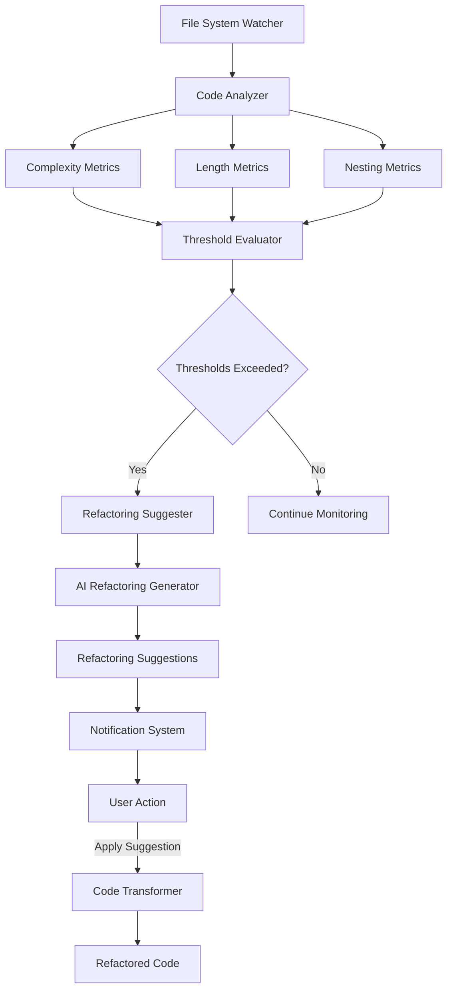

# Code Modularity & Refactoring Tools

> **Breadcrumb Navigation**: [README.md](../../README.md) > [Documentation](../index.md) > [Features](./index.md) > Code Modularity & Refactoring Tools

## Table of Contents

1. [Overview](#overview)
2. [Implementation Details](#implementation-details)
3. [Usage](#usage)
4. [Configuration](#configuration)
5. [Technical Architecture](#technical-architecture)
6. [Future Enhancements](#future-enhancements)
7. [Related Documentation](#related-documentation)

## Overview

The Code Modularity & Refactoring Tools feature helps developers maintain clean, modular code by analyzing files for complexity and length, identifying code that could benefit from modularization, and suggesting AI-powered refactoring options. This feature is inspired by David Jones Gelardi's "Vibe Coding" approach, which emphasizes modular code for better maintainability and collaboration.

### Key Features

1. **Code Complexity Analysis**: Analyzes files for cyclomatic complexity, length, and other metrics
2. **Modularization Suggestions**: Identifies code sections that could be extracted into separate functions or modules
3. **AI-Powered Refactoring**: Generates refactoring suggestions using AI
4. **Configurable Thresholds**: User-configurable settings for complexity and length thresholds
5. **IDE Integration**: Notifications and UI for displaying suggestions

## Implementation Details

The implementation consists of several components:

1. **Code Analyzer**: Analyzes files for complexity, length, and modularization opportunities
2. **Refactoring Suggester**: Generates AI-powered refactoring suggestions
3. **Configuration System**: User-configurable settings for thresholds and preferences
4. **Notification System**: Displays suggestions and notifications to the user

### Current Implementation Status

- ⬜ Code analyzer module
- ⬜ Refactoring suggester module
- ⬜ Configuration system
- ⬜ Notification system
- ⬜ Integration with IDE
- ✅ Documentation created

The implementation is in progress.

## Usage

### Basic Usage

1. The system automatically analyzes code files as you work
2. When a file exceeds configured thresholds, a notification is displayed
3. You can view refactoring suggestions and apply them as needed
4. You can also manually trigger analysis for specific files

### Installation

To install the Code Modularity & Refactoring Tools:

1. The scripts are included in the project
2. Install dependencies:

```bash
npm install --save-dev complexity-report esprima escodegen
```

### Commands

- `npm run modularity:analyze <file>`: Analyze a specific file for modularity issues
- `npm run modularity:suggest <file>`: Generate refactoring suggestions for a file
- `npm run modularity:config`: View or update configuration settings

## Configuration

Configuration is stored in `.code-modularity.json` in the project root:

```json
{
  "analysis": {
    "complexityThreshold": 10,     // Cyclomatic complexity threshold
    "lengthThreshold": 100,        // Line count threshold for functions
    "depthThreshold": 3,           // Nesting depth threshold
    "parameterThreshold": 4,       // Parameter count threshold
    "enabled": true                // Enable/disable analysis
  },
  "aiAssistance": {
    "enabled": true,               // Enable/disable AI assistance
    "model": "default",            // AI model to use
    "customPrompt": ""             // Custom prompt for AI
  },
  "notifications": {
    "vscode": true,                // Show VS Code notifications
    "terminal": true,              // Show terminal notifications
    "frequency": "high"            // Notification frequency (low, medium, high)
  },
  "fileTypes": [                   // File types to analyze
    "js", "jsx", "ts", "tsx"
  ],
  "excludePaths": [                // Paths to exclude from analysis
    "node_modules",
    "dist",
    "build"
  ]
}
```

## Technical Architecture

The feature is built with a modular architecture:



## Future Enhancements

1. **Machine Learning**: Train on the codebase to provide more contextual refactoring suggestions
2. **Automated Refactoring**: Implement automatic application of refactoring suggestions
3. **Integration with Testing**: Ensure refactorings maintain test coverage
4. **Team Standards**: Incorporate team coding standards into suggestions
5. **Historical Analysis**: Track code complexity over time

## Related Documentation

- [Code Standards](../processes/code-standards.md)
- [Development Workflow](../processes/development-workflow.md)
- [AI Integration](../features/ai-integration.md)
- [VS Code Extensions](../tools/vscode-extensions.md)
