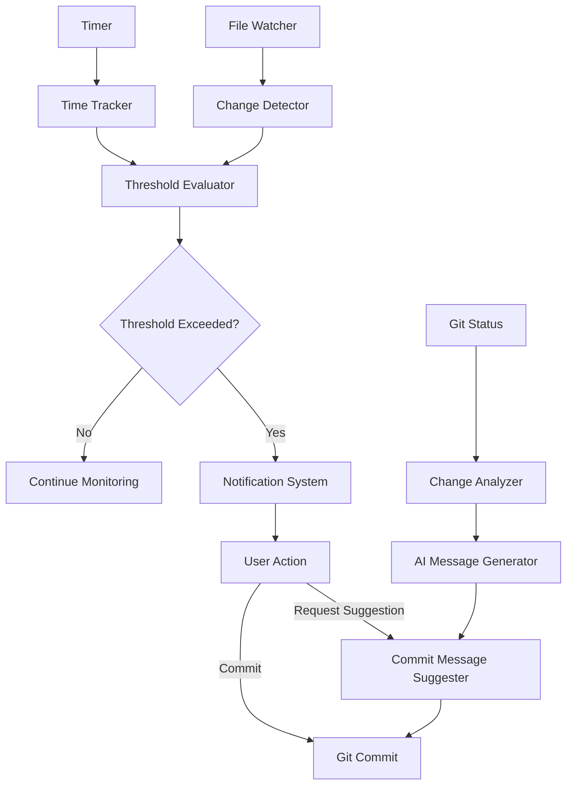

# Intelligent Commit Reminders & Assistance

> **Breadcrumb Navigation**: [README.md](../../README.md) > [Documentation](../index.md) > [Features](./index.md) > Intelligent Commit Reminders & Assistance

## Table of Contents

1. [Overview](#overview)
2. [Implementation Details](#implementation-details)
3. [Usage](#usage)
4. [Configuration](#configuration)
5. [Technical Architecture](#technical-architecture)
6. [Future Enhancements](#future-enhancements)
7. [Related Documentation](#related-documentation)

## Overview

The Intelligent Commit Reminders & Assistance feature helps developers maintain good version control practices by providing timely reminders to commit changes and assistance in creating meaningful commit messages. This feature is inspired by David Jones Gelardi's "Vibe Coding" approach, which emphasizes frequent, small commits to maintain a steady workflow.

### Key Features

1. **Time-Based Commit Reminders**: Notifications to commit changes after a configurable period of time
2. **Change-Based Commit Reminders**: Notifications based on the number of significant changes made
3. **AI-Generated Commit Messages**: Suggestions for commit messages based on the changes made
4. **Pre-Commit Validation**: Checks to ensure commits follow project standards
5. **Commit History Analysis**: Insights into commit patterns and suggestions for improvement

## Implementation Details

The implementation consists of several components:

1. **Commit Reminder Script**: A Node.js script that monitors file changes and time elapsed
2. **AI Message Generator**: A module that analyzes changes and suggests commit messages
3. **VS Code Extension Integration**: Integration with VS Code for notifications
4. **Configuration System**: User-configurable settings for reminder thresholds
5. **Git Hooks**: Pre-commit hooks for validation and message suggestions

### Current Implementation Status

- ✅ Commit reminder script implemented
- ✅ AI message generation functionality implemented
- ✅ Configuration file structure created
- ✅ VS Code and terminal notification system implemented
- ✅ Git hooks integration implemented
- ✅ Package.json scripts added
- ✅ Documentation created

The implementation is now complete and ready for use.

## Usage

### Basic Usage

1. The system automatically monitors your work and provides notifications when it's time to commit
2. When you're ready to commit, use the "Generate Commit Message" command to get AI-suggested messages
3. Review and edit the suggested message as needed
4. Complete the commit process

### Installation

To install the Intelligent Commit Assistant:

1. The scripts are already included in the project
2. Install the Git hooks by running:

```bash
npm run commit:install-hooks
```

This will install the pre-commit and commit-msg hooks that integrate with Git.

### Commands

- `npm run commit:check`: Manually trigger a commit reminder check
- `npm run commit:suggest`: Generate an AI-suggested commit message
- `npm run commit:stats`: View statistics about your commit patterns
- `npm run commit:config`: View or update configuration settings
- `npm run commit:install-hooks`: Install Git hooks

### Git Integration

The Intelligent Commit Assistant integrates with Git in two ways:

1. **Pre-commit Hook**: Checks if it's time to commit and ensures there are staged changes
2. **Commit-msg Hook**: Validates commit messages against the conventional commit format

If a commit message doesn't follow the conventional format, the hook will suggest a properly formatted message.

## Configuration

Configuration is stored in `.commit-assistant.json` in the project root:

```json
{
  "reminders": {
    "timeThreshold": 30,        // Minutes before time-based reminder
    "changeThreshold": 50,      // Number of lines changed before reminder
    "fileThreshold": 5,         // Number of files changed before reminder
    "enabled": true             // Enable/disable reminders
  },
  "aiAssistance": {
    "enabled": true,            // Enable/disable AI assistance
    "model": "default",         // AI model to use
    "customPrompt": ""          // Custom prompt for AI
  },
  "notifications": {
    "vscode": true,             // Show VS Code notifications
    "terminal": true,           // Show terminal notifications
    "sound": false              // Play sound with notifications
  }
}
```

## Technical Architecture

The feature is built with a modular architecture:



## Future Enhancements

1. **Machine Learning**: Train on the developer's commit patterns to provide more personalized reminders
2. **Team Analytics**: Aggregate commit data to provide team-level insights
3. **Integration with Issue Tracking**: Link commits to issues automatically
4. **Customizable Notification Channels**: Support for Slack, email, etc.
5. **Commit Quality Scoring**: Provide feedback on commit message quality

## Related Documentation

- [Commit Standards](../processes/commit-standards.md)
- [Git Workflow](../processes/git-workflow.md)
- [AI Integration](../features/ai-integration.md)
- [VS Code Extensions](../tools/vscode-extensions.md)
