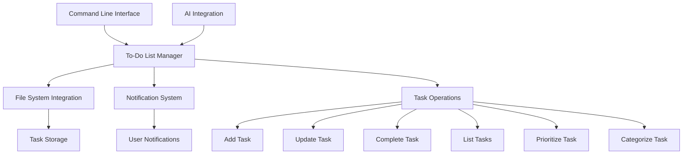

# To-Do List Management with AI Sync

> **Breadcrumb Navigation**: [README.md](../../README.md) > [Documentation](../index.md) > [Features](./index.md) > To-Do List Management with AI Sync

## Table of Contents

1. [Overview](#overview)
2. [Implementation Details](#implementation-details)
3. [Usage](#usage)
4. [Configuration](#configuration)
5. [Technical Architecture](#technical-architecture)
6. [Future Enhancements](#future-enhancements)
7. [Related Documentation](#related-documentation)

## Overview

The To-Do List Management with AI Sync feature provides a seamless, project-aware task management system that integrates directly with the development workflow. It allows developers to quickly add, update, and complete tasks, while also enabling AI assistants to interact with the task list, creating a collaborative environment between developers and AI tools.

### Key Features

1. **Project-Aware Task Management**: Tasks are stored in a structured format within the project
2. **Command Line Interface**: Quick commands for adding, updating, and completing tasks
3. **AI Integration**: AI assistants can read, add, and mark tasks as complete
4. **Task Prioritization**: Tasks can be prioritized and categorized
5. **Task Synchronization**: Tasks are synchronized across the project

## Implementation Details

The implementation consists of several components:

1. **To-Do List Manager**: Core functionality for managing tasks
2. **File System Integration**: Store tasks in a structured format
3. **Command Line Interface**: Allow users to interact with tasks via commands
4. **AI Integration**: Enable AI assistants to read and modify tasks
5. **Notification System**: Alert users about task updates

### Current Implementation Status

- ⬜ To-Do List Manager module
- ⬜ File System Integration
- ⬜ Command Line Interface
- ⬜ AI Integration
- ⬜ Notification System
- ✅ Documentation created

The implementation is in progress.

## Usage

### Basic Usage

1. Add a task:
   ```bash
   npm run todo:add "Implement feature X"
   ```

2. List all tasks:
   ```bash
   npm run todo:list
   ```

3. Complete a task:
   ```bash
   npm run todo:complete 1
   ```

4. Update a task:
   ```bash
   npm run todo:update 1 "Implement feature X with Y"
   ```

5. Prioritize a task:
   ```bash
   npm run todo:prioritize 1 high
   ```

### AI Integration

AI assistants can interact with the to-do list using special commands:

1. Read tasks:
   ```
   AI: Please show me the current to-do list
   ```

2. Add a task:
   ```
   AI: Add to the to-do list: "Refactor authentication module"
   ```

3. Complete a task:
   ```
   AI: Mark task #3 as complete
   ```

4. Update a task:
   ```
   AI: Update task #2 to "Implement responsive design for mobile"
   ```

## Configuration

Configuration is stored in `.todo-config.json` in the project root:

```json
{
  "storage": {
    "format": "json",           // Format to store tasks (json, markdown, yaml)
    "path": ".todo",            // Path to store tasks
    "backupEnabled": true,      // Enable backups
    "backupInterval": 86400     // Backup interval in seconds (1 day)
  },
  "tasks": {
    "defaultPriority": "medium", // Default priority for new tasks
    "priorities": [              // Available priorities
      "critical",
      "high",
      "medium",
      "low"
    ],
    "statuses": [                // Available statuses
      "todo",
      "in-progress",
      "blocked",
      "completed"
    ],
    "categories": [              // Available categories
      "feature",
      "bug",
      "documentation",
      "refactoring",
      "testing"
    ]
  },
  "notifications": {
    "enabled": true,             // Enable notifications
    "showOnStartup": true,       // Show tasks on startup
    "reminderInterval": 3600     // Reminder interval in seconds (1 hour)
  },
  "ai": {
    "enabled": true,             // Enable AI integration
    "allowAdd": true,            // Allow AI to add tasks
    "allowComplete": true,       // Allow AI to complete tasks
    "allowUpdate": true,         // Allow AI to update tasks
    "requireConfirmation": true  // Require confirmation for AI changes
  }
}
```

## Technical Architecture

The feature is built with a modular architecture:



## Future Enhancements

1. **Web Interface**: Add a web interface for managing tasks
2. **Integration with Issue Trackers**: Sync with GitHub Issues, Linear, or Jira
3. **Time Tracking**: Add time tracking for tasks
4. **Team Collaboration**: Enable team collaboration on tasks
5. **Advanced AI Capabilities**: Allow AI to suggest task priorities and deadlines

## Related Documentation

- [Development Workflow](../processes/development-workflow.md)
- [AI Integration](../features/ai-integration.md)
- [Project Management](../processes/project-management.md)
