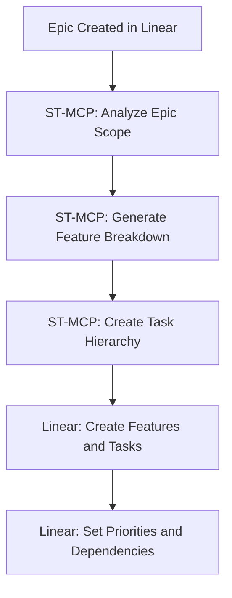
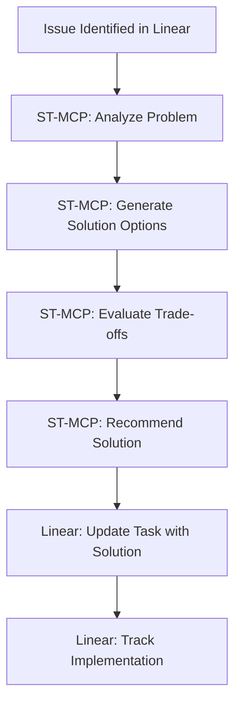
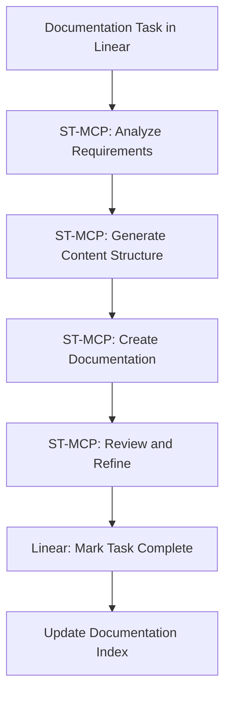

# MCP Server Integration Guide

> **Breadcrumb Navigation**: [README.md](../../README.md) > [Documentation](../index.md) > [Guides](./index.md) > MCP Server Integration Guide

**Version:** 1.0  
**Created:** January 2, 2025  
**Linear Task:** [1BU-15: Create MCP Server Integration Guide](https://linear.app/1builder/issue/1BU-15/create-mcp-server-integration-guide)

## Overview

This guide provides comprehensive instructions for integrating and using the dual MCP server strategy in the Window World LA website project. It details how Linear MCP Server and Sequential Thinking MCP Server work in tandem to create an efficient, AI-augmented development workflow.

## Table of Contents

1. [MCP Server Architecture](#mcp-server-architecture)
2. [Linear MCP Server Integration](#linear-mcp-server-integration)
3. [Sequential Thinking MCP Server Integration](#sequential-thinking-mcp-server-integration)
4. [Dual Server Workflow Patterns](#dual-server-workflow-patterns)
5. [Linking Conventions](#linking-conventions)
6. [Data Flow and Triggers](#data-flow-and-triggers)
7. [Use Case Examples](#use-case-examples)
8. [Best Practices](#best-practices)
9. [Troubleshooting](#troubleshooting)

## MCP Server Architecture

### Dual MCP Server Strategy

Our project utilizes two complementary MCP servers:

#### **Linear MCP Server**
- **Purpose:** Project and task management
- **Responsibilities:** 
  - Epic, Feature, and Task tracking
  - Priority management and sprint planning
  - Progress monitoring and reporting
  - Team collaboration and assignments
- **Access:** Built into Augment Code IDE
- **Project:** Window World LA Website (ID: 9b6cde48-4ecd-4614-afe2-49032515e820)

#### **Sequential Thinking MCP Server**
- **Purpose:** Workflow orchestration and complex problem-solving
- **Responsibilities:**
  - Multi-step process automation
  - Complex decision-making workflows
  - AI-assisted problem analysis
  - Documentation generation and updates
- **Access:** Built into Augment Code IDE
- **Integration:** Works seamlessly with Linear MCP

### Architecture Benefits

1. **Separation of Concerns:** Clear distinction between task management and workflow execution
2. **Scalability:** Each server optimized for its specific purpose
3. **AI Augmentation:** Enhanced decision-making and automation capabilities
4. **Audit Trail:** Complete tracking of decisions and actions across both systems

## Linear MCP Server Integration

### Project Structure

#### **Hierarchy:**
```
Window World LA Website Project
├── Epic: Project Structure Standardization (1BU-10) [URGENT]
│   ├── Feature: Fix Relume-root References (1BU-17)
│   │   ├── Task: Update import statements (1BU-18)
│   │   ├── Task: Update configuration files (1BU-19)
│   │   └── Task: Test all pages (1BU-20)
│   └── Feature: Standardize Directory Structure (1BU-21)
│       ├── Task: Identify misplaced pages (1BU-22)
│       ├── Task: Move pages to correct structure (1BU-23)
│       └── Task: Test after changes (1BU-24)
├── Epic: Vibe Coding Implementation (1BU-11) [HIGH]
├── Epic: App Router Migration (1BU-12) [HIGH]
├── Epic: Image Generation Integration (1BU-13) [MEDIUM]
└── Epic: Knowledge Base Development (1BU-14) [MEDIUM]
```

#### **Priority Levels:**
- **Urgent (1):** Critical foundation issues that block other work
- **High (2):** Important features and fixes needed for core functionality
- **Medium (3):** Enhancement features and optimizations
- **Low (4):** Nice-to-have features and future improvements

#### **Status Workflow:**
```
Backlog → Todo → In Progress → In Review → Done
```

### Task Management Conventions

#### **Issue Naming:**
- **Epics:** "Epic: [Name]" (e.g., "Epic: Project Structure Standardization")
- **Features:** "Feature: [Name]" (e.g., "Feature: Fix Relume-root References")
- **Tasks:** Descriptive action-oriented titles (e.g., "Update import statements across entire codebase")

#### **Descriptions:**
- **Epics:** High-level overview with business value and scope
- **Features:** Detailed functional requirements and acceptance criteria
- **Tasks:** Specific implementation steps and technical details

#### **Labels and Tags:**
- **Frontend:** UI/UX related tasks
- **Backend:** Server-side and API tasks
- **Documentation:** Documentation creation and updates
- **Testing:** Quality assurance and testing tasks
- **AI Integration:** AI-related features and tools

## Sequential Thinking MCP Server Integration

### Workflow Orchestration

The Sequential Thinking MCP Server handles complex, multi-step processes that require:

1. **Analysis and Planning:** Breaking down complex problems
2. **Decision Making:** Evaluating options and making informed choices
3. **Execution Coordination:** Managing multi-step workflows
4. **Documentation Generation:** Creating comprehensive documentation
5. **Error Handling:** Managing exceptions and recovery procedures

### Integration Points with Linear MCP

#### **Workflow Triggers:**
- **Task Assignment:** When a complex task is assigned in Linear
- **Epic Planning:** When breaking down Epics into Features and Tasks
- **Problem Resolution:** When issues require multi-step analysis
- **Documentation Updates:** When comprehensive documentation is needed

#### **Data Exchange:**
- **Task Context:** ST-MCP receives task details from Linear
- **Progress Updates:** ST-MCP updates Linear with workflow progress
- **Results Documentation:** ST-MCP creates documentation linked to Linear tasks
- **Decision Logs:** ST-MCP maintains decision history for Linear reference

## Dual Server Workflow Patterns

### Pattern 1: Epic Planning and Breakdown



### Pattern 2: Complex Problem Resolution



### Pattern 3: Documentation Generation



## Linking Conventions

### Cross-Reference Standards

#### **Linear to ST-MCP:**
- Include ST-MCP workflow ID in Linear task comments
- Reference Linear task ID in ST-MCP workflow logs
- Use consistent naming conventions across both systems

#### **Documentation Links:**
- Always include Linear task ID in generated documentation
- Link back to relevant Linear tasks from documentation
- Maintain bidirectional traceability

#### **Example Linking:**
```markdown
**Linear Task:** [1BU-15: Create MCP Server Integration Guide](https://linear.app/1builder/issue/1BU-15/create-mcp-server-integration-guide)
**ST-MCP Workflow:** ST-WF-001-Documentation-Generation
**Related Documentation:** [Project Operations Manual](../project-operations-manual.md)
```

## Data Flow and Triggers

### Automated Triggers

#### **From Linear to ST-MCP:**
1. **High-Priority Task Assignment:** Triggers ST-MCP analysis workflow
2. **Epic Creation:** Triggers ST-MCP planning and breakdown workflow
3. **Issue Status Change:** Triggers ST-MCP progress tracking workflow
4. **Documentation Request:** Triggers ST-MCP documentation generation workflow

#### **From ST-MCP to Linear:**
1. **Workflow Completion:** Updates Linear task status
2. **Decision Made:** Adds comment to Linear task
3. **Documentation Created:** Links documentation to Linear task
4. **Issue Identified:** Creates new Linear task for follow-up

### Manual Triggers

#### **Developer-Initiated:**
- Request ST-MCP analysis for complex problems
- Trigger documentation generation workflows
- Initiate planning workflows for new features

#### **Project Manager-Initiated:**
- Request epic breakdown and planning
- Trigger progress analysis and reporting
- Initiate risk assessment workflows

## Use Case Examples

### Use Case 1: Project Structure Standardization

**Scenario:** Epic 1BU-10 requires fixing all Relume-root references

**Linear MCP Role:**
- Track Epic progress and Feature completion
- Manage task assignments and priorities
- Monitor testing and validation progress

**ST-MCP Role:**
- Analyze codebase to identify all Relume-root references
- Generate comprehensive replacement strategy
- Create testing checklist and validation procedures
- Document changes and update project documentation

**Integration:**
- ST-MCP analysis results inform Linear task creation
- Linear task progress triggers ST-MCP validation workflows
- ST-MCP documentation updates link back to Linear tasks

### Use Case 2: Vibe Coding Feature Implementation

**Scenario:** Feature 1BU-25 requires Code Audit Detection implementation

**Linear MCP Role:**
- Track feature development progress
- Manage sub-task assignments
- Monitor integration testing

**ST-MCP Role:**
- Research and evaluate code audit tools
- Generate implementation strategy
- Create integration workflows
- Document configuration and usage

**Integration:**
- ST-MCP research informs Linear task breakdown
- Linear progress updates trigger ST-MCP documentation workflows
- ST-MCP generates testing procedures for Linear tracking

## Best Practices

### Task Management

1. **Always link Linear tasks to ST-MCP workflows** when complex analysis is involved
2. **Use consistent naming conventions** across both systems
3. **Maintain bidirectional traceability** between tasks and workflows
4. **Update both systems** when status changes occur

### Documentation

1. **Include Linear task references** in all generated documentation
2. **Link documentation back to Linear tasks** for easy navigation
3. **Use ST-MCP for comprehensive documentation generation**
4. **Maintain documentation hierarchy** aligned with Linear project structure

### Workflow Management

1. **Use ST-MCP for complex, multi-step processes**
2. **Keep Linear updated** with ST-MCP workflow progress
3. **Document decisions and rationale** in both systems
4. **Maintain audit trail** of all workflow executions

## Troubleshooting

### Common Issues

#### **Linear MCP Connection Issues:**
- Verify Augment Code IDE connection
- Check project permissions and access
- Refresh Linear workspace if needed

#### **ST-MCP Workflow Failures:**
- Review workflow logs for error details
- Check input parameters and data format
- Restart workflow with corrected parameters

#### **Integration Sync Issues:**
- Verify linking conventions are followed
- Check for network connectivity issues
- Manually sync data if automatic sync fails

### Support Resources

- **Linear MCP Documentation:** Built into Augment Code
- **ST-MCP Documentation:** Available in Augment Code help
- **Project Documentation:** [Documentation Index](../index.md)
- **Team Support:** Contact project team for assistance

## Related Documentation

- [Project Operations Manual](../project-operations-manual.md)
- [Dual Operational Framework Implementation Guide](../dual-operational-framework-implementation-guide.md)
- [Implementation Plan: Dual Operational Framework](../implementation-plan-dual-operational-framework.md)
- [Development Workflow](../processes/development-workflow.md)

Last Updated: January 2, 2025
