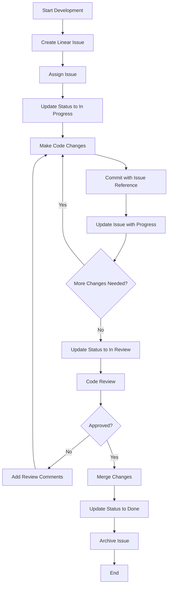

# Linear Integration

> **Breadcrumb Navigation**: [README.md](../../README.md) > [Documentation](../index.md) > [Integrations](./index.md) > Linear Integration

## Table of Contents

1. [Overview](#overview)
2. [Setup and Configuration](#setup-and-configuration)
3. [Key Features](#key-features)
4. [Integration with Development Workflow](#integration-with-development-workflow)
5. [Task Management](#task-management)
6. [Commit Integration](#commit-integration)
7. [AI Agent Integration](#ai-agent-integration)
8. [Workflow Diagram](#workflow-diagram)
9. [Examples](#examples)
10. [Troubleshooting](#troubleshooting)
11. [Related Documentation](#related-documentation)

## Overview

This document outlines the integration of Linear project management with the Windows Doors CA website development workflow using the Linear MCP server. This integration enhances task management, streamlines development processes, and improves collaboration between AI agents and human developers.

## Setup and Configuration

### Prerequisites

- Linear account and workspace
- Linear API key
- Node.js and NPM

### Installation

1. Install the Linear MCP server via Smithery:

```bash
npx -y @smithery/cli install @tacticlaunch/mcp-linear
```

2. Configure the server in your Smithery configuration:

```json
{
  "mcpServers": {
    "linear": {
      "command": "npx",
      "args": [
        "-y",
        "@tacticlaunch/mcp-linear"
      ],
      "env": {
        "LINEAR_API_KEY": "<YOUR_LINEAR_API_KEY>"
      }
    }
  }
}
```

3. Obtain a Linear API key:
   - Log in to your Linear account
   - Go to Settings > API > Personal API Keys
   - Create a new API key with appropriate permissions
   - Copy the key and add it to your configuration

4. Test the connection:

```bash
npx -y @smithery/cli test linear
```

## Key Features

The Linear MCP server provides access to Linear's project management features through a set of tools:

### Organization and User Management
- View organization details
- Access user information
- Manage teams

### Project Management
- Create and update projects
- Add issues to projects
- View project issues

### Issue Management
- Create, update, and search issues
- Add comments to issues
- Assign issues to team members
- Set issue priorities
- Add and remove labels
- Archive issues

### Workflow Management
- Access workflow states
- Manage cycles
- Track issue history

## Integration with Development Workflow

### Development Process Integration

The Linear integration enhances our development workflow in the following ways:

1. **Planning Phase**
   - Create projects and issues for new features
   - Assign issues to team members
   - Set priorities and deadlines

2. **Development Phase**
   - Update issue status as development progresses
   - Add comments with development notes
   - Link commits to issues

3. **Review Phase**
   - Track issue history
   - Add review comments
   - Update issue status based on review outcomes

4. **Deployment Phase**
   - Update issue status upon deployment
   - Archive completed issues
   - Create new issues for follow-up tasks

### AI-Assisted Workflow

AI agents can interact with Linear to:

1. **Manage Tasks**
   - Create issues for new requirements
   - Update issue status based on development progress
   - Search for relevant issues

2. **Provide Context**
   - Retrieve issue details for context
   - Access project information
   - View issue history

3. **Facilitate Collaboration**
   - Add comments with AI-generated suggestions
   - Assign issues to appropriate team members
   - Add labels for categorization

## Task Management

### Task Creation

AI agents can create tasks in Linear using the `linear_createIssue` tool:

```javascript
// Example task creation
{
  "title": "Implement double-hung windows product page",
  "description": "Create a new product page for double-hung windows with specifications and images",
  "teamId": "TEAM_ID",
  "priority": 2, // High priority
  "labelIds": ["LABEL_ID_1", "LABEL_ID_2"]
}
```

### Task Updates

As development progresses, AI agents can update tasks using the `linear_updateIssue` tool:

```javascript
// Example task update
{
  "issueId": "ISSUE_ID",
  "title": "Implement double-hung windows product page",
  "description": "Updated description with implementation details",
  "stateId": "STATE_ID_IN_PROGRESS"
}
```

### Task Tracking

AI agents can track task progress using various tools:

- `linear_getIssueById`: Retrieve detailed information about a specific issue
- `linear_searchIssues`: Find issues matching specific criteria
- `linear_getIssueHistory`: View the history of changes to an issue

## Commit Integration

### Linking Commits to Issues

When making commits, developers should reference Linear issues using the following format:

```
feat(windows): add double-hung windows product page [LINEAR-123]
```

AI agents can suggest commit messages that include Linear issue references:

```
fix(contact): resolve form submission error on mobile devices [LINEAR-456]

Form submission was failing on mobile devices due to incorrect
viewport handling in the validation logic. Updated the validation
to be responsive to different screen sizes.
```

### Automated Status Updates

AI agents can update issue status based on commit messages using the `linear_updateIssue` tool:

```javascript
// Example status update after commit
{
  "issueId": "ISSUE_ID",
  "stateId": "STATE_ID_IN_REVIEW"
}
```

## AI Agent Integration

### AI Agent Rules for Linear

AI agents should follow these rules when interacting with Linear:

1. **Task Creation**
   - Create specific, actionable tasks
   - Include clear descriptions and acceptance criteria
   - Assign appropriate labels and priorities

2. **Task Updates**
   - Update task status to reflect current progress
   - Add comments with relevant information
   - Link to related resources or documentation

3. **Task Completion**
   - Verify all requirements are met before marking tasks as complete
   - Document any follow-up tasks or considerations
   - Update related documentation

### Prompt Templates for Linear Integration

#### Task Creation Template

```
Create a Linear issue for the following task:

Task: [Brief description]

Details:
- [Requirement 1]
- [Requirement 2]
- [...]

Priority: [Low/Medium/High/Urgent]
Labels: [Label1, Label2, ...]
Team: [Team name]
```

#### Task Update Template

```
Update the Linear issue [ISSUE-ID] with the following information:

Status: [New status]
Progress: [Brief description of progress]
Blockers: [Any blockers or challenges]
Next steps: [What needs to be done next]
```

## Workflow Diagram



## Examples

### Example 1: Creating a New Feature Task

```javascript
// AI agent creates a new feature task
const newIssue = {
  title: "Implement responsive gallery for windows page",
  description: "Create a responsive image gallery component for the windows product page that works on all device sizes.",
  teamId: "TEAM_ID",
  priority: 2,
  labelIds: ["FEATURE", "UI", "RESPONSIVE"]
};

// Using the linear_createIssue tool
const issueResult = await linear_createIssue(newIssue);
console.log(`Created issue: ${issueResult.id}`);
```

### Example 2: Updating Task Status During Development

```javascript
// AI agent updates task status after implementing a feature
const updateIssue = {
  issueId: "ISSUE_ID",
  stateId: "STATE_ID_IN_REVIEW",
  description: "Implemented responsive gallery with the following features:\n- Swipe gestures on mobile\n- Keyboard navigation\n- Screen reader support\n\nReady for review."
};

// Using the linear_updateIssue tool
const updateResult = await linear_updateIssue(updateIssue);
console.log(`Updated issue: ${updateResult.id}`);
```

## Troubleshooting

### Common Issues

1. **Authentication Errors**
   - Verify your Linear API key is correct
   - Check that the API key has the necessary permissions
   - Ensure the API key is properly configured in the MCP server

2. **Permission Issues**
   - Verify the user associated with the API key has appropriate permissions
   - Check team access settings in Linear

3. **Rate Limiting**
   - Implement retry logic for rate-limited requests
   - Consider batching operations to reduce API calls

### Support Resources

- [Linear API Documentation](https://developers.linear.app/docs/)
- [Linear MCP Server Repository](https://github.com/tacticlaunch/mcp-linear)
- [Smithery Documentation](https://smithery.ai/docs)

## Related Documentation

- [AI Agent Rules](../processes/ai-agent-rules.md)
- [Commit Standards](../processes/commit-standards.md)
- [Effective AI Interaction](../processes/effective-ai-interaction.md)
- [AI Task Management](../processes/ai-task-management.md)
- [Development Workflow](../processes/development-workflow.md)

Last Updated: May 28, 2025
