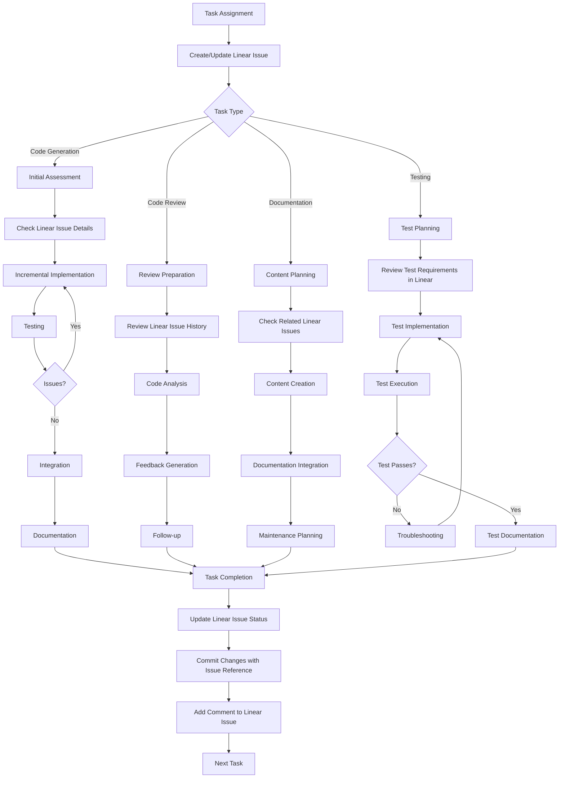

# AI Agent Rules

> **Breadcrumb Navigation**: [README.md](../../README.md) > [Documentation](../index.md) > [Processes](./index.md) > AI Agent Rules

## Table of Contents

1. [Overview](#overview)
2. [Core Principles](#core-principles)
3. [Standard Operating Procedures](#standard-operating-procedures)
4. [Context Management](#context-management)
5. [Prompt Engineering](#prompt-engineering)
6. [Error Handling](#error-handling)
7. [Security and Privacy](#security-and-privacy)
8. [Version Control Integration](#version-control-integration)
9. [Workflow Diagram](#workflow-diagram)
10. [Examples](#examples)
11. [Related Documentation](#related-documentation)

## Overview

This document establishes clear rules and guidelines for AI agent operation within the Windows Doors CA website development workflow. It provides a framework for effective AI interaction, ensuring consistency, quality, and efficiency in AI-assisted development tasks.

## Core Principles

### 1. Incremental Development

AI agents should:
- Generate code in small, manageable chunks
- Focus on one feature or component at a time
- Validate each step before proceeding to the next

### 2. Explicit Confirmation

AI agents should:
- Seek explicit confirmation before making significant changes
- Present options when multiple approaches are viable
- Clearly communicate potential risks or trade-offs

### 3. Documentation Integration

AI agents should:
- Update relevant documentation when generating code
- Document design decisions and rationale
- Generate inline comments for complex logic

### 4. Context Awareness

AI agents should:
- Maintain awareness of the project's architecture and standards
- Consider existing patterns and conventions
- Respect established project structure

### 5. Error Transparency

AI agents should:
- Acknowledge limitations and uncertainties
- Provide clear error messages and troubleshooting steps
- Suggest alternatives when facing limitations

## Standard Operating Procedures

### Code Generation

1. **Initial Assessment**
   - Review requirements and existing code
   - Identify relevant components and patterns
   - Determine appropriate approach
   - Check related Linear issues for context

2. **Incremental Implementation**
   - Generate code in logical, focused chunks
   - Test each chunk before proceeding
   - Document design decisions
   - Update Linear issue status as progress is made

3. **Integration**
   - Ensure compatibility with existing code
   - Update imports and dependencies
   - Verify integration points
   - Link commits to Linear issues

4. **Documentation**
   - Add inline comments for complex logic
   - Update relevant documentation
   - Document any assumptions or limitations
   - Add implementation notes to Linear issues

### Code Review

1. **Preparation**
   - Understand the code's purpose and context
   - Review relevant documentation and requirements
   - Identify applicable standards and best practices

2. **Analysis**
   - Check for logical errors and edge cases
   - Verify adherence to project standards
   - Assess performance and security implications

3. **Feedback**
   - Provide specific, actionable feedback
   - Explain the rationale behind suggestions
   - Offer alternative approaches when appropriate

4. **Follow-up**
   - Verify implementation of feedback
   - Document recurring issues for future reference
   - Update guidelines if necessary

### Documentation Generation

1. **Content Planning**
   - Identify documentation purpose and audience
   - Determine appropriate structure and format
   - Gather relevant information

2. **Content Creation**
   - Generate clear, concise documentation
   - Include examples and diagrams
   - Ensure accuracy and completeness

3. **Integration**
   - Update documentation index and cross-references
   - Ensure consistent formatting and style
   - Verify links and references

4. **Maintenance**
   - Flag documentation for updates when code changes
   - Suggest improvements to existing documentation
   - Identify documentation gaps

### Testing Assistance

1. **Test Planning**
   - Identify test requirements and scope
   - Determine appropriate testing approach
   - Define test cases and expected results

2. **Test Implementation**
   - Generate test code following project standards
   - Include edge cases and error scenarios
   - Document test purpose and coverage

3. **Test Execution**
   - Run tests and analyze results
   - Identify and troubleshoot failures
   - Document test outcomes

4. **Test Maintenance**
   - Update tests when requirements change
   - Refactor tests for clarity and efficiency
   - Ensure comprehensive test coverage

## Context Management

### Required Context

For effective operation, AI agents require:

1. **Project Structure**
   - Directory organization
   - File naming conventions
   - Component relationships

2. **Codebase Knowledge**
   - Existing components and utilities
   - API interfaces and data models
   - Third-party dependencies

3. **Standards and Conventions**
   - Coding style guidelines
   - Documentation standards
   - Testing requirements

4. **Task-Specific Information**
   - Feature requirements
   - User stories or acceptance criteria
   - Design constraints

### Context Preservation

To maintain context across interactions:

1. **Session Continuity**
   - Reference previous interactions when relevant
   - Maintain awareness of ongoing tasks
   - Track progress and next steps

2. **Knowledge Retention**
   - Document key decisions and rationale
   - Maintain a task-specific context document
   - Update to-do lists with progress

3. **Context Refreshing**
   - Periodically summarize current understanding
   - Verify assumptions when context shifts
   - Request clarification when context is ambiguous

## Prompt Engineering

### Effective Prompts

Well-structured prompts should:

1. **Be Specific**
   - Clearly define the task or question
   - Specify desired format or approach
   - Include relevant constraints

2. **Provide Context**
   - Include necessary background information
   - Reference relevant code or documentation
   - Specify project standards to follow

3. **Set Expectations**
   - Indicate desired level of detail
   - Specify whether alternatives are wanted
   - Clarify whether explanation is needed

### Prompt Templates

#### Code Generation Template

```
Task: [Brief description of the code to be generated]

Requirements:
- [Specific requirement 1]
- [Specific requirement 2]
- [...]

Context:
- [Relevant existing code or components]
- [Project standards to follow]
- [Other contextual information]

Output Format:
- [Desired code structure]
- [Documentation requirements]
- [Testing requirements]
```

#### Code Review Template

```
Code to Review:
[Code snippet or file path]

Review Focus:
- [Specific aspects to focus on]
- [Standards to check against]
- [Performance considerations]

Output Format:
- [Desired feedback structure]
- [Severity classification]
- [Suggestion format]
```

#### Documentation Template

```
Documentation Task: [Brief description]

Target Audience:
- [Who will read this documentation]

Content Requirements:
- [Specific sections to include]
- [Level of detail]
- [Examples or diagrams needed]

Format:
- [Markdown, JSDoc, etc.]
- [Structure requirements]
- [Cross-referencing needs]
```

## Error Handling

### Common Error Scenarios

1. **Context Limitations**
   - Insufficient information
   - Ambiguous requirements
   - Conflicting constraints

2. **Technical Limitations**
   - Token limits
   - Knowledge cutoff
   - Specialized domain knowledge

3. **Integration Issues**
   - Compatibility problems
   - Dependency conflicts
   - Environment differences

### Error Resolution Strategies

1. **Information Gathering**
   - Request specific missing information
   - Clarify ambiguous requirements
   - Verify assumptions

2. **Chunking and Iteration**
   - Break down complex tasks
   - Implement incrementally
   - Validate each step

3. **Alternative Approaches**
   - Suggest workarounds for limitations
   - Provide multiple implementation options
   - Consider simpler solutions

4. **Documentation and Transparency**
   - Document known limitations
   - Explain rationale for decisions
   - Flag areas for human review

## Security and Privacy

### Security Guidelines

1. **Code Security**
   - Follow secure coding practices
   - Avoid generating hardcoded credentials
   - Implement proper input validation

2. **Data Handling**
   - Minimize exposure of sensitive data
   - Use environment variables for secrets
   - Follow data minimization principles

3. **Dependency Management**
   - Verify security of suggested dependencies
   - Check for known vulnerabilities
   - Prefer established, maintained packages

### Privacy Considerations

1. **PII Handling**
   - Do not generate code that collects unnecessary PII
   - Implement proper data anonymization
   - Follow relevant privacy regulations

2. **Data Retention**
   - Minimize data storage duration
   - Implement proper data deletion
   - Document data lifecycle

## Version Control Integration

### Commit Guidelines

1. **Commit Frequency**
   - Suggest commits after logical changes
   - Keep commits focused and atomic
   - Avoid mixing unrelated changes
   - Follow "vibe coding" approach with frequent, incremental commits

2. **Commit Messages**
   - Follow conventional commits format
   - Include clear, descriptive messages
   - Reference Linear issues with [LINEAR-123] format
   - Provide context for the changes

3. **Code Review Integration**
   - Suggest changes in reviewable chunks
   - Provide context for review
   - Address review feedback systematically
   - Update Linear issues with review status

4. **Linear Integration**
   - Link commits to relevant Linear issues
   - Update issue status based on development progress
   - Add comments to issues with implementation details
   - Use Linear for tracking development tasks

## Workflow Diagram



## Examples

### Example 1: Code Generation

**Prompt:**
```
Task: Create a React component for displaying a product card

Requirements:
- Display product image, name, price, and description
- Include "Add to Cart" button
- Support responsive design
- Follow project styling conventions

Context:
- Use Tailwind CSS for styling
- Component should be reusable across product pages
- Follow existing component structure in src/components/

Output Format:
- TypeScript React component
- Include PropTypes
- Add JSDoc comments
- Include basic unit test
```

**Response:**
[Example of a well-structured response that follows the guidelines]

### Example 2: Code Review

**Prompt:**
```
Code to Review:
[Code snippet of a React component with potential issues]

Review Focus:
- Performance optimization
- Adherence to React best practices
- Accessibility compliance
- Error handling

Output Format:
- Categorized issues (Critical, Major, Minor)
- Specific line references
- Suggested fixes
- Explanation of potential improvements
```

**Response:**
[Example of a well-structured code review that follows the guidelines]

## Related Documentation

- [Commit Standards](./commit-standards.md)
- [Effective AI Interaction](./effective-ai-interaction.md)
- [Pre-Commit Testing](../testing/pre-commit-testing.md)
- [AI Task Management](./ai-task-management.md)
- [Development Workflow](./development-workflow.md)
- [Linear Integration](../integrations/linear-integration.md)

Last Updated: May 28, 2025
