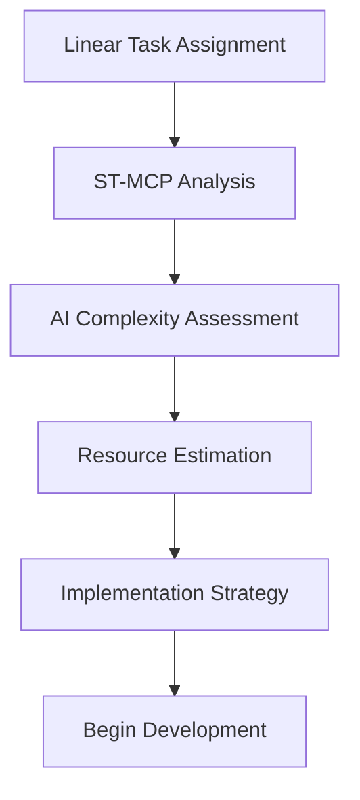
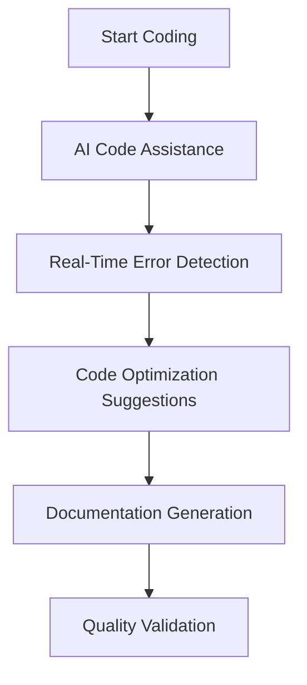
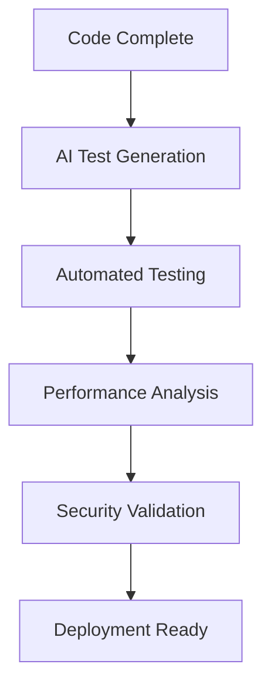

# AI Integration Procedures

> **Breadcrumb Navigation**: [README.md](../../README.md) > [Documentation](../index.md) > [Processes](./index.md) > AI Integration Procedures

**Version:** 1.0  
**Created:** January 2, 2025  
**Linear Task:** Related to Epic 1BU-11 (Vibe Coding Implementation)  
**Last Updated:** January 2, 2025

## Overview

This document outlines comprehensive procedures for integrating AI tools and services throughout the Window World LA website development process. It covers the dual MCP strategy, AI-assisted development workflows, and best practices for leveraging AI capabilities effectively.

## Table of Contents

1. [AI Architecture Overview](#ai-architecture-overview)
2. [Dual MCP Integration](#dual-mcp-integration)
3. [AI-Assisted Development Workflows](#ai-assisted-development-workflows)
4. [Code Generation and Optimization](#code-generation-and-optimization)
5. [AI-Powered Quality Assurance](#ai-powered-quality-assurance)
6. [Documentation Generation](#documentation-generation)
7. [Decision Support Systems](#decision-support-systems)
8. [AI Tool Configuration](#ai-tool-configuration)
9. [Best Practices](#best-practices)
10. [Troubleshooting](#troubleshooting)

## AI Architecture Overview

### Core AI Components

#### **Augment Code IDE**
- **Primary Development Environment:** Built-in AI assistance for coding
- **Features:** Code completion, error detection, refactoring, documentation generation
- **Integration:** Seamless integration with MCP servers and project workflows

#### **Linear MCP Server**
- **Purpose:** AI-enhanced project management and task tracking
- **Capabilities:** Intelligent task assignment, progress analysis, dependency mapping
- **AI Features:** Natural language task creation, automated status updates

#### **Sequential Thinking MCP Server**
- **Purpose:** AI-powered workflow orchestration and complex problem-solving
- **Capabilities:** Multi-step analysis, decision trees, workflow automation
- **AI Features:** Context-aware reasoning, solution generation, process optimization

#### **Google Generative AI (Gemini 2.0 Flash)**
- **Purpose:** Content generation, image analysis, and advanced AI capabilities
- **Integration:** Vertex AI platform for scalable AI operations
- **Use Cases:** Image generation, content creation, data analysis

#### **Supabase AI Features**
- **Purpose:** Database-integrated AI capabilities
- **Features:** pgvector for embeddings, AI-powered search, intelligent data processing
- **Integration:** Seamless integration with application data layer

### AI Integration Strategy

#### **Layered AI Approach**
1. **IDE Level:** Real-time coding assistance and error detection
2. **Workflow Level:** Process automation and decision support
3. **Project Level:** Strategic planning and resource optimization
4. **Content Level:** Dynamic content generation and optimization

#### **AI Decision Framework**
- **Human-in-the-Loop:** Critical decisions require human validation
- **Automated Tasks:** Routine tasks can be fully automated
- **AI-Assisted Tasks:** Complex tasks benefit from AI guidance
- **Quality Gates:** AI recommendations validated against project standards

## Dual MCP Integration

### Linear MCP AI Features

#### **Intelligent Task Management**
- **Natural Language Processing:** Create tasks using natural language descriptions
- **Automatic Categorization:** AI categorizes tasks by type, priority, and complexity
- **Dependency Detection:** Automatically identifies task dependencies and relationships
- **Progress Prediction:** AI estimates completion times based on historical data

#### **AI-Enhanced Reporting**
- **Status Analysis:** AI analyzes project status and identifies potential issues
- **Resource Optimization:** Suggests optimal resource allocation based on task complexity
- **Risk Assessment:** Identifies potential risks and suggests mitigation strategies
- **Performance Metrics:** AI-generated insights on team and project performance

### Sequential Thinking MCP AI Features

#### **Complex Problem Solving**
- **Multi-Step Analysis:** Breaks down complex problems into manageable steps
- **Solution Generation:** Generates multiple solution options with trade-off analysis
- **Decision Trees:** Creates decision frameworks for complex choices
- **Context Awareness:** Maintains context across multi-step workflows

#### **Workflow Automation**
- **Process Optimization:** AI optimizes workflows based on efficiency metrics
- **Automated Documentation:** Generates comprehensive documentation from workflow execution
- **Error Recovery:** Intelligent error handling and recovery procedures
- **Learning Adaptation:** Workflows improve based on execution history and outcomes

### MCP Synchronization

#### **Data Flow Management**
- **Real-Time Sync:** Ensures data consistency between Linear and ST-MCP
- **Conflict Resolution:** AI-powered conflict resolution for competing updates
- **Version Control:** Maintains version history for all AI-generated content
- **Audit Trail:** Complete tracking of all AI decisions and recommendations

## AI-Assisted Development Workflows

### Code Development Workflow

#### **1. Task Analysis Phase**


**AI Actions:**
- Analyze task requirements and complexity
- Estimate development time and resources
- Identify potential challenges and dependencies
- Generate implementation strategy and approach

#### **2. Implementation Phase**


**AI Actions:**
- Provide real-time code completion and suggestions
- Detect errors and suggest corrections
- Optimize code for performance and readability
- Generate inline documentation and comments
- Validate code against project standards

#### **3. Testing and Validation Phase**


**AI Actions:**
- Generate comprehensive test cases
- Execute automated testing procedures
- Analyze performance metrics and optimization opportunities
- Validate security best practices
- Prepare deployment documentation

### Component Development Workflow

#### **AI-Assisted Component Creation**

**Step 1: Component Analysis**
- AI analyzes design requirements and existing components
- Identifies reusable patterns and components
- Suggests optimal component structure and organization
- Generates component specification and interface

**Step 2: Code Generation**
- AI generates initial component code based on specifications
- Applies project coding standards and conventions
- Integrates with existing design system and components
- Generates TypeScript types and interfaces

**Step 3: Integration and Testing**
- AI generates integration tests and usage examples
- Validates component against design requirements
- Optimizes for performance and accessibility
- Generates documentation and usage guidelines

### Page Development Workflow

#### **AI-Enhanced Page Creation**

**Step 1: Page Planning**
- AI analyzes page requirements and user flow
- Identifies required components and data sources
- Generates page structure and layout recommendations
- Creates routing and navigation integration plan

**Step 2: Implementation**
- AI assists with App Router implementation
- Generates page components and data fetching logic
- Integrates with Supabase for dynamic content
- Implements responsive design and accessibility features

**Step 3: Optimization**
- AI analyzes page performance and loading times
- Suggests optimization strategies for Core Web Vitals
- Implements SEO best practices and meta tags
- Generates comprehensive testing procedures

## Code Generation and Optimization

### AI Code Generation Standards

#### **Code Quality Requirements**
- **Consistency:** All AI-generated code follows project conventions
- **Readability:** Code is well-structured and documented
- **Performance:** Optimized for speed and efficiency
- **Security:** Follows security best practices and guidelines
- **Accessibility:** Meets WCAG 2.1 AA standards

#### **AI Code Review Process**
1. **Initial Generation:** AI generates code based on requirements
2. **Self-Review:** AI validates code against project standards
3. **Human Review:** Developer reviews and validates AI-generated code
4. **Iteration:** Refine code based on review feedback
5. **Final Validation:** Comprehensive testing and quality assurance

### Optimization Strategies

#### **Performance Optimization**
- **Bundle Analysis:** AI analyzes bundle size and suggests optimizations
- **Code Splitting:** Intelligent code splitting for optimal loading
- **Caching Strategies:** AI-recommended caching for improved performance
- **Resource Optimization:** Optimize images, fonts, and other assets

#### **Code Quality Optimization**
- **Refactoring Suggestions:** AI identifies opportunities for code improvement
- **Pattern Recognition:** Suggests design patterns and best practices
- **Dependency Management:** Optimizes dependencies and reduces bundle size
- **Type Safety:** Enhances TypeScript usage and type definitions

## AI-Powered Quality Assurance

### Automated Testing

#### **AI Test Generation**
- **Unit Tests:** AI generates comprehensive unit tests for components
- **Integration Tests:** Creates tests for component interactions
- **End-to-End Tests:** Generates user journey and workflow tests
- **Performance Tests:** Creates performance benchmarks and monitoring

#### **Test Optimization**
- **Coverage Analysis:** AI ensures comprehensive test coverage
- **Test Efficiency:** Optimizes test execution time and resource usage
- **Flaky Test Detection:** Identifies and fixes unreliable tests
- **Test Maintenance:** Automatically updates tests when code changes

### Quality Metrics

#### **AI-Driven Quality Assessment**
- **Code Quality Score:** Comprehensive assessment of code quality
- **Performance Metrics:** Real-time performance monitoring and analysis
- **Security Assessment:** Continuous security vulnerability scanning
- **Accessibility Compliance:** Automated accessibility testing and validation

## Documentation Generation

### AI Documentation Workflows

#### **Automated Documentation Creation**
- **API Documentation:** AI generates comprehensive API documentation
- **Component Documentation:** Creates detailed component usage guides
- **Process Documentation:** Generates workflow and process documentation
- **Architecture Documentation:** Maintains up-to-date system architecture docs

#### **Documentation Maintenance**
- **Consistency Checking:** AI ensures documentation consistency across project
- **Update Detection:** Identifies when documentation needs updates
- **Link Validation:** Maintains valid links and references
- **Version Synchronization:** Keeps documentation in sync with code changes

### Content Generation

#### **Technical Writing**
- **User Guides:** AI generates user-friendly guides and tutorials
- **Technical Specifications:** Creates detailed technical documentation
- **Release Notes:** Generates comprehensive release documentation
- **Troubleshooting Guides:** Creates problem-solving documentation

## Decision Support Systems

### AI-Assisted Decision Making

#### **Technical Decisions**
- **Architecture Choices:** AI analyzes options and recommends optimal solutions
- **Technology Selection:** Evaluates technologies based on project requirements
- **Performance Trade-offs:** Analyzes performance implications of design decisions
- **Scalability Planning:** Recommends scalable architecture patterns

#### **Project Management Decisions**
- **Resource Allocation:** AI optimizes team and resource assignments
- **Timeline Planning:** Generates realistic project timelines and milestones
- **Risk Management:** Identifies and prioritizes project risks
- **Quality Gates:** Recommends quality checkpoints and validation criteria

### Decision Documentation

#### **Decision Records**
- **Rationale Capture:** AI documents decision rationale and context
- **Alternative Analysis:** Records alternatives considered and trade-offs
- **Impact Assessment:** Analyzes potential impact of decisions
- **Review Scheduling:** Schedules decision reviews and updates

## AI Tool Configuration

### Environment Setup

#### **Augment Code IDE Configuration**
```json
{
  "ai.codeCompletion": true,
  "ai.errorDetection": true,
  "ai.refactoring": true,
  "ai.documentation": true,
  "ai.qualityAnalysis": true
}
```

#### **MCP Server Configuration**
```json
{
  "linear": {
    "aiFeatures": true,
    "naturalLanguageProcessing": true,
    "automaticCategorization": true,
    "progressPrediction": true
  },
  "sequentialThinking": {
    "complexProblemSolving": true,
    "workflowAutomation": true,
    "contextAwareness": true,
    "learningAdaptation": true
  }
}
```

#### **Google Generative AI Setup**
```env
GOOGLE_API_KEY=your_api_key_here
GEMINI_MODEL_VERSION=gemini-2.0-flash
VERTEX_AI_PROJECT_ID=your_project_id
VERTEX_AI_LOCATION=us-central1
```

### Integration Testing

#### **AI Feature Validation**
- **Functionality Testing:** Verify all AI features work as expected
- **Performance Testing:** Ensure AI operations don't impact system performance
- **Accuracy Testing:** Validate AI recommendations and suggestions
- **Integration Testing:** Test AI integration with existing systems

## Best Practices

### AI Usage Guidelines

#### **When to Use AI**
- **Routine Tasks:** Use AI for repetitive and routine development tasks
- **Code Generation:** Leverage AI for boilerplate and standard code patterns
- **Documentation:** Use AI for generating and maintaining documentation
- **Analysis:** Apply AI for complex analysis and decision support

#### **When to Avoid AI**
- **Critical Decisions:** Human oversight required for business-critical decisions
- **Creative Design:** Human creativity needed for unique design solutions
- **Security Sensitive:** Human review required for security-related code
- **Domain Expertise:** Human knowledge needed for specialized domain logic

### Quality Assurance

#### **AI Output Validation**
- **Human Review:** Always review AI-generated code and documentation
- **Testing Requirements:** Comprehensive testing of AI-generated components
- **Quality Standards:** Ensure AI output meets project quality standards
- **Security Review:** Validate security implications of AI recommendations

#### **Continuous Improvement**
- **Feedback Loops:** Provide feedback to improve AI recommendations
- **Learning Integration:** Incorporate lessons learned into AI workflows
- **Performance Monitoring:** Monitor AI performance and effectiveness
- **Regular Updates:** Keep AI tools and models updated

## Troubleshooting

### Common AI Integration Issues

#### **Performance Issues**
- **Slow AI Responses:** Check network connectivity and API limits
- **High Resource Usage:** Monitor and optimize AI tool resource consumption
- **Integration Conflicts:** Resolve conflicts between different AI tools

#### **Quality Issues**
- **Inaccurate Suggestions:** Provide feedback to improve AI accuracy
- **Inconsistent Output:** Ensure consistent configuration across AI tools
- **Missing Context:** Provide sufficient context for AI analysis

### Support Resources

- **AI Tool Documentation:** Comprehensive documentation for all AI tools
- **Community Support:** Access to AI tool communities and forums
- **Technical Support:** Direct support channels for AI tool issues
- **Training Resources:** Training materials for effective AI usage

## Related Documentation

- [Development Workflow](./development-workflow.md) - Complete development process
- [MCP Server Integration Guide](../guides/mcp-server-integration-guide.md) - Dual MCP strategy
- [Project Hub Strategic Dashboard](../dashboards/project-hub-strategic-dashboard.md) - Project overview
- [Quality Assurance Processes](./quality-assurance-processes.md) - QA procedures

---

**Last Updated:** January 2, 2025  
**Version:** 1.0  
**Next Review:** January 9, 2025
