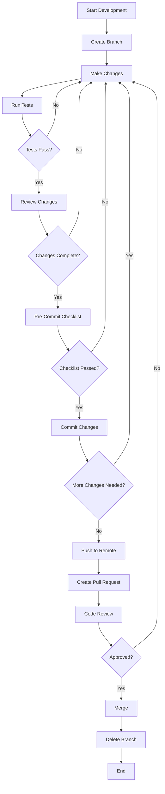

# Commit Standards

> **Breadcrumb Navigation**: [README.md](../../README.md) > [Documentation](../index.md) > [Processes](./index.md) > Commit Standards

## Table of Contents

1. [Overview](#overview)
2. [Commit Frequency](#commit-frequency)
3. [Commit Message Format](#commit-message-format)
4. [Conventional Commits](#conventional-commits)
5. [AI-Assisted Commit Messages](#ai-assisted-commit-messages)
6. [Pre-Commit Checklist](#pre-commit-checklist)
7. [Branch Naming Conventions](#branch-naming-conventions)
8. [Pull Request Guidelines](#pull-request-guidelines)
9. [Code Review Process](#code-review-process)
10. [Commit Workflow Diagram](#commit-workflow-diagram)
11. [Examples](#examples)
12. [Related Documentation](#related-documentation)

## Overview

This document establishes standards for commit practices in the Windows Doors CA website project. It provides guidelines for commit frequency, message formatting, and related version control processes to ensure consistency, clarity, and traceability in the development workflow.

## Commit Frequency

### General Guidelines

- **Commit Early and Often**: Make small, focused commits rather than large, monolithic ones
- **Logical Units**: Each commit should represent a single logical change
- **Complete Changes**: Ensure each commit leaves the codebase in a working state
- **Avoid Mixing Concerns**: Separate refactoring, feature additions, and bug fixes into different commits

### Recommended Commit Points

Commit changes after completing:

1. **A Single Feature**: When a discrete feature is implemented and tested
2. **A Logical Component**: When a component or module is completed
3. **A Significant Refactoring**: When code has been restructured or improved
4. **A Bug Fix**: When a specific issue has been resolved
5. **Documentation Updates**: When documentation has been added or updated
6. **Test Additions**: When tests have been added or updated

### Vibe Coding Approach

Following the "vibe coding" philosophy:

- Commit after each small, incremental change
- Don't wait until a feature is "perfect" before committing
- Use commits as save points during development
- Aim for 5-10 commits per day during active development

## Commit Message Format

### Basic Structure

```
<type>(<scope>): <subject>

<body>

<footer>
```

### Components

1. **Type**: Indicates the kind of change (see Conventional Commits section)
2. **Scope** (optional): Indicates the area of the codebase affected
3. **Subject**: A concise description of the change
4. **Body** (optional): Detailed explanation of the change
5. **Footer** (optional): References to issues, breaking changes, etc.

### Guidelines

- **Subject Line**:
  - Limited to 72 characters
  - Written in imperative mood (e.g., "Add" not "Added")
  - First letter capitalized
  - No period at the end

- **Body**:
  - Separated from subject by a blank line
  - Explains what and why, not how
  - May include bullet points for multiple changes
  - Wrapped at 72 characters

- **Footer**:
  - References issues with "Fixes #123" or "Relates to #456"
  - Notes breaking changes with "BREAKING CHANGE:"

## Conventional Commits

This project follows the [Conventional Commits](https://www.conventionalcommits.org/) specification for commit messages.

### Types

- **feat**: A new feature
- **fix**: A bug fix
- **docs**: Documentation changes
- **style**: Changes that don't affect code functionality (formatting, etc.)
- **refactor**: Code changes that neither fix bugs nor add features
- **perf**: Performance improvements
- **test**: Adding or correcting tests
- **chore**: Changes to build process, tools, etc.

### Scopes

Common scopes for this project include:

- **windows**: Windows product pages
- **doors**: Doors product pages
- **siding**: Vinyl siding pages
- **roofing**: Roofing pages
- **contact**: Contact-related functionality
- **ui**: UI components
- **api**: API-related changes
- **db**: Database-related changes
- **auth**: Authentication-related changes
- **config**: Configuration changes
- **deps**: Dependency updates

### Examples

```
feat(windows): add double-hung windows product page
```

```
fix(contact): resolve form submission error on mobile devices
```

```
docs(api): update API documentation with new endpoints
```

```
refactor(ui): improve component reusability in product cards
```

## AI-Assisted Commit Messages

When using AI to generate commit messages:

### Guidelines

1. **Review Before Using**: Always review AI-generated commit messages before applying them
2. **Ensure Accuracy**: Verify that the message accurately reflects the changes made
3. **Maintain Conventions**: Ensure the message follows the project's commit conventions
4. **Add Context if Needed**: Supplement the AI-generated message with additional context if necessary

### Prompt Template

When asking an AI to generate a commit message:

```
Generate a conventional commit message for the following changes:

[Brief description of changes]

Files changed:
[List of changed files]

Changes include:
[Specific details about the changes]

Follow the format: <type>(<scope>): <subject>
```

## Pre-Commit Checklist

Before committing changes, verify:

1. **Code Quality**:
   - Code follows project style guidelines
   - No debugging code (console.log, etc.) remains
   - No commented-out code remains
   - No TODOs without associated tickets

2. **Functionality**:
   - Code has been tested locally
   - All tests pass
   - No new warnings or errors

3. **Documentation**:
   - Code includes necessary comments
   - Documentation has been updated if needed
   - API changes are documented

4. **Commit Content**:
   - Changes are focused on a single concern
   - No unrelated changes are included
   - No sensitive information is included

5. **Commit Message**:
   - Follows conventional commits format
   - Accurately describes the changes
   - References relevant issues

## Branch Naming Conventions

### Format

```
<type>/<scope>/<description>
```

### Components

1. **Type**: Same as commit types (feat, fix, docs, etc.)
2. **Scope**: Area of the codebase affected
3. **Description**: Brief description using kebab-case

### Examples

```
feat/windows/add-double-hung-page
```

```
fix/contact/form-submission-error
```

```
docs/api/update-endpoints
```

## Pull Request Guidelines

### PR Title Format

```
<type>(<scope>): <subject>
```

### PR Description Template

```
## Description
[Detailed description of the changes]

## Related Issues
[References to related issues]

## Testing
[Description of testing performed]

## Screenshots
[If applicable]

## Checklist
- [ ] Tests added/updated
- [ ] Documentation updated
- [ ] No new warnings
- [ ] Follows style guidelines
```

### Review Process

1. **Self-Review**: Conduct a self-review before requesting reviews
2. **Peer Review**: Request review from at least one team member
3. **Address Feedback**: Address all feedback promptly
4. **Final Verification**: Verify all tests pass before merging

## Code Review Process

### Reviewer Guidelines

1. **Focus on**:
   - Code correctness
   - Adherence to project standards
   - Performance implications
   - Security considerations
   - Test coverage

2. **Provide**:
   - Specific, actionable feedback
   - Explanations for suggested changes
   - References to documentation or examples
   - Positive reinforcement for good practices

3. **Avoid**:
   - Nitpicking minor style issues
   - Personal preferences without rationale
   - Vague or ambiguous feedback

### Author Guidelines

1. **Respond to All Comments**:
   - Address each comment with a response
   - Explain rationale for disagreements
   - Thank reviewers for helpful feedback

2. **Make Requested Changes**:
   - Implement agreed-upon changes
   - Request re-review when changes are complete
   - Explain any deviations from requested changes

3. **Learn from Feedback**:
   - Apply lessons to future code
   - Update documentation if needed
   - Share insights with the team

## Commit Workflow Diagram



## Examples

### Good Commit Messages

```
feat(windows): add double-hung windows product page

- Create new product page component
- Add routing configuration
- Implement product specifications section
- Add image gallery component
- Connect to product database

Fixes #123
```

```
fix(contact): resolve form submission error on mobile devices

Form submission was failing on mobile devices due to incorrect
viewport handling in the validation logic. Updated the validation
to be responsive to different screen sizes.

Fixes #456
```

```
refactor(ui): improve component reusability in product cards

Extracted common functionality into a shared ProductCard component
to reduce duplication across product pages. This improves maintainability
and ensures consistent styling.
```

### Bad Commit Messages (Avoid These)

```
update stuff
```

```
WIP
```

```
Fixed bugs
```

```
Changes requested by John
```

## Related Documentation

- [AI Agent Rules](./ai-agent-rules.md)
- [Effective AI Interaction](./effective-ai-interaction.md)
- [Pre-Commit Testing](../testing/pre-commit-testing.md)
- [Development Workflow](./development-workflow.md)
- [Git Workflow](./git-workflow.md)

Last Updated: May 28, 2025
